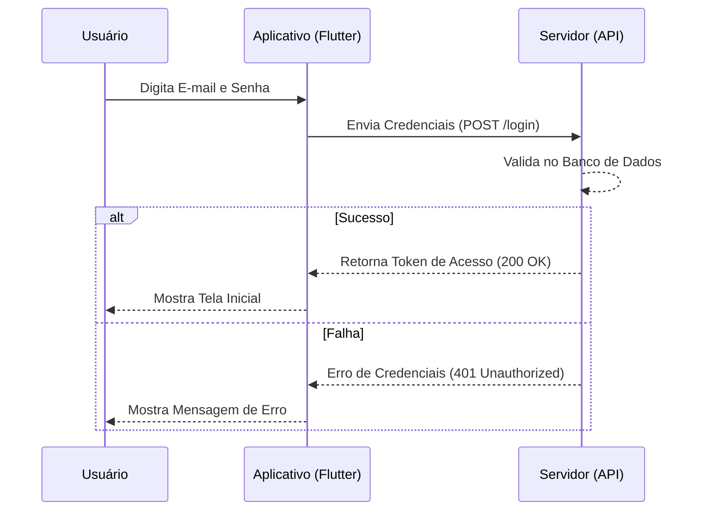
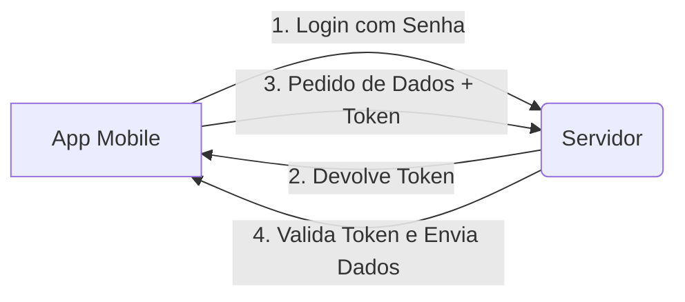
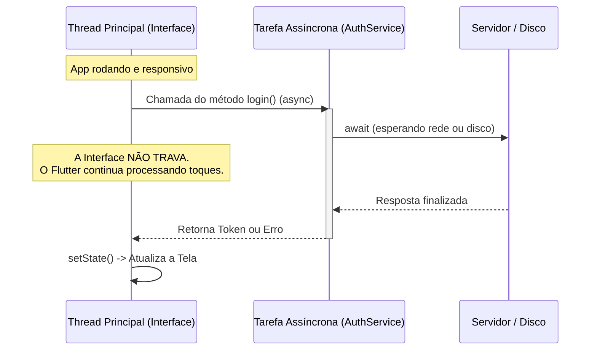

## Data e contexto

- **Data:** 22/04/2026
- **Duração:** 5 horas-aula
- **Horário real:** 18h45 às 22h20
- **Intervalo sugerido:** 20h25 às 20h40
- **Laboratório:** 6

## Alinhamento com o PTD

- **Habilidades:** 1.1, 1.3, 1.4
- **Bases:** Autenticação; persistência inicial de dados; integração básica com
  banco local/remoto; usabilidade e segurança básica.

---

## Objetivo da noite

Ao final da aula, você terá um app que "lembra" de você. Você vai aprender a:

1. Simular uma chamada de login que demora 2 segundos (como na vida real).
2. Salvar um "Token" (um crachá digital) no celular.
3. Fazer o app decidir sozinho se abre a tela de Login ou a Home ao ligar.

---

## O que você vai construir hoje

O fluxo completo de acesso:

- **Login:** Digitar e-mail/senha -> App mostra "carregando" -> App salva o
  Token.
- **Persistência:** Fechar o app -> Abrir de novo -> App já cai na Home sozinho.
- **Logout:** Clicar em "Sair" -> App apaga o Token -> Volta para o Login.

---

## Conceitos-chave desta aula

Para dominar esta aula, você precisa entender profundamente estes 5 pilares
fundamentais do desenvolvimento mobile moderno.

### 1. Autenticação (Authentication)

A **Autenticação** é o processo de verificar a identidade de um usuário. Em
aplicativos móveis, isso geralmente começa com um par de credenciais (e-mail e
senha) que são enviados para um servidor.

Ao contrário da **Autorização** (que define _o que_ você pode acessar), a
**Autenticação** foca em _quem_ você é.



- **Documentação Oficial:**
  [Requisições autenticadas no Flutter](https://docs.flutter.dev/cookbook/networking/authenticated-requests)
- **Referência:**
  [MDN - HTTP Authentication](https://developer.mozilla.org/pt-BR/docs/Web/HTTP/Authentication)

---

### 2. O Conceito de Token (JWT como exemplo comum)

Diferente da Web tradicional que usa _Cookies_ e _Sessions_, o desenvolvimento
mobile utiliza majoritariamente **Tokens**. Um Token é como um "crachá digital".
Uma vez que você faz o login, o servidor te entrega esse código.

Na aula de hoje, vamos usar um **token simulado em texto** para entender o
fluxo. Em projetos reais, esse token muitas vezes é um JWT, mas o mecanismo de
persistir a sessão continua parecido.

Nas próximas vezes que você precisar de um dado protegido (como sua lista de
pedidos), você não envia a senha de novo; você apenas apresenta o Token no
cabeçalho (**Header**) da requisição.



- **Documentação Oficial:**
  [Networking no Flutter](https://docs.flutter.dev/cookbook/networking/fetch-data)
- **Referência:**
  [JWT.io - Introdução ao JSON Web Token](https://jwt.io/introduction/)

---

### 3. Persistência Local (Shared Preferences)

A **Persistência** é o que permite que um dado "sobreviva" mesmo após o
aplicativo ser fechado ou o celular reiniciado. Sem ela, o usuário teria que
fazer login toda vez que abrisse o app.

O pacote `shared_preferences` salva dados simples (texto, números, booleanos) em
um formato de **Chave -> Valor** no armazenamento permanente do dispositivo.

- **Chave:** Nome do dado (ex: `"auth_token"`)
- **Valor:** O conteúdo salvo (ex: `"sucesso_token_123"`)

- **Documentação Oficial:**
  [Armazenando dados chave-valor](https://docs.flutter.dev/cookbook/persistence/key-value)
- **Pacote:**
  [shared_preferences no Pub.dev](https://pub.dev/packages/shared_preferences)

---

### 4. Programação Assíncrona (Async / Await)

O Flutter roda quase tudo em uma única "via" (a _Main Thread_). Se você fizer
uma tarefa pesada ou lenta (como esperar um servidor) nessa via, o app trava e
para de responder aos toques.

Para resolver isso, usamos o **Assincronismo**:

- **Future**: Um objeto que representa um valor que ainda não chegou (como um
  ticket de retirada de lanche).
- **Async**: Marca uma função que pode esperar por algo.
- **Await**: Diz ao app para pausar a execução _daquela função_ até que o
  resultado chegue, sem travar o resto do aplicativo.



- **Documentação Oficial:**
  [Dart - Asynchronous programming](https://dart.dev/codelabs/async-await)
- **Vídeo:**
  [Flutter - Asynchronous Programming](https://www.youtube.com/watch?v=SmMZqhUigyw)

---

### 5. WidgetsFlutterBinding

O Flutter é uma "ilha" de código UI que roda dentro de um "continente" (Android
ou iOS). Para que eles conversem, existe uma ponte.

O `WidgetsFlutterBinding.ensureInitialized()` é o comando que garante que essa
ponte está pronta. Precisamos dele no `main` sempre que formos usar um plugin
nativo (como a Memória ou a Câmera) **antes** do comando `runApp`. Sem ele, o
app tentará acessar o hardware do celular antes do Flutter estar totalmente
conectado ao sistema.

- **Documentação Oficial:**
  [WidgetsFlutterBinding class](https://api.flutter.dev/flutter/widgets/WidgetsFlutterBinding-class.html)
- **Referência:**
  [Stack Overflow - Why ensureInitialized?](https://stackoverflow.com/questions/57689492/flutter-widgetsflutterbinding-ensureinitialized-explanation)

---

## Mapa rápido da aula (O caminho das pedras)

1. **Instalar:** Adicionar o pacote de memória (`shared_preferences`).
2. **Serviço:** Criar o código que finge ser o servidor (Mock API).
3. **Interface:** Colocar o botão de login para funcionar com o "carregando".
4. **Memória:** Fazer o login gravar o token no "HD" do celular.
5. **Inteligência:** Mudar o início do app para verificar se já existe alguém
   logado.

---

## Organização da aula (Roteiro de Autonomia)

### Bloco 1, 18h45 às 19h35

## 1. Instalando a Memória e Criando o Serviço

### Passo 1. Instale o pacote

Abra o terminal do VS Code (Ctrl + ') e digite:

```bash
flutter pub add shared_preferences
```

_Aguarde terminar. Isso permite que o app salve dados que não somem quando o
celular desliga._

### Passo 2. Crie a pasta de serviços

Na pasta `lib`, clique com o botão direito e crie uma **nova pasta** chamada
`services`. Dentro dela, crie o arquivo `auth_service.dart`.

### Passo 3. O código do Serviço (Copie e entenda)

Aqui usamos **Programação Assíncrona**. Como não sabemos quanto tempo a internet
vai demorar, usamos `Future` para dizer que o resultado virá no futuro.

```dart
class AuthService {
  // Este método finge que vai na internet conferir o login
  // Usamos String? pois se o login falhar, o resultado será null (nulo)
  Future<String?> login(String email, String senha) async {
    // 1. Espera 2 segundos (Simula o tempo de resposta da internet)
    // O 'await' avisa o app: "pode continuar funcionando, mas pare esta função aqui até terminar"
    await Future.delayed(const Duration(seconds: 2));

    // 2. Confere se os dados estão certos
    if (email == "aluno@etec.sp.gov.br" && senha == "123456") {
      return "sucesso_token_123"; // Retorna o 'crachá' (Token)
    }

    return null; // Retorna nulo se o login falhar
  }
}
```

### Checkpoint 1

- [ ] O arquivo `pubspec.yaml` agora tem a linha `shared_preferences`.
- [ ] O arquivo `lib/services/auth_service.dart` existe e não tem erros
      (sublinhados vermelhos).

---

### Bloco 2, 19h35 às 20h25

## 2. Fazendo o Botão Girar (Feedback Visual)

Para o usuário não achar que o app travou enquanto espera os 2 segundos, usamos
o **Estado (`State`)** para redesenhar a tela com um carregando.

### Passo 1. Prepare a tela de Login

No topo da sua classe `_LoginScreenState` (dentro do arquivo de login), crie as
variáveis:

```dart
final _authService = AuthService(); // Instancia o serviço que criamos acima
bool _carregando = false;           // Variável que diz se estamos esperando o servidor
```

### Passo 2. A lógica do botão

Crie o método que será chamado quando clicar no botão "Entrar". Note o uso do
`setState`: ele é o comando que avisa ao Flutter: "Ei, mudei um dado, redesenhe
a tela agora!".

```dart
void _executarLogin() async {
  // 1. Começa a girar o círculo (Muda o estado para true e redesenha)
  setState(() => _carregando = true);

  // 2. Chama o serviço e espera a resposta (o await garante que a linha 3 só rode após os 2 seg)
  String? token = await _authService.login(_emailController.text, _senhaController.text);

  // 3. Para de girar o círculo (Muda o estado para false e redesenha)
  setState(() => _carregando = false);

  if (token != null) {
    // LOGIN CERTO: Mostra uma mensagem rápida (SnackBar)
    ScaffoldMessenger.of(context).showSnackBar(const SnackBar(content: Text('Bem-vindo!')));
  } else {
    // LOGIN ERRADO: Mostra mensagem de erro
    ScaffoldMessenger.of(context).showSnackBar(const SnackBar(content: Text('E-mail ou senha inválidos')));
  }
}
```

### Passo 3. Mude o visual do botão

No seu `ElevatedButton`, usamos um **operador ternário**
(`condicao ? se_verdade : se_falso`) para decidir o que mostrar.

```dart
child: _carregando
  ? const SizedBox(width: 20, height: 20, child: CircularProgressIndicator(color: Colors.white))
  : const Text('Entrar'),
```

### Checkpoint 2

- [ ] Digite o e-mail correto e clique em entrar.
- [ ] O botão mostra o círculo girando por 2 segundos? **Sim? Continue.**

---

### Intervalo, 20h25 às 20h40

---

### Bloco 3, 20h40 às 21h30

## 3. Gravando o Token "No Disco"

Para o login não "sumir" quando o app fechar, usamos o **Shared Preferences**.
Ele salva dados no armazenamento permanente do celular.

### Passo 1. Crie a função de gravar

Abaixo do seu método de login (ainda na LoginScreen), adicione esta função.

Primeiro, no topo do arquivo de login, adicione o import:

```dart
import 'package:shared_preferences/shared_preferences.dart';
```

Depois, abaixo do método `_executarLogin`, adicione apenas a função:

```dart
Future<void> _salvarSessao(String token) async {
  // SharedPreferences.getInstance() abre o arquivo de memória do celular
  final prefs = await SharedPreferences.getInstance();
  // setString grava um texto associado a uma 'chave' (meu_token_seguro)
  await prefs.setString('meu_token_seguro', token);
}
```

### Passo 2. Atualize o sucesso do login

Volte no seu método `_executarLogin` e adicione a chamada de salvamento e a
navegação. Usamos `pushReplacement` para que o usuário não consiga voltar para a
tela de login apertando o botão "voltar" do celular.

```dart
if (token != null) {
  await _salvarSessao(token); // GRAVA NA MEMÓRIA PERMANENTE

  // Troca a tela de Login pela Home
  Navigator.pushReplacement(
    context,
    MaterialPageRoute(builder: (context) => const HomeScreen())
  );
}
```

### Checkpoint 3

- [ ] Ao logar com sucesso, o app te leva para a tela de Home.
- [ ] O login agora "dura" mesmo que você mude de tela.

---

### Bloco 4, 21h30 às 22h10

## 4. O Teste Final: O App Inteligente

Agora vamos usar a **Lógica de Inicialização**. O `main` vai ler a memória antes
do app começar para saber para onde ir.

### Passo 1. Mude o arquivo `main.dart`

```dart
import 'package:shared_preferences/shared_preferences.dart';

void main() async {
  // 1. WidgetsFlutterBinding é necessário porque vamos usar plugins (memória)
  // antes do comando runApp ser executado.
  WidgetsFlutterBinding.ensureInitialized();

  // 2. Abre a memória e tenta ler o token que salvamos no login
  final prefs = await SharedPreferences.getInstance();
  final String? token = prefs.getString('meu_token_seguro');

  // 3. Inicia o app avisando se existe um token (true/false)
  // Passamos essa informação como um "contrato" para a classe MyApp
  runApp(MyApp(estaLogado: token != null));
}
```

### Passo 2. Ajuste o seu `MyApp` para receber o parâmetro

Aqui usamos o parâmetro `estaLogado` para decidir qual tela o usuário verá
primeiro.

```dart
class MyApp extends StatelessWidget {
  final bool estaLogado; // Recebe o dado lá do main
  const MyApp({super.key, required this.estaLogado});

  @override
  Widget build(BuildContext context) {
    return MaterialApp(
      // Se estiver logado, abre Home. Se não, abre Login.
      // Isso é o que chamamos de 'Persistência de Sessão'
      home: estaLogado ? const HomeScreen() : const LoginScreen(),
    );
  }
}
```

### Checkpoint Final (A Prova Real)

1. Faça login com sucesso.
2. **Feche o app completamente** no celular/emulador (remova da lista de apps
   abertos).
3. Abra o app de novo pelo ícone.
4. **Ele caiu direto na Home?** Parabéns, você domina persistência de sessão!

---

### Fechamento, 22h10 às 22h20

## 5. Entrega da aula

### Checklist de conclusão

- [ ] Login funcional com atraso simulado de 2 segundos.
- [ ] Feedback visual (CircularProgressIndicator) funcionando no botão.
- [ ] Token sendo gravado e recuperado do `shared_preferences`.
- [ ] Auto-login funcionando ao reiniciar o app.
- [ ] Botão de Logout na Home (dica: use `prefs.remove('meu_token_seguro')`).

---

## Atividade Integrada

### Sua missão

Implementar o fluxo de autenticação persistente. O usuário deve conseguir logar,
ver a Home e, mesmo fechando o app, continuar logado até que clique em "Sair".

### Critérios de avaliação

- **4 pts**: Implementação do serviço com feedback visual de carregamento.
- **4 pts**: Persistência funcionando (salvar no login e ler no `main`).
- **2 pts**: Organização do código e funcionamento do Logout.

---

## Estrutura do formulário (Google Forms)

| Ordem | Pergunta                                                                | Tipo de resposta |
| :---- | :---------------------------------------------------------------------- | :--------------- |
| 1     | Nome completo                                                           | Resposta curta   |
| 2     | Qual a função do `WidgetsFlutterBinding.ensureInitialized()` no `main`? | Múltipla escolha |
| 3     | O que o `await` faz em uma função `async`?                              | Múltipla escolha |
| 4     | Onde os dados do `shared_preferences` ficam salvos?                     | Múltipla escolha |
| 5     | Link para o repositório no GitHub (Código-fonte)                        | Resposta curta   |
| 6     | Link para evidências (Screenshots do Login, Carregando e Auto-login)    | Resposta curta   |
| 7     | Qual foi sua maior dificuldade na aula?                                 | Parágrafo        |

---

## Dicas de Ouro e Troubleshooting

### Se algo der errado:

- **Erro de Import:** Clique no erro e aperte `Ctrl + .` para importar
  automaticamente.
- **O círculo não para de girar:** Verifique se você colocou
  `_carregando = false` após o login.
- **O app quebra no início:** Verifique se o `main` tem o
  `WidgetsFlutterBinding`.
- **Dica:** O `shared_preferences` salva dados como se fosse um arquivo de texto
  simples no celular. Não salve senhas reais lá, apenas tokens!

---

## Materiais relacionados

- [Material 17 - Autenticação e Sessão Local](/self/courses/2026-1-DS-Prog-Aplicativos-Mobile-II-Novotec-Noturno/materiais/material-17)
- [Atividade 06 - Login + Token + Tela Protegida](/self/courses/2026-1-DS-Prog-Aplicativos-Mobile-II-Novotec-Noturno/atividades/atividade-06)
- [Formulário Aula 06](/self/courses/2026-1-DS-Prog-Aplicativos-Mobile-II-Novotec-Noturno/atividades/formulario-aula-06)

---

**Material elaborado para o curso de PAM2 - 2026**  
Prof. Gustavo Villalta
