## Data e contexto

- **Data:** 20/05/2026
- **Duração:** 5 horas-aula (250 min)
- **Horário:** 18h45 às 23h10 (considerando 15 min de intervalo)
- **Laboratório:** 6

## Alinhamento com o PTD

- **Habilidades:** 1.1 e 1.5.
- **Bases:** recursos do dispositivo via plugins; câmera; galeria; permissões;
  exceções; logs; tratamento de erros.

---

## Objetivo da noite

Na Aula 09, você aprendeu que um app Flutter pode conversar com serviços
externos usando HTTP, JSON, `statusCode`, `SnackBar` e tratamento de erro.

Hoje o app vai conversar com outro tipo de recurso externo: o **próprio
dispositivo**. Em vez de chamar uma URL, o app vai pedir ao sistema operacional
para abrir a galeria ou a câmera. O usuário pode escolher uma imagem, tirar uma
foto, cancelar a ação ou negar acesso. O app precisa lidar com todos esses
casos sem quebrar.

Ao final da aula, você deve conseguir construir uma tela Flutter com:

- botão para selecionar imagem da galeria;
- botão para tirar foto com a câmera;
- preview da imagem selecionada;
- mensagem clara quando o usuário cancela a escolha;
- mensagem clara quando acontece erro;
- organização mínima entre tela, estado e função de captura.

O foco não é fazer upload da imagem ainda. O foco é entender como o app acessa
recursos nativos com plugin, como recebe o resultado e como mostra esse resultado
na interface.

---

## O que você vai construir hoje

Você vai criar uma tela chamada **Perfil com Foto**. Ela simula um recurso comum
em apps reais: escolher ou tirar uma foto para exibir no perfil do usuário.

Resultado esperado:

- uma `AppBar` com o título da aula;
- uma área central de preview;
- dois botões: **Galeria** e **Câmera**;
- um texto de status;
- tratamento para imagem nula, erro e carregamento;
- código comentado apenas nos pontos necessários.

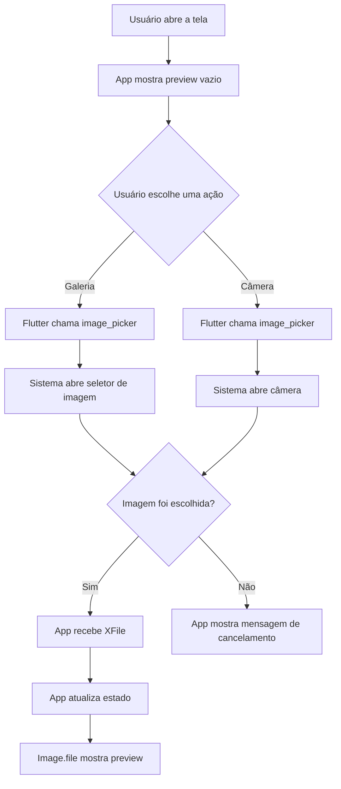

Observe a diferença em relação à Aula 09:

| Aula 09: API REST                       | Aula 10: câmera e galeria                  |
| :-------------------------------------- | :----------------------------------------- |
| O app chama uma URL                     | O app chama um plugin                      |
| A resposta vem como JSON                | A resposta vem como arquivo local (`XFile`) |
| O sucesso é medido por `statusCode`     | O sucesso é medido por imagem retornada    |
| O erro pode vir da API ou da internet   | O erro pode vir do sistema, permissão ou cancelamento |
| A UI mostra lista, formulário e feedback | A UI mostra preview, botões e feedback     |

---

## Materiais necessários

Antes de começar, você precisa de:

- projeto Flutter funcionando;
- emulador Android, celular Android ou iPhone;
- internet para instalar pacote;
- editor aberto no projeto;
- terminal aberto na raiz do projeto;
- noção de `StatefulWidget`, `setState`, `SnackBar` e `async/await`.

Se você estiver sem celular físico, comece pela galeria. A câmera costuma ser
mais instável em emulador, dependendo da configuração do laboratório.

---

## Documentação para consulta

- [Pacote image_picker](https://pub.dev/packages/image_picker)
- [Flutter - Using packages](https://docs.flutter.dev/packages-and-plugins/using-packages)
- [`Image.file`](https://api.flutter.dev/flutter/widgets/Image/Image.file.html)
- [`SnackBar`](https://api.flutter.dev/flutter/material/SnackBar-class.html)
- [`setState`](https://api.flutter.dev/flutter/widgets/State/setState.html)
- [`try`](https://dart.dev/language/error-handling)

---

## Mapa rápido da aula

Siga a aula nesta ordem. Não pule direto para a câmera.

1. Entender a diferença entre API, plugin e recurso nativo.
2. Instalar o pacote `image_picker`.
3. Criar uma tela mínima com estado.
4. Selecionar uma imagem da galeria.
5. Exibir a imagem com `Image.file`.
6. Capturar uma foto com a câmera.
7. Tratar cancelamento e erro.
8. Revisar o fluxo completo.
9. Entregar evidências no Google Forms indicado pelo professor.

---

## 1. Conceitos antes do código

### 1.1 O que é um recurso nativo?

Um app Flutter não roda sozinho. Ele roda dentro de um sistema operacional:
Android, iOS, web, Windows, macOS ou Linux. Cada sistema tem recursos próprios,
como câmera, arquivos, localização, bluetooth e sensores.

Quando o Flutter precisa usar algo que pertence ao sistema operacional, ele
normalmente usa um **plugin**.

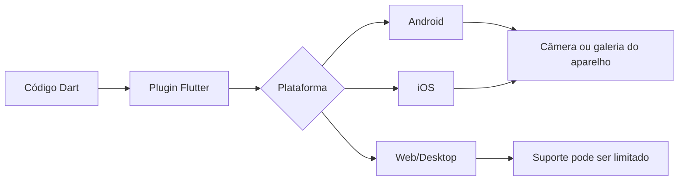

O plugin funciona como uma ponte. Você escreve Dart, mas por baixo o plugin sabe
conversar com Android e iOS.

Na Aula 09, a ponte era a internet:

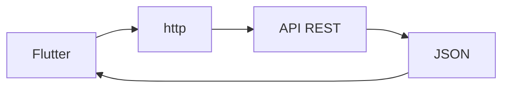

Na Aula 10, a ponte é o plugin:

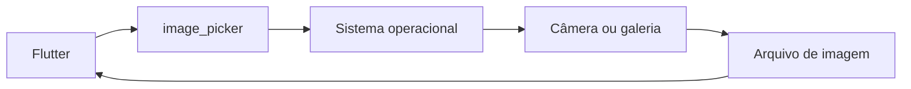

### 1.2 O que é `image_picker`?

`image_picker` é um pacote Flutter usado para:

- selecionar imagem da galeria;
- tirar foto com a câmera;
- retornar o resultado como um `XFile`.

`XFile` representa um arquivo escolhido pelo usuário. Ele tem propriedades como
`path` e métodos como `readAsBytes`. Nesta aula, vamos usar o `path` para exibir
a imagem com `Image.file`.

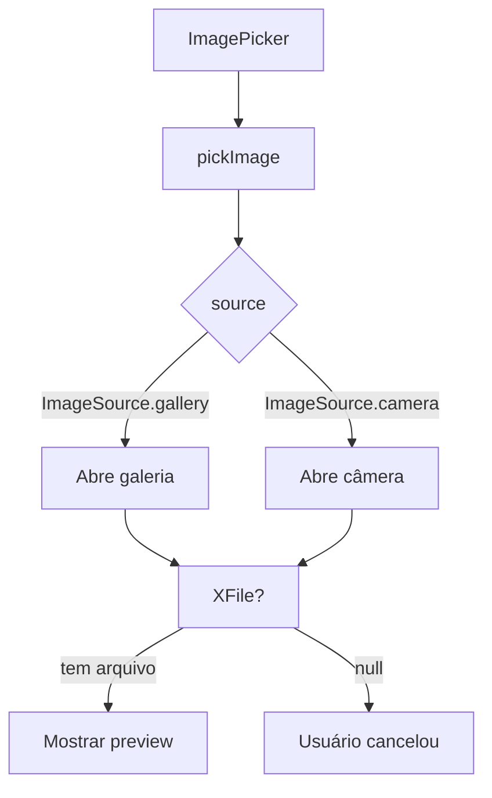

O sinal `?` em `XFile?` é importante: ele avisa que o resultado pode ser nulo.
Isso acontece quando o usuário abre a galeria e volta sem escolher nada, ou abre
a câmera e cancela.

### 1.3 Permissão não é só uma tela de aviso

Permissão é o acordo entre usuário, sistema operacional e aplicativo.

O app não deve acessar câmera, fotos, localização ou microfone sem explicar o
motivo. Em sistemas modernos, o usuário pode permitir, negar ou limitar o acesso.

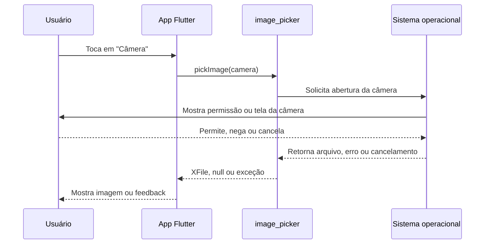

Para Android, o pacote atual funciona sem configuração manual obrigatória para
este roteiro básico. Para iOS, a documentação do pacote orienta adicionar textos
de uso no `Info.plist`, como motivo para acessar câmera e biblioteca de fotos.

Mesmo quando o plugin simplifica permissões, o app ainda precisa tratar três
situações:

- o usuário escolheu uma imagem;
- o usuário cancelou;
- o sistema retornou erro.

### 1.4 Cache não é armazenamento definitivo

Quando a foto é capturada com `image_picker`, o arquivo pode ficar em uma área
temporária do app. Isso é suficiente para o preview da aula, mas não significa
que a imagem foi salva para sempre.

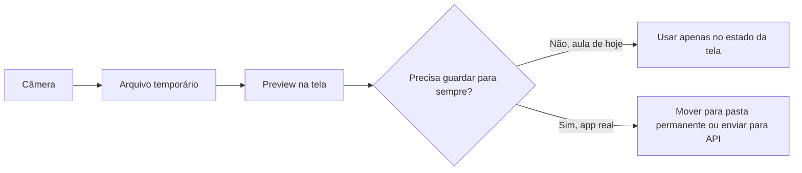

Hoje vamos parar no preview. Em um app real, depois você poderia salvar o arquivo
em armazenamento permanente ou enviar para uma API usando multipart upload.

---

## 2. Preparar o projeto

Abra o terminal na raiz do seu projeto Flutter e rode:

```bash
flutter pub add image_picker
```

Depois confira se o pacote apareceu em `pubspec.yaml`:

```yaml
dependencies:
  image_picker: ^1.2.2
```

Não copie a versão manualmente se o comando instalar outra versão mais nova. Use
a versão instalada pelo `flutter pub add`.

Agora rode o projeto:

```bash
flutter run
```

Se o app já estava aberto, pare e rode de novo. Mudanças em dependências não são
apenas Hot Reload.

---

## 3. Criar a tela base

Para esta aula, você pode substituir o conteúdo de `lib/main.dart` pelo código
abaixo. Se o seu projeto já tem navegação própria, você também pode criar uma
tela separada e chamar essa tela pela rota que já existe.

Comece com a estrutura mínima:

```dart
import 'dart:io';

import 'package:flutter/material.dart';
import 'package:image_picker/image_picker.dart';

void main() {
  runApp(const AppAula10());
}

class AppAula10 extends StatelessWidget {
  const AppAula10({super.key});

  @override
  Widget build(BuildContext context) {
    return MaterialApp(
      debugShowCheckedModeBanner: false,
      title: 'Aula 10 - Câmera e Galeria',
      theme: ThemeData(
        colorScheme: ColorScheme.fromSeed(seedColor: Colors.teal),
        useMaterial3: true,
      ),
      home: const PerfilComFotoPage(),
    );
  }
}

class PerfilComFotoPage extends StatefulWidget {
  const PerfilComFotoPage({super.key});

  @override
  State<PerfilComFotoPage> createState() => _PerfilComFotoPageState();
}

class _PerfilComFotoPageState extends State<PerfilComFotoPage> {
  final ImagePicker _picker = ImagePicker();

  XFile? _imagemSelecionada;
  bool _carregando = false;
  String _status = 'Nenhuma imagem selecionada.';

  @override
  Widget build(BuildContext context) {
    return Scaffold(
      appBar: AppBar(
        title: const Text('Perfil com Foto'),
      ),
      body: Padding(
        padding: const EdgeInsets.all(16),
        child: Column(
          crossAxisAlignment: CrossAxisAlignment.stretch,
          children: [
            _PreviewImagem(imagem: _imagemSelecionada),
            const SizedBox(height: 16),
            Text(
              _status,
              textAlign: TextAlign.center,
            ),
            const SizedBox(height: 16),
            if (_carregando)
              const Center(child: CircularProgressIndicator())
            else
              _BotoesImagem(
                aoAbrirGaleria: () {},
                aoAbrirCamera: () {},
              ),
          ],
        ),
      ),
    );
  }
}

class _PreviewImagem extends StatelessWidget {
  const _PreviewImagem({required this.imagem});

  final XFile? imagem;

  @override
  Widget build(BuildContext context) {
    if (imagem == null) {
      return Container(
        height: 260,
        alignment: Alignment.center,
        decoration: BoxDecoration(
          color: Colors.grey.shade200,
          borderRadius: BorderRadius.circular(16),
          border: Border.all(color: Colors.grey.shade400),
        ),
        child: const Text('Preview da imagem'),
      );
    }

    return ClipRRect(
      borderRadius: BorderRadius.circular(16),
      child: Image.file(
        File(imagem!.path),
        height: 260,
        fit: BoxFit.cover,
      ),
    );
  }
}

class _BotoesImagem extends StatelessWidget {
  const _BotoesImagem({
    required this.aoAbrirGaleria,
    required this.aoAbrirCamera,
  });

  final VoidCallback aoAbrirGaleria;
  final VoidCallback aoAbrirCamera;

  @override
  Widget build(BuildContext context) {
    return Row(
      children: [
        Expanded(
          child: OutlinedButton.icon(
            onPressed: aoAbrirGaleria,
            icon: const Icon(Icons.photo_library),
            label: const Text('Galeria'),
          ),
        ),
        const SizedBox(width: 12),
        Expanded(
          child: FilledButton.icon(
            onPressed: aoAbrirCamera,
            icon: const Icon(Icons.photo_camera),
            label: const Text('Câmera'),
          ),
        ),
      ],
    );
  }
}
```

Rode o app. Por enquanto, os botões ainda não fazem nada. Isso é esperado.

### Checkpoint 1

Antes de continuar, confirme:

- o app abre sem erro;
- aparece uma área de preview;
- aparecem os botões Galeria e Câmera;
- não há erro vermelho na tela.

---

## 4. Entender o estado da tela

Nesta tela existem três informações principais:

```dart
XFile? _imagemSelecionada;
bool _carregando = false;
String _status = 'Nenhuma imagem selecionada.';
```

Cada uma tem uma responsabilidade:

| Estado                | Tipo      | Para que serve                                      |
| :-------------------- | :-------- | :-------------------------------------------------- |
| `_imagemSelecionada`  | `XFile?`  | Guarda o arquivo retornado pelo plugin              |
| `_carregando`         | `bool`    | Evita cliques repetidos enquanto o picker está aberto |
| `_status`             | `String`  | Explica ao usuário o que aconteceu                  |

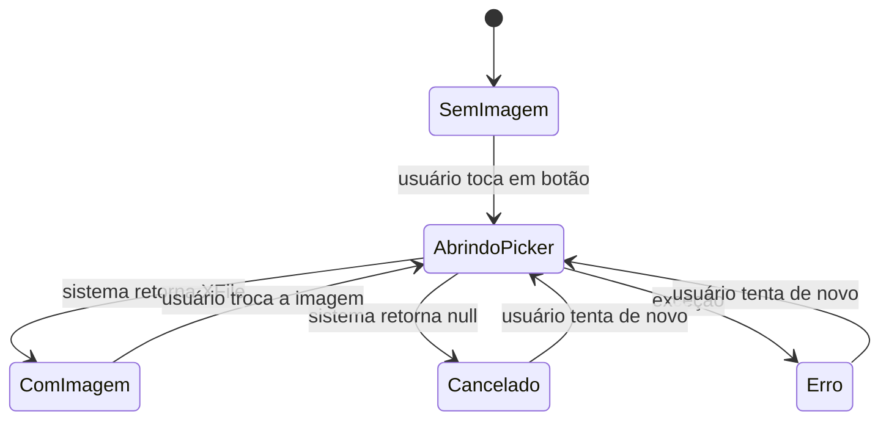

A tela muda quando chamamos `setState`. Sem `setState`, a variável pode até
mudar, mas a interface não é redesenhada.

---

## 5. Selecionar imagem da galeria

Agora adicione este método dentro de `_PerfilComFotoPageState`, antes do
`build`:

```dart
Future<void> _selecionarImagem(ImageSource origem) async {
  setState(() {
    _carregando = true;
    _status = origem == ImageSource.gallery
        ? 'Abrindo galeria...'
        : 'Abrindo câmera...';
  });

  try {
    final XFile? imagem = await _picker.pickImage(
      source: origem,
      imageQuality: 80,
      maxWidth: 1200,
    );

    if (!mounted) return;

    if (imagem == null) {
      setState(() {
        _status = 'Ação cancelada. Nenhuma imagem foi selecionada.';
      });
      return;
    }

    setState(() {
      _imagemSelecionada = imagem;
      _status = origem == ImageSource.gallery
          ? 'Imagem selecionada da galeria.'
          : 'Foto capturada com a câmera.';
    });

    ScaffoldMessenger.of(context).showSnackBar(
      const SnackBar(content: Text('Imagem carregada com sucesso.')),
    );
  } catch (erro) {
    if (!mounted) return;

    setState(() {
      _status = 'Não foi possível carregar a imagem.';
    });

    ScaffoldMessenger.of(context).showSnackBar(
      SnackBar(content: Text('Erro: $erro')),
    );
  } finally {
    if (mounted) {
      setState(() {
        _carregando = false;
      });
    }
  }
}
```

Depois conecte o botão da galeria:

```dart
_BotoesImagem(
  aoAbrirGaleria: () => _selecionarImagem(ImageSource.gallery),
  aoAbrirCamera: () {},
),
```

Rode o app e teste a galeria.

### O que está acontecendo?

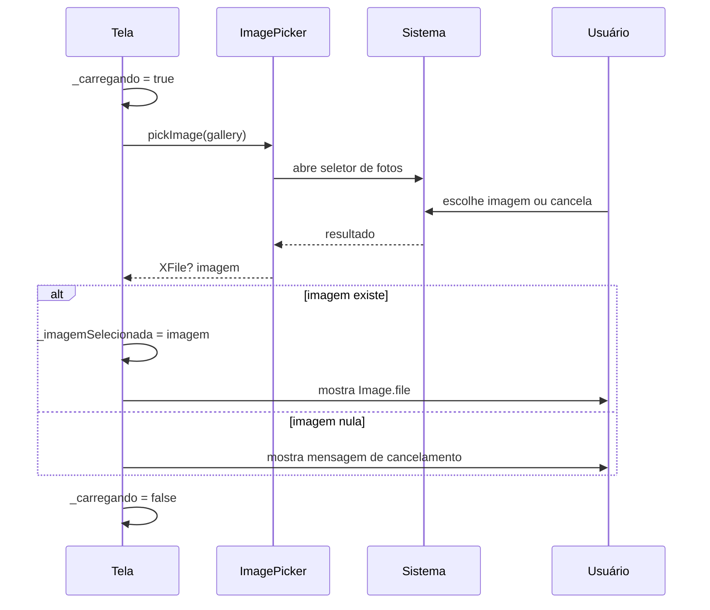

### Checkpoint 2

Confirme:

- o botão Galeria abre o seletor de imagens;
- ao escolher uma imagem, ela aparece no preview;
- ao cancelar, o app não quebra;
- aparece uma mensagem explicando o que aconteceu.

---

## 6. Capturar foto com a câmera

Agora conecte o botão da câmera:

```dart
_BotoesImagem(
  aoAbrirGaleria: () => _selecionarImagem(ImageSource.gallery),
  aoAbrirCamera: () => _selecionarImagem(ImageSource.camera),
),
```

Rode o app novamente e teste a câmera.

Se estiver usando emulador e a câmera não funcionar, não apague o código. Teste
primeiro com a galeria e registre no status ou nas anotações que o emulador não
forneceu câmera corretamente.

### Câmera e galeria usam a mesma função?

Sim. O que muda é o parâmetro:

```dart
ImageSource.gallery
ImageSource.camera
```

Esse é um exemplo de reaproveitamento de código. Em vez de criar duas funções
quase iguais, criamos uma função que recebe a origem.

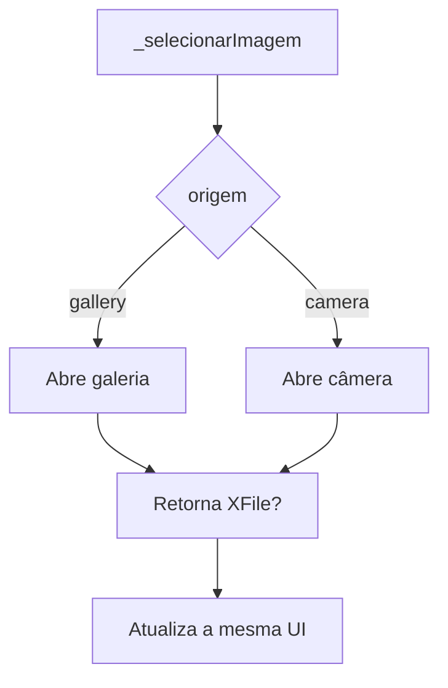

### Checkpoint 3

Confirme:

- o botão Câmera tenta abrir a câmera;
- em dispositivo físico, a foto capturada aparece no preview;
- no emulador, se falhar, o app mostra erro em vez de travar;
- a galeria continua funcionando depois de testar a câmera.

---

## 7. Código completo de referência

Compare seu arquivo com esta versão completa. Não copie sem entender. Use como
referência para encontrar diferenças.

```dart
import 'dart:io';

import 'package:flutter/material.dart';
import 'package:image_picker/image_picker.dart';

void main() {
  runApp(const AppAula10());
}

class AppAula10 extends StatelessWidget {
  const AppAula10({super.key});

  @override
  Widget build(BuildContext context) {
    return MaterialApp(
      debugShowCheckedModeBanner: false,
      title: 'Aula 10 - Câmera e Galeria',
      theme: ThemeData(
        colorScheme: ColorScheme.fromSeed(seedColor: Colors.teal),
        useMaterial3: true,
      ),
      home: const PerfilComFotoPage(),
    );
  }
}

class PerfilComFotoPage extends StatefulWidget {
  const PerfilComFotoPage({super.key});

  @override
  State<PerfilComFotoPage> createState() => _PerfilComFotoPageState();
}

class _PerfilComFotoPageState extends State<PerfilComFotoPage> {
  final ImagePicker _picker = ImagePicker();

  XFile? _imagemSelecionada;
  bool _carregando = false;
  String _status = 'Nenhuma imagem selecionada.';

  Future<void> _selecionarImagem(ImageSource origem) async {
    setState(() {
      _carregando = true;
      _status = origem == ImageSource.gallery
          ? 'Abrindo galeria...'
          : 'Abrindo câmera...';
    });

    try {
      final XFile? imagem = await _picker.pickImage(
        source: origem,
        imageQuality: 80,
        maxWidth: 1200,
      );

      if (!mounted) return;

      if (imagem == null) {
        setState(() {
          _status = 'Ação cancelada. Nenhuma imagem foi selecionada.';
        });
        return;
      }

      setState(() {
        _imagemSelecionada = imagem;
        _status = origem == ImageSource.gallery
            ? 'Imagem selecionada da galeria.'
            : 'Foto capturada com a câmera.';
      });

      ScaffoldMessenger.of(context).showSnackBar(
        const SnackBar(content: Text('Imagem carregada com sucesso.')),
      );
    } catch (erro) {
      if (!mounted) return;

      setState(() {
        _status = 'Não foi possível carregar a imagem.';
      });

      ScaffoldMessenger.of(context).showSnackBar(
        SnackBar(content: Text('Erro: $erro')),
      );
    } finally {
      if (mounted) {
        setState(() {
          _carregando = false;
        });
      }
    }
  }

  @override
  Widget build(BuildContext context) {
    return Scaffold(
      appBar: AppBar(
        title: const Text('Perfil com Foto'),
      ),
      body: Padding(
        padding: const EdgeInsets.all(16),
        child: Column(
          crossAxisAlignment: CrossAxisAlignment.stretch,
          children: [
            _PreviewImagem(imagem: _imagemSelecionada),
            const SizedBox(height: 16),
            Text(
              _status,
              textAlign: TextAlign.center,
            ),
            const SizedBox(height: 16),
            if (_carregando)
              const Center(child: CircularProgressIndicator())
            else
              _BotoesImagem(
                aoAbrirGaleria: () => _selecionarImagem(ImageSource.gallery),
                aoAbrirCamera: () => _selecionarImagem(ImageSource.camera),
              ),
          ],
        ),
      ),
    );
  }
}

class _PreviewImagem extends StatelessWidget {
  const _PreviewImagem({required this.imagem});

  final XFile? imagem;

  @override
  Widget build(BuildContext context) {
    if (imagem == null) {
      return Container(
        height: 260,
        alignment: Alignment.center,
        decoration: BoxDecoration(
          color: Colors.grey.shade200,
          borderRadius: BorderRadius.circular(16),
          border: Border.all(color: Colors.grey.shade400),
        ),
        child: const Text('Preview da imagem'),
      );
    }

    return ClipRRect(
      borderRadius: BorderRadius.circular(16),
      child: Image.file(
        File(imagem!.path),
        height: 260,
        fit: BoxFit.cover,
      ),
    );
  }
}

class _BotoesImagem extends StatelessWidget {
  const _BotoesImagem({
    required this.aoAbrirGaleria,
    required this.aoAbrirCamera,
  });

  final VoidCallback aoAbrirGaleria;
  final VoidCallback aoAbrirCamera;

  @override
  Widget build(BuildContext context) {
    return Row(
      children: [
        Expanded(
          child: OutlinedButton.icon(
            onPressed: aoAbrirGaleria,
            icon: const Icon(Icons.photo_library),
            label: const Text('Galeria'),
          ),
        ),
        const SizedBox(width: 12),
        Expanded(
          child: FilledButton.icon(
            onPressed: aoAbrirCamera,
            icon: const Icon(Icons.photo_camera),
            label: const Text('Câmera'),
          ),
        ),
      ],
    );
  }
}
```

---

## 8. Como pensar sobre erros

Apps reais não quebram apenas quando o programador erra. Eles também precisam
lidar com decisões do usuário e limitações do ambiente.

Nesta aula, estes casos são normais:

| Situação                         | Resultado esperado no app                         |
| :------------------------------- | :------------------------------------------------ |
| Usuário escolhe imagem           | Preview aparece                                   |
| Usuário cancela a galeria        | Texto informa cancelamento                        |
| Usuário cancela a câmera         | Texto informa cancelamento                        |
| Câmera indisponível no emulador  | `SnackBar` mostra erro                            |
| Permissão negada                 | App mostra erro ou cancelamento, sem travar       |
| Clique repetido rápido           | `_carregando` evita abrir várias ações ao mesmo tempo |

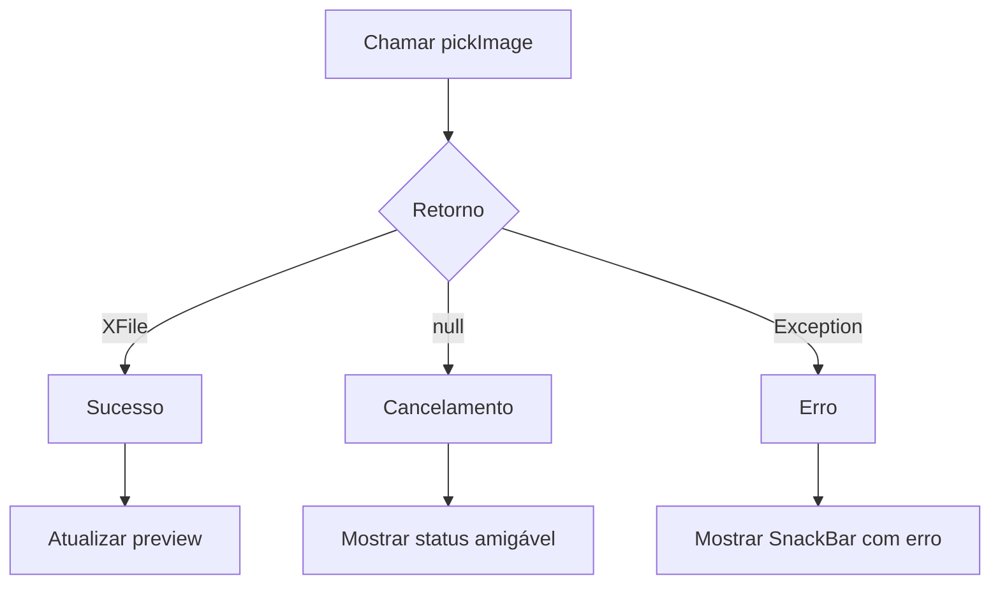

Esse raciocínio continua o que foi visto na Aula 09: antes o app precisava
entender `200`, `201`, `400` e `500`. Agora ele precisa entender `XFile`, `null`
e exceção.

---

## 9. Ajustes para iOS e observações de plataforma

Se você estiver criando um app que será testado em iPhone, confira o arquivo:

```text
ios/Runner/Info.plist
```

O pacote `image_picker` documenta chaves de privacidade para explicar por que o
app usa fotos e câmera. Exemplos de textos:

```xml
<key>NSPhotoLibraryUsageDescription</key>
<string>Este app permite escolher uma foto para exibir no perfil.</string>
<key>NSCameraUsageDescription</key>
<string>Este app permite tirar uma foto para exibir no perfil.</string>
```

Para Android, neste roteiro básico, o pacote funciona sem configuração manual
obrigatória no `AndroidManifest.xml`. Evite adicionar permissões antigas de
armazenamento sem necessidade. Em Android moderno, a seleção de fotos usa o
seletor do próprio sistema.

Se você alterar arquivos nativos como `AndroidManifest.xml` ou `Info.plist`,
pare o app e rode novamente. Hot Reload não reaplica configuração nativa.

---

## 10. Desafio guiado

Depois que o fluxo principal funcionar, escolha pelo menos um incremento:

1. Mostrar o caminho do arquivo abaixo do preview.
2. Criar um botão **Limpar foto**.
3. Mostrar se a imagem veio da galeria ou da câmera.
4. Trocar o preview vazio por um avatar circular.
5. Impedir captura nova enquanto `_carregando` for `true`.

Exemplo para limpar foto:

```dart
void _limparImagem() {
  setState(() {
    _imagemSelecionada = null;
    _status = 'Imagem removida da tela.';
  });
}
```

Você pode chamar essa função em um terceiro botão.

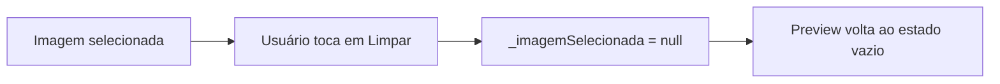

---

## 11. Revisão final da aula

Antes de entregar, explique com suas palavras:

1. Qual é a diferença entre consumir uma API REST e usar um plugin nativo?
2. Por que `pickImage` retorna `XFile?` e não apenas `XFile`?
3. O que significa o retorno `null`?
4. Por que usamos `try/catch`?
5. Por que chamamos `setState` depois de receber a imagem?
6. Por que uma foto capturada pode não estar salva permanentemente?

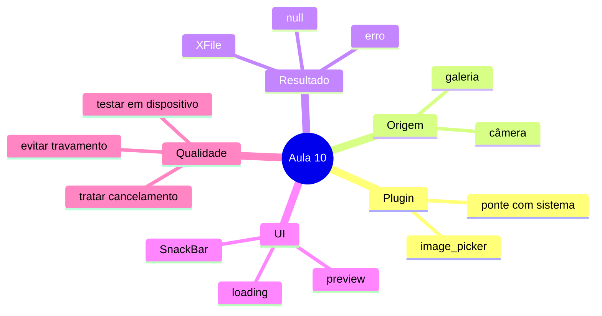

---

## 12. Entrega da aula

A entrega deve ser registrada no Google Forms indicado pelo professor. Não há
arquivo de atividade separado para esta aula.

Entregue evidências de que você concluiu o roteiro:

- link do repositório ou pasta do projeto;
- print do app com imagem selecionada da galeria;
- print do app depois de testar câmera ou registrar erro do emulador;
- resposta curta explicando a diferença entre `ImageSource.gallery` e
  `ImageSource.camera`;
- resposta curta explicando o que acontece quando o usuário cancela a escolha.

### Checklist antes de enviar

- [ ] Projeto Flutter abre sem erro.
- [ ] Pacote `image_picker` instalado.
- [ ] Botão Galeria funcionando.
- [ ] Botão Câmera implementado.
- [ ] Preview aparece quando existe imagem.
- [ ] Cancelamento não quebra o app.
- [ ] Erro mostra feedback claro.
- [ ] Código usa `try/catch`.
- [ ] Código usa `setState` para atualizar a interface.
- [ ] Evidências separadas para galeria e câmera/emulador.

---

## 13. Ponte para a próxima aula

Hoje você usou um plugin para acessar câmera e galeria. Na próxima aula, o mesmo
raciocínio será aplicado a sensores e ciclo de vida: o app vai receber dados do
dispositivo continuamente e precisará reagir quando a tela abrir, pausar,
retomar ou fechar.

O ponto principal é este:

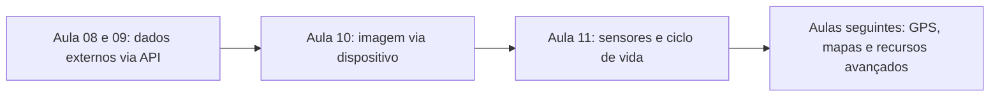

Quanto melhor você tratar estados, erros e feedback hoje, mais fácil será
trabalhar com sensores, GPS e recursos em tempo real depois.
