## Data e contexto

- **Data:** 23/05/2026
- **Duração:** 5 horas-aula (250 min)
- **Horário:** sábado letivo
- **Laboratório:** 6

## Alinhamento com o PTD

- **Habilidades:** 1.1 e 1.5.
- **Bases:** recursos do dispositivo via plugins; sensores; ciclo de vida;
  exceções; logs; tratamento de erros; interface reativa.

---

## Objetivo da aula

Na Aula 10, você aprendeu que o Flutter pode acessar recursos nativos do
aparelho usando plugins. O app não abriu a câmera diretamente com código Dart:
ele pediu ajuda ao `image_picker`, que conversou com Android ou iOS e devolveu
um `XFile?`.

Hoje a ideia continua a mesma, mas com uma complexidade maior. Em vez de pedir
uma imagem uma única vez, o app vai **escutar dados contínuos** do dispositivo.
O acelerômetro envia vários valores por segundo. Esses valores precisam ser
lidos, interpretados e convertidos em interface.

Ao final da aula, você deve conseguir construir uma tela Flutter com:

- leitura do acelerômetro usando `sensors_plus`;
- exibição dos valores `x`, `y` e `z`;
- uma bolha que se move conforme a inclinação do celular;
- mensagem de orientação para o usuário;
- pausa da leitura quando o app vai para segundo plano;
- retomada da leitura quando o app volta para primeiro plano;
- cancelamento correto da assinatura do sensor no `dispose()`.

---

## O que você vai construir hoje

Você vai construir um miniapp chamado **Nível Digital**. Ele simula um nível de
bolha simples: quando o celular inclina, uma bolha se desloca na tela.

Resultado esperado:

- uma `AppBar` com o título da aula;
- um painel com os valores do acelerômetro;
- uma área quadrada representando a superfície do nível;
- uma bolha circular que se move dentro dessa área;
- um texto dizendo se o celular está quase nivelado ou inclinado;
- tratamento de ciclo de vida para evitar leitura desnecessária em background.

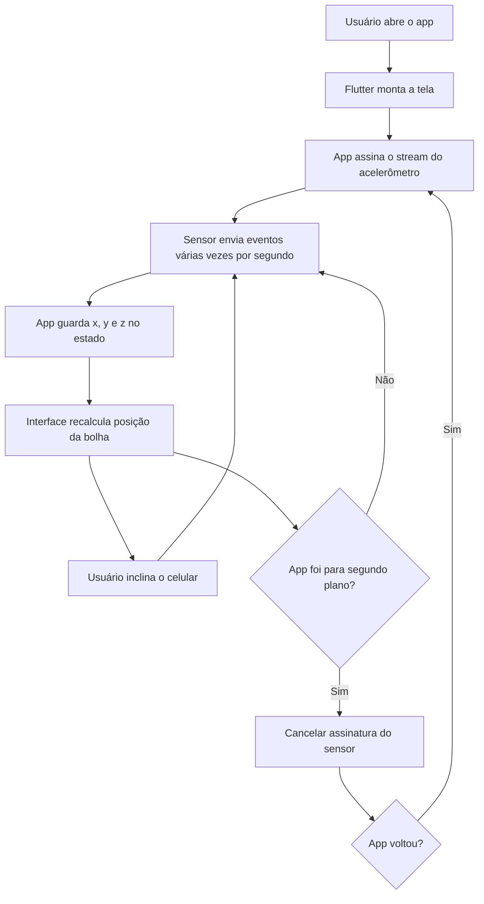

Observe a evolução:

| Aula 10: câmera e galeria            | Aula 11: sensores                         |
| :----------------------------------- | :---------------------------------------- |
| O app pede uma ação ao sistema       | O app escuta dados contínuos do sistema   |
| O resultado vem uma vez como `XFile?` | O resultado vem várias vezes em um stream |
| O usuário pode cancelar              | O usuário pode mexer o aparelho sem parar |
| `setState` atualiza após uma escolha | `setState` atualiza a cada evento útil    |
| O risco principal é erro/permissão   | O risco principal é consumo e vazamento   |

---

## Materiais necessários

Antes de começar, você precisa de:

- projeto Flutter funcionando;
- celular físico com modo desenvolvedor ou emulador com sensores virtuais;
- cabo USB, se for testar em celular Android;
- internet para instalar pacote;
- editor aberto no projeto;
- terminal aberto na raiz do projeto;
- noção de `StatefulWidget`, `setState`, `try/catch` e `dispose()`.

Se o laboratório estiver pesado, prefira testar em celular físico. Sensores em
emulador funcionam melhor quando o Android Studio oferece a tela **Virtual
Sensors**, mas nem sempre essa opção está configurada.

---

## Documentação para consulta

- [Pacote sensors_plus](https://pub.dev/packages/sensors_plus)
- [API do sensors_plus](https://pub.dev/documentation/sensors_plus/latest/sensors_plus/)
- [Flutter - Using packages](https://docs.flutter.dev/packages-and-plugins/using-packages)
- [`StatefulWidget`](https://api.flutter.dev/flutter/widgets/StatefulWidget-class.html)
- [`StreamSubscription`](https://api.dart.dev/stable/dart-async/StreamSubscription-class.html)
- [`WidgetsBindingObserver`](https://api.flutter.dev/flutter/widgets/WidgetsBindingObserver-class.html)
- [`AppLifecycleState`](https://api.flutter.dev/flutter/dart-ui/AppLifecycleState.html)

---

## Mapa rápido da aula

Siga a aula nesta ordem:

1. Retomar a ponte entre Flutter, plugin e recurso nativo.
2. Entender o que é um sensor e o que é um stream.
3. Instalar o pacote `sensors_plus`.
4. Ler os valores do acelerômetro.
5. Mostrar os valores na interface.
6. Converter valores em movimento visual.
7. Controlar a assinatura do sensor no ciclo de vida.
8. Testar no celular ou no emulador.
9. Revisar o checklist de entrega.

---

## 1. Conceitos antes do código

### 1.1 O que muda da câmera para o sensor?

Na Aula 10, o fluxo tinha começo, meio e fim: o usuário tocava em um botão, o
sistema abria a câmera ou galeria e o app recebia uma resposta.

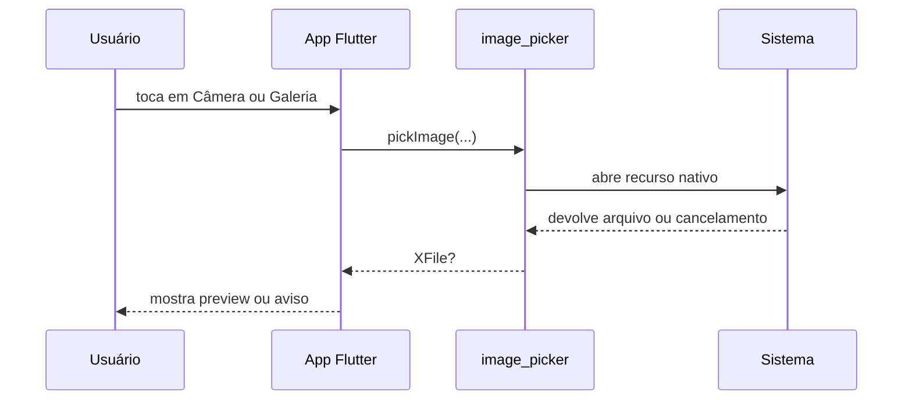

Sensores são diferentes. O usuário não toca em um botão para receber uma única
resposta. O aparelho envia leituras continuamente enquanto o app estiver
ouvindo.

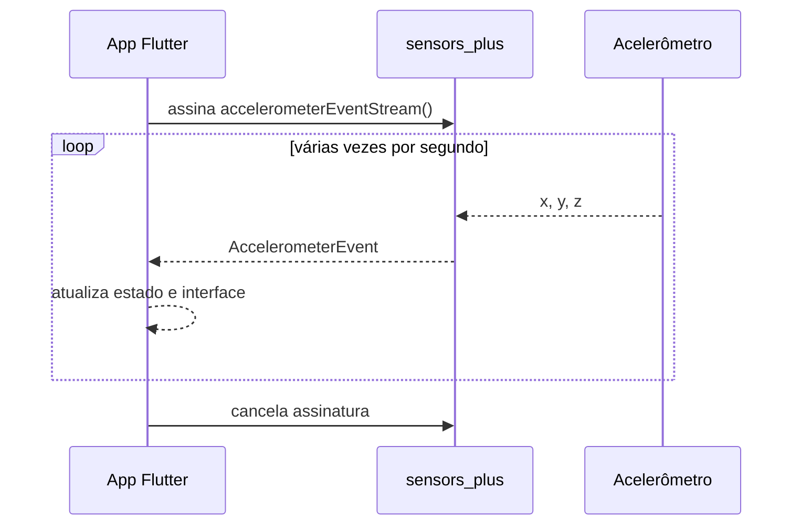

Essa diferença é importante porque dados contínuos exigem mais cuidado. Se o
app continuar lendo o sensor quando a tela não precisa mais dele, ele desperdiça
bateria e pode manter objetos vivos sem necessidade.

### 1.2 O que é acelerômetro?

O acelerômetro mede aceleração nos eixos `x`, `y` e `z`. Em termos práticos,
para esta aula, você pode pensar nele como um sensor que ajuda o app a perceber
inclinação e movimento.

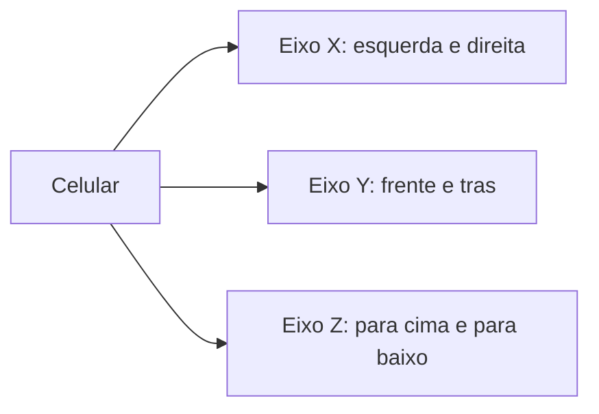

Quando o celular está parado sobre a mesa, ainda existe leitura porque a
gravidade influencia o sensor. Por isso os valores não ficam todos em zero. O
objetivo da aula não é fazer física avançada, mas entender como transformar
leituras reais em uma interface útil.

### 1.3 O que é um stream?

Um `Future` representa uma resposta que chegará uma vez. Um `Stream` representa
uma sequência de respostas ao longo do tempo.

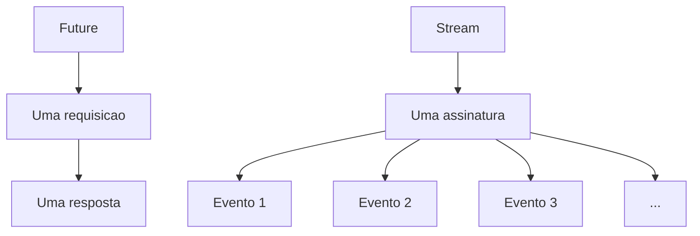

Na Aula 09, `http.get` retornava um `Future`. Na Aula 11, o acelerômetro retorna
um `Stream`. Isso muda a forma de pensar:

- `Future`: "me avise quando terminar";
- `Stream`: "me avise toda vez que chegar um novo dado".

### 1.4 O que é uma assinatura?

Quando você chama `.listen(...)` em um stream, cria uma assinatura
(`StreamSubscription`). Essa assinatura é como dizer: "quero receber os eventos
desse sensor".

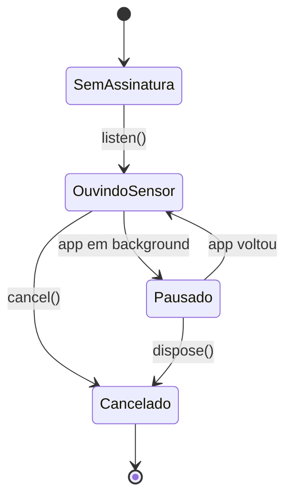

Se você cria uma assinatura, também precisa saber quando cancelá-la. Esse é o
papel do `dispose()` e do controle de ciclo de vida.

### 1.5 O que é ciclo de vida do app?

O app muda de estado conforme o usuário alterna entre aplicativos, bloqueia a
tela ou volta para a aplicação.

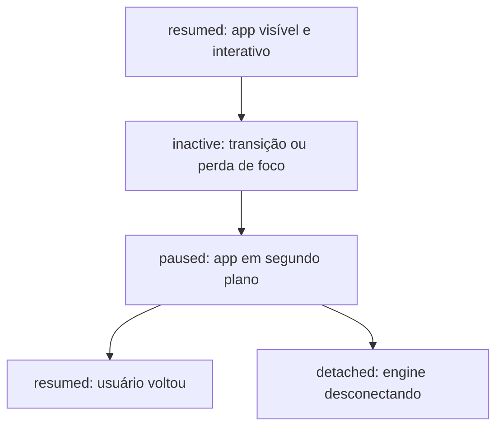

Para a aula de hoje, a regra prática será:

- se o app está `resumed`, pode ler o sensor;
- se o app está `inactive`, `paused`, `hidden` ou `detached`, pare a leitura;
- ao destruir a tela, cancele tudo no `dispose()`.

---

## 2. Preparar o projeto

Abra o terminal na raiz do seu projeto Flutter e instale o pacote:

```bash
flutter pub add sensors_plus
```

Depois confira se o pacote entrou no `pubspec.yaml`:

```yaml
dependencies:
  flutter:
    sdk: flutter
  sensors_plus: ^7.0.0
```

O número exato da versão pode mudar. O importante é que `sensors_plus` apareça
em `dependencies`.

Se estiver desenvolvendo para iOS, confira também a configuração
`NSMotionUsageDescription` no `Info.plist`. Sem essa justificativa de uso, o app
pode falhar ao acessar dados de movimento em aparelhos Apple.

Execute o app para verificar se o projeto ainda compila:

```bash
flutter run
```

Se aparecer erro de ambiente, resolva antes de continuar. Não avance para o
código do sensor com o projeto quebrado.

---

## 3. Criar a tela da aula

Você pode usar o projeto da aula anterior ou criar uma tela nova no `main.dart`.
Para simplificar, esta aula usa um arquivo único. Substitua o conteúdo do
`lib/main.dart` pelo código abaixo.

Leia primeiro a estrutura geral:

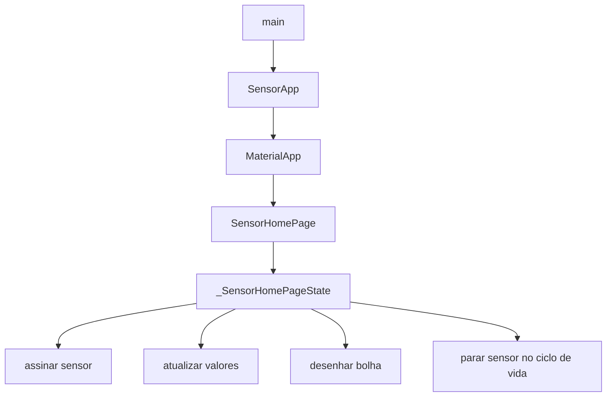

Agora implemente:

```dart
import 'dart:async';
import 'dart:math' as math;

import 'package:flutter/material.dart';
import 'package:sensors_plus/sensors_plus.dart';

void main() {
  runApp(const SensorApp());
}

class SensorApp extends StatelessWidget {
  const SensorApp({super.key});

  @override
  Widget build(BuildContext context) {
    return MaterialApp(
      debugShowCheckedModeBanner: false,
      title: 'Aula 11 - Sensores',
      theme: ThemeData(
        colorScheme: ColorScheme.fromSeed(seedColor: Colors.teal),
        useMaterial3: true,
      ),
      home: const SensorHomePage(),
    );
  }
}

class SensorHomePage extends StatefulWidget {
  const SensorHomePage({super.key});

  @override
  State<SensorHomePage> createState() => _SensorHomePageState();
}

class _SensorHomePageState extends State<SensorHomePage>
    with WidgetsBindingObserver {
  StreamSubscription<AccelerometerEvent>? _subscription;

  double _x = 0;
  double _y = 0;
  double _z = 0;
  bool _isListening = false;
  String _status = 'Aguardando leitura do acelerômetro...';

  @override
  void initState() {
    super.initState();
    WidgetsBinding.instance.addObserver(this);
    _startSensor();
  }

  void _startSensor() {
    if (_isListening) {
      return;
    }

    _subscription = accelerometerEventStream(
      samplingPeriod: SensorInterval.normalInterval,
    ).listen(
      (event) {
        if (!mounted) {
          return;
        }

        setState(() {
          _x = event.x;
          _y = event.y;
          _z = event.z;
          _status = _buildStatusMessage(event.x, event.y);
        });
      },
      onError: (error) {
        if (!mounted) {
          return;
        }

        setState(() {
          _status = 'Não foi possível ler o acelerômetro: $error';
        });
      },
    );

    setState(() {
      _isListening = true;
      _status = 'Lendo o acelerômetro...';
    });
  }

  Future<void> _stopSensor() async {
    await _subscription?.cancel();
    _subscription = null;

    if (!mounted) {
      return;
    }

    setState(() {
      _isListening = false;
      _status = 'Leitura pausada.';
    });
  }

  String _buildStatusMessage(double x, double y) {
    final horizontalTilt = x.abs();
    final verticalTilt = y.abs();

    if (horizontalTilt < 1.2 && verticalTilt < 1.2) {
      return 'Quase nivelado. Tente manter a bolha no centro.';
    }

    if (horizontalTilt > verticalTilt) {
      return x > 0
          ? 'Inclinado para a esquerda.'
          : 'Inclinado para a direita.';
    }

    return y > 0
        ? 'Inclinado para baixo.'
        : 'Inclinado para cima.';
  }

  @override
  void didChangeAppLifecycleState(AppLifecycleState state) {
    if (state == AppLifecycleState.resumed) {
      _startSensor();
      return;
    }

    _stopSensor();
  }

  @override
  void dispose() {
    WidgetsBinding.instance.removeObserver(this);
    _subscription?.cancel();
    super.dispose();
  }

  @override
  Widget build(BuildContext context) {
    return Scaffold(
      appBar: AppBar(
        title: const Text('Aula 11 - Nível Digital'),
      ),
      body: SafeArea(
        child: Padding(
          padding: const EdgeInsets.all(16),
          child: Column(
            crossAxisAlignment: CrossAxisAlignment.stretch,
            children: [
              _SensorValuesCard(
                x: _x,
                y: _y,
                z: _z,
                isListening: _isListening,
              ),
              const SizedBox(height: 16),
              Expanded(
                child: _BubbleLevel(
                  x: _x,
                  y: _y,
                ),
              ),
              const SizedBox(height: 16),
              Text(
                _status,
                textAlign: TextAlign.center,
                style: Theme.of(context).textTheme.titleMedium,
              ),
              const SizedBox(height: 12),
              FilledButton.icon(
                onPressed: _isListening ? _stopSensor : _startSensor,
                icon: Icon(_isListening ? Icons.pause : Icons.play_arrow),
                label: Text(_isListening ? 'Pausar leitura' : 'Retomar leitura'),
              ),
            ],
          ),
        ),
      ),
    );
  }
}

class _SensorValuesCard extends StatelessWidget {
  const _SensorValuesCard({
    required this.x,
    required this.y,
    required this.z,
    required this.isListening,
  });

  final double x;
  final double y;
  final double z;
  final bool isListening;

  @override
  Widget build(BuildContext context) {
    return Card(
      child: Padding(
        padding: const EdgeInsets.all(16),
        child: Column(
          crossAxisAlignment: CrossAxisAlignment.start,
          children: [
            Row(
              children: [
                Icon(
                  isListening ? Icons.sensors : Icons.sensors_off,
                  color: isListening ? Colors.teal : Colors.grey,
                ),
                const SizedBox(width: 8),
                Text(
                  isListening ? 'Sensor ativo' : 'Sensor pausado',
                  style: Theme.of(context).textTheme.titleMedium,
                ),
              ],
            ),
            const SizedBox(height: 12),
            Text('x: ${x.toStringAsFixed(2)}'),
            Text('y: ${y.toStringAsFixed(2)}'),
            Text('z: ${z.toStringAsFixed(2)}'),
          ],
        ),
      ),
    );
  }
}

class _BubbleLevel extends StatelessWidget {
  const _BubbleLevel({
    required this.x,
    required this.y,
  });

  final double x;
  final double y;

  @override
  Widget build(BuildContext context) {
    return LayoutBuilder(
      builder: (context, constraints) {
        final size = math.min(constraints.maxWidth, constraints.maxHeight);
        const bubbleSize = 48.0;
        final limit = (size - bubbleSize) / 2;

        final normalizedX = (x / 9.8).clamp(-1.0, 1.0);
        final normalizedY = (y / 9.8).clamp(-1.0, 1.0);

        final center = limit;
        final left = center + (normalizedX * limit);
        final top = center + (normalizedY * limit);

        return Center(
          child: Container(
            width: size,
            height: size,
            decoration: BoxDecoration(
              color: Colors.teal.shade50,
              border: Border.all(color: Colors.teal, width: 2),
              borderRadius: BorderRadius.circular(16),
            ),
            child: Stack(
              children: [
                const Center(
                  child: Icon(
                    Icons.add,
                    size: 72,
                    color: Colors.teal,
                  ),
                ),
                Positioned(
                  left: left,
                  top: top,
                  child: Container(
                    width: bubbleSize,
                    height: bubbleSize,
                    decoration: BoxDecoration(
                      color: Colors.orange,
                      shape: BoxShape.circle,
                      border: Border.all(color: Colors.deepOrange, width: 2),
                    ),
                  ),
                ),
              ],
            ),
          ),
        );
      },
    );
  }
}
```

---

## 4. Entender o código por partes

### 4.1 Importações

```dart
import 'dart:async';
import 'dart:math' as math;

import 'package:flutter/material.dart';
import 'package:sensors_plus/sensors_plus.dart';
```

`dart:async` fornece `StreamSubscription`. Sem isso, o app não consegue guardar
a assinatura do sensor para cancelar depois.

`dart:math` aparece como `math` para usar `math.min`. Isso ajuda a manter a área
do nível sempre quadrada, mesmo em telas diferentes.

`sensors_plus` fornece `accelerometerEventStream`, `SensorInterval` e
`AccelerometerEvent`.

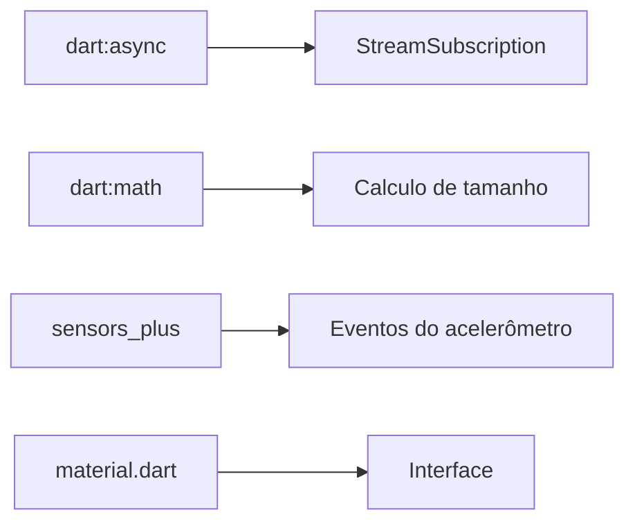

### 4.2 Estado da tela

```dart
StreamSubscription<AccelerometerEvent>? _subscription;

double _x = 0;
double _y = 0;
double _z = 0;
bool _isListening = false;
String _status = 'Aguardando leitura do acelerômetro...';
```

Essas variáveis guardam o estado atual da tela:

- `_subscription`: assinatura ativa do sensor, se existir;
- `_x`, `_y`, `_z`: últimos valores recebidos;
- `_isListening`: indica se o app está ouvindo o sensor;
- `_status`: mensagem amigável para o usuário.

O `?` em `StreamSubscription<AccelerometerEvent>?` significa que a assinatura
pode ser nula. Ela começa nula, vira uma assinatura real quando o app chama
`listen` e volta a ser nula quando o app cancela a leitura.

### 4.3 Início da tela

```dart
@override
void initState() {
  super.initState();
  WidgetsBinding.instance.addObserver(this);
  _startSensor();
}
```

`initState()` roda uma vez quando a tela é criada. Aqui acontecem duas coisas:

1. a tela se registra como observadora do ciclo de vida;
2. a leitura do sensor começa.

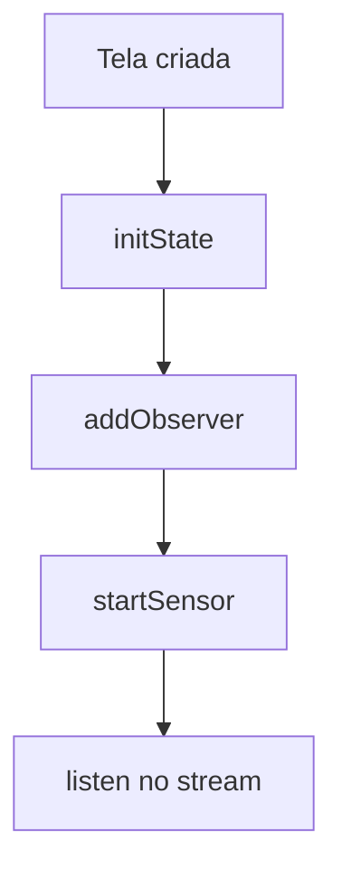

### 4.4 Assinar o stream do acelerômetro

```dart
_subscription = accelerometerEventStream(
  samplingPeriod: SensorInterval.normalInterval,
).listen(
  (event) {
    if (!mounted) {
      return;
    }

    setState(() {
      _x = event.x;
      _y = event.y;
      _z = event.z;
      _status = _buildStatusMessage(event.x, event.y);
    });
  },
);
```

`accelerometerEventStream(...)` cria um stream de eventos do acelerômetro.
`.listen(...)` diz o que o app fará a cada evento.

O `mounted` evita atualizar uma tela que já saiu da árvore de widgets. Essa
proteção é parecida com cuidados que você já usou em chamadas assíncronas: antes
de mexer na interface, confirme se a tela ainda existe.

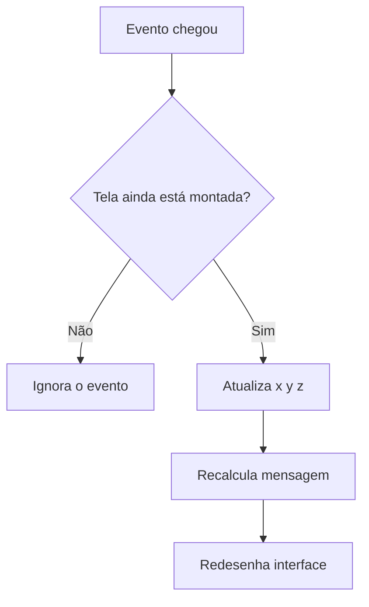

### 4.5 Cancelar a assinatura

```dart
Future<void> _stopSensor() async {
  await _subscription?.cancel();
  _subscription = null;
  ...
}
```

Cancelar a assinatura é obrigatório quando a tela não precisa mais receber
eventos. Sem isso, o app pode continuar gastando recursos e tentando atualizar
uma tela que não deveria mais mudar.

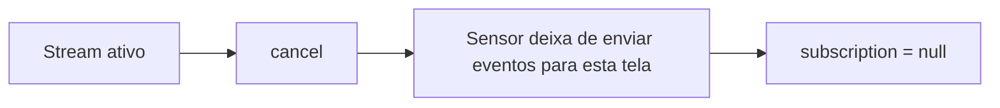

### 4.6 Ciclo de vida

```dart
@override
void didChangeAppLifecycleState(AppLifecycleState state) {
  if (state == AppLifecycleState.resumed) {
    _startSensor();
    return;
  }

  _stopSensor();
}
```

Quando o app volta para primeiro plano (`resumed`), a leitura recomeça. Em
qualquer outro estado, a leitura é pausada.

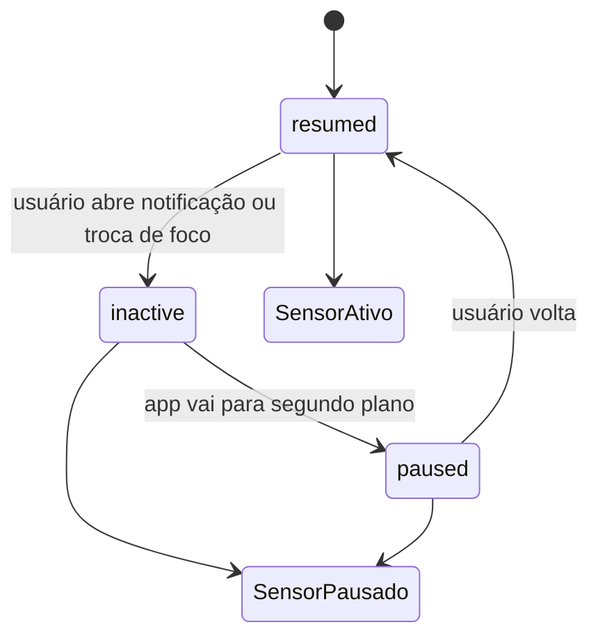

Essa regra é simples e segura para a aula. Em apps reais, a decisão pode variar:
um app de corrida talvez continue coletando localização em background, mas um
nível de bolha não precisa ler sensor quando o usuário nem está olhando para a
tela.

### 4.7 `dispose()`

```dart
@override
void dispose() {
  WidgetsBinding.instance.removeObserver(this);
  _subscription?.cancel();
  super.dispose();
}
```

`dispose()` é o último momento da tela. Tudo que a tela abriu deve ser fechado:
observer, assinatura de stream, controller, timer ou qualquer recurso semelhante.

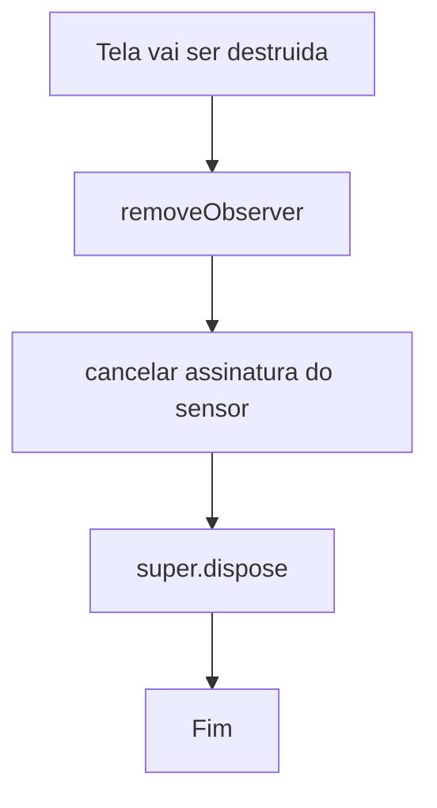

---

## 5. Como a bolha se move

A interface recebe valores reais do acelerômetro. Esses valores podem ser
positivos, negativos e variar conforme o aparelho. Para desenhar a bolha, o app
precisa transformar esses valores em coordenadas dentro de um quadrado.

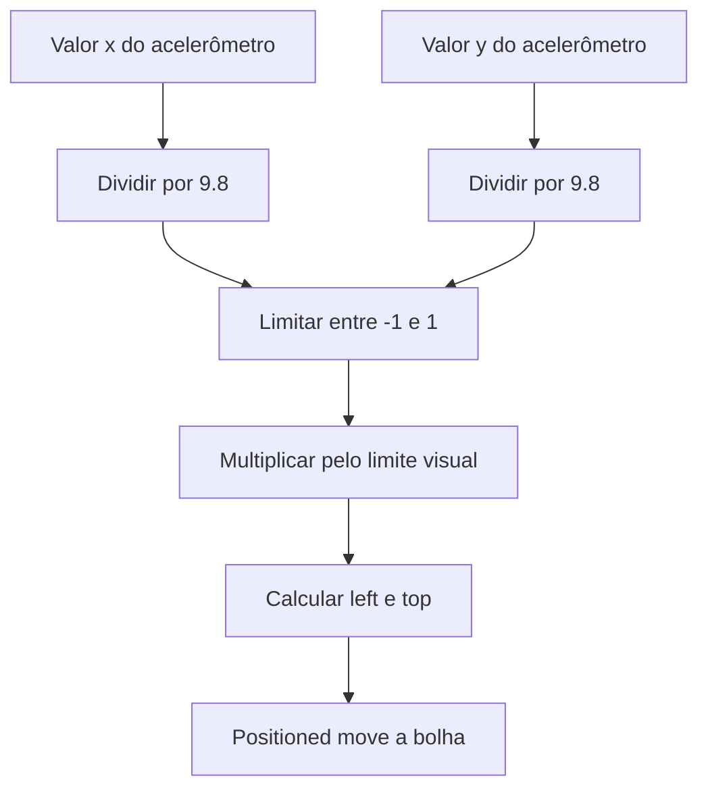

O valor `9.8` aparece porque a gravidade na Terra é aproximadamente
`9.8 m/s²`. Para esta aula, ele serve como referência prática para normalizar a
inclinação.

```dart
final normalizedX = (x / 9.8).clamp(-1.0, 1.0);
final normalizedY = (y / 9.8).clamp(-1.0, 1.0);
```

`clamp(-1.0, 1.0)` impede que a bolha saia da área visual. Mesmo que o sensor
registre um movimento brusco, o desenho fica limitado ao quadrado.

---

## 6. Checkpoints durante a implementação

Use esta lista para conferir seu progresso antes de pedir ajuda.

### Checkpoint 1: pacote instalado

O projeto deve reconhecer esta importação:

```dart
import 'package:sensors_plus/sensors_plus.dart';
```

Se o editor sublinhar `sensors_plus` em vermelho, rode:

```bash
flutter pub get
```

### Checkpoint 2: app abre sem sensor visual

Antes de testar movimento, o app precisa abrir a tela com:

- `AppBar`;
- card de valores;
- área quadrada do nível;
- botão de pausar/retomar.

### Checkpoint 3: valores mudam

Mexa o celular devagar. Os valores `x`, `y` e `z` devem mudar.

Se estiver no emulador, procure a opção de sensores virtuais. Em alguns
ambientes, os valores ficam parados porque o emulador não está simulando
inclinação.

### Checkpoint 4: bolha se move

Ao inclinar o celular, a bolha deve se deslocar. Ela não precisa ficar perfeita
como um app profissional de nível. O objetivo é provar que você transformou
leitura de sensor em interface.

### Checkpoint 5: pausa funciona

Toque em **Pausar leitura**. Os valores devem parar de mudar e o ícone deve
indicar sensor pausado.

Depois toque em **Retomar leitura** e teste novamente.

---

## 7. Erros comuns e como resolver

### 7.1 `Target of URI doesn't exist: package:sensors_plus`

O pacote não foi instalado ou o `pub get` não rodou.

Resolva com:

```bash
flutter pub add sensors_plus
flutter pub get
```

### 7.2 A tela abre, mas os valores não mudam

Possíveis causas:

- você está usando emulador sem sensor virtual configurado;
- o app não tem acesso ao sensor no ambiente atual;
- a assinatura foi pausada;
- o hot reload deixou o estado estranho.

Tente:

```bash
flutter clean
flutter pub get
flutter run
```

Se possível, teste em celular físico.

### 7.3 Erro depois de sair da tela

Verifique se você manteve:

```dart
WidgetsBinding.instance.removeObserver(this);
_subscription?.cancel();
```

Essas linhas devem estar no `dispose()`.

### 7.4 Bolha sai da tela

Confirme se o cálculo usa `clamp`:

```dart
final normalizedX = (x / 9.8).clamp(-1.0, 1.0);
final normalizedY = (y / 9.8).clamp(-1.0, 1.0);
```

Sem `clamp`, uma leitura alta pode gerar uma posição fora do quadrado.

### 7.5 Atualização visual tremendo demais

Sensores podem enviar pequenas variações mesmo com o celular quase parado. Isso
é normal. Para reduzir tremulação, você pode arredondar valores ou ignorar
movimentos muito pequenos.

Exemplo de arredondamento:

```dart
double roundSensorValue(double value) {
  return double.parse(value.toStringAsFixed(2));
}
```

Use esse ajuste apenas depois que a versão principal estiver funcionando.

---

## 8. Desafio orientado

Depois que o nível digital básico funcionar, escolha **um** incremento:

1. Mudar a cor da bolha quando o aparelho estiver quase nivelado.
2. Mostrar uma porcentagem de inclinação.
3. Adicionar um contador de movimentos bruscos.
4. Criar um botão para zerar/calibrar a posição atual.

Não tente fazer todos ao mesmo tempo. Escolha um, implemente, teste e só depois
pense no próximo.

### Exemplo: cor da bolha por estado

A regra pode ser:

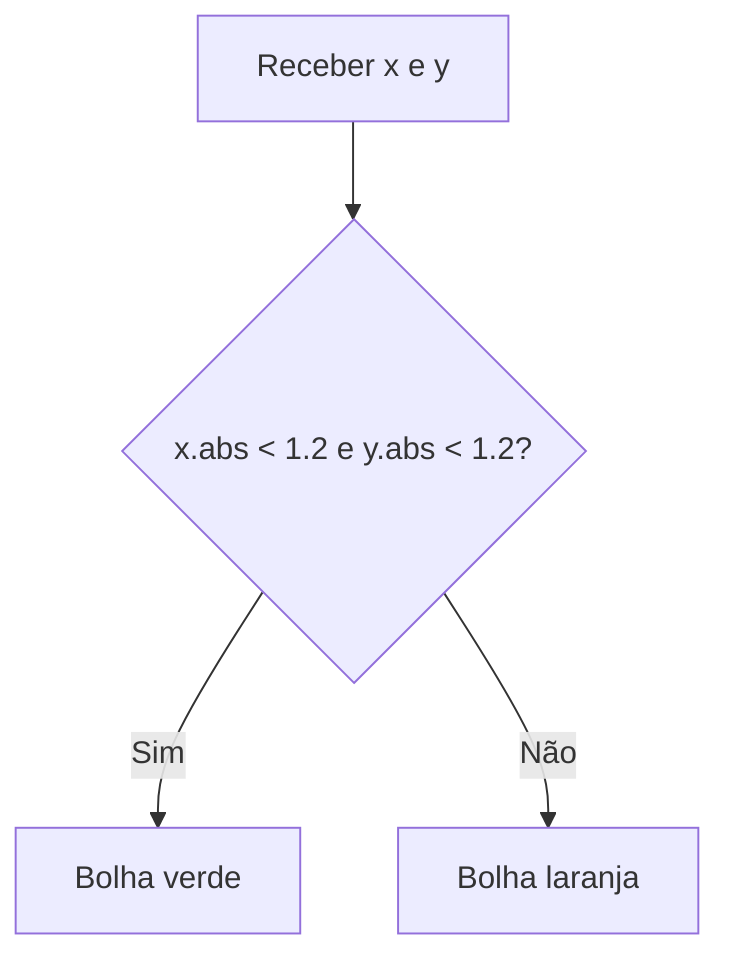

Para implementar, você pode calcular uma variável dentro do `_BubbleLevel`:

```dart
final isNearCenter = x.abs() < 1.2 && y.abs() < 1.2;
final bubbleColor = isNearCenter ? Colors.green : Colors.orange;
```

Depois troque:

```dart
color: Colors.orange,
```

por:

```dart
color: bubbleColor,
```

---

## 9. Revisão final do fluxo

Antes de entregar, explique o fluxo completo com suas palavras:

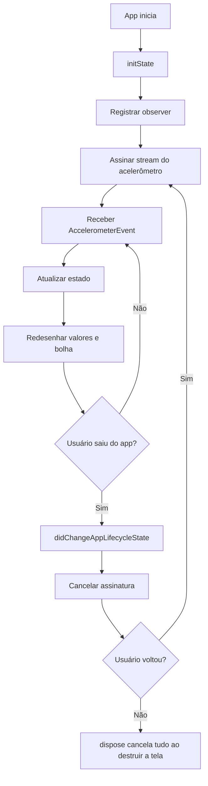

Se você consegue explicar esse diagrama, você entendeu o ponto principal da
aula: um app mobile não é apenas tela. Ele também conversa com recursos do
dispositivo e precisa respeitar o ciclo de vida.

---

## 10. Checklist de entrega

Antes de responder ao formulário indicado pelo professor, confirme:

- o projeto compila;
- `sensors_plus` está no `pubspec.yaml`;
- a tela mostra `x`, `y` e `z`;
- a bolha se move quando o celular inclina;
- o botão de pausar/retomar funciona;
- `dispose()` cancela a assinatura;
- `didChangeAppLifecycleState` pausa e retoma a leitura;
- você fez pelo menos um commit com a aula;
- você tem uma evidência: print, vídeo curto ou link do repositório.

Sugestão de commit:

```bash
git add .
git commit -m "Implementa aula 11 com sensores e ciclo de vida"
```

---

## 11. Perguntas para consolidar

Responda no seu caderno ou no formulário indicado pelo professor:

1. Qual é a diferença entre `Future` e `Stream`?
2. Por que a assinatura do sensor precisa ser cancelada?
3. O que pode acontecer se o app continuar lendo sensores em segundo plano sem
   necessidade?
4. Qual é a diferença entre usar câmera na Aula 10 e acelerômetro na Aula 11?
5. O que o método `dispose()` deve encerrar nesta aula?

---

## Fechamento

Nesta aula, você saiu de um recurso nativo acionado por botão, como câmera e
galeria, para um recurso nativo contínuo, como o acelerômetro. A complexidade
aumentou porque agora o app precisa lidar com fluxo de eventos, atualização
constante da interface e ciclo de vida.

Na próxima aula, essa ideia continua com localização: o app também receberá
dados do dispositivo, mas agora com permissões mais sensíveis, coordenadas
geográficas e decisões de privacidade mais importantes.

**Material elaborado para o curso de PAM2 - 2026**
