## Data e contexto

- **Data:** 27/05/2026
- **Duração:** 5 horas-aula (250 min)
- **Horário:** 18h45 às 23h10 (considerando 15 min de intervalo)
- **Laboratório:** 6

## Alinhamento com o PTD

- **Habilidades:** 1.1 e 1.5.
- **Bases:** recursos do dispositivo via plugins; localização; GPS;
  permissões; tratamento de erros; interface reativa; acompanhamento em tempo
  real.

---

## Objetivo da noite

Na Aula 11, você aprendeu que alguns recursos do dispositivo não devolvem uma
resposta única. O acelerômetro envia eventos continuamente por um `Stream`, e o
app precisa assinar, usar e cancelar essa leitura no momento certo.

Hoje a ideia continua, mas com uma camada a mais de responsabilidade: o app vai
ler a **localização do aparelho**. Localização também pode ser lida uma vez ou
acompanhada em tempo real, mas envolve permissões mais sensíveis, serviço do
sistema ligado, privacidade e consumo de bateria.

Ao final da aula, você deve conseguir construir uma tela Flutter com:

- verificação se o serviço de localização está ligado;
- solicitação de permissão de localização em tempo de execução;
- leitura da posição atual com latitude, longitude e precisão;
- link textual para abrir as coordenadas em um mapa;
- tracking em tempo real usando `getPositionStream`;
- cálculo simples de distância percorrida;
- parada correta do tracking quando o app sai de primeiro plano;
- mensagens claras para erro, permissão negada e permissão negada para sempre.

---

## O que você vai construir hoje

Você vai construir um miniapp chamado **Onde Estou Agora**. Ele mostra a posição
atual do dispositivo e permite iniciar um acompanhamento simples de deslocamento.

Resultado esperado:

- uma `AppBar` com o título da aula;
- um painel de status da permissão e do serviço de localização;
- um botão para obter a posição atual;
- latitude, longitude e precisão exibidas na tela;
- um link em texto para abrir a posição no Google Maps;
- um botão para iniciar/parar tracking;
- distância aproximada acumulada enquanto o tracking está ativo;
- tratamento de ciclo de vida para parar a escuta em background.

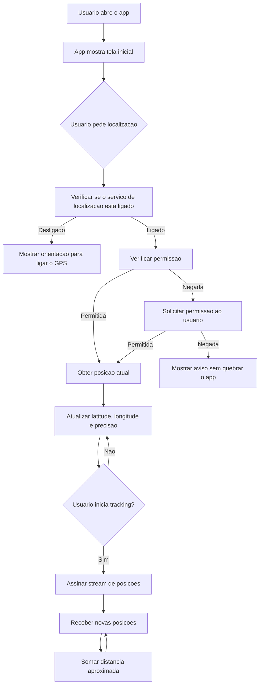

Observe a continuidade:

| Aula 11: acelerômetro                    | Aula 12: localização                         |
| :--------------------------------------- | :------------------------------------------- |
| Lê eventos contínuos do sensor           | Lê posição atual ou fluxo contínuo de posição |
| Usa `StreamSubscription`                 | Usa `StreamSubscription<Position>`            |
| Precisa cancelar assinatura no `dispose` | Precisa cancelar tracking no `dispose`        |
| Preocupação principal: consumo           | Consumo + privacidade + permissão sensível    |
| Dado muda com inclinação                 | Dado muda com deslocamento e precisão do GPS  |

---

## Materiais necessários

Antes de começar, você precisa de:

- projeto Flutter funcionando;
- celular físico Android ou emulador com localização simulada;
- internet para instalar pacote;
- editor aberto no projeto;
- terminal aberto na raiz do projeto;
- noção de `StatefulWidget`, `setState`, `async/await`, `try/catch`,
  `dispose()` e `StreamSubscription`.

Em sala, o GPS pode oscilar dentro do laboratório. Se estiver testando no
emulador, use a ferramenta de localização simulada do Android Emulator. Se
estiver testando em celular físico, confira se a localização do aparelho está
ligada nas configurações do sistema.

---

## Documentação para consulta

- [Pacote geolocator](https://pub.dev/packages/geolocator)
- [API do geolocator](https://pub.dev/documentation/geolocator/latest/geolocator/)
- [Flutter - Using packages](https://docs.flutter.dev/packages-and-plugins/using-packages)
- [`StreamSubscription`](https://api.dart.dev/stable/dart-async/StreamSubscription-class.html)
- [`AppLifecycleState`](https://api.flutter.dev/flutter/dart-ui/AppLifecycleState.html)

---

## Mapa rápido da aula

Siga a aula nesta ordem:

1. Entender a diferença entre posição atual e tracking.
2. Entender o fluxo correto de serviço + permissão + leitura.
3. Instalar o pacote `geolocator`.
4. Configurar permissões no Android e no iOS.
5. Criar a função que determina a posição atual.
6. Mostrar latitude, longitude, precisão e link de mapa.
7. Assinar o stream de posição para tracking.
8. Calcular distância aproximada entre leituras.
9. Parar o tracking no ciclo de vida e no `dispose()`.
10. Revisar o checklist de entrega.

---

## 1. Conceitos antes do código

### 1.1 Localização não é apenas GPS

No dia a dia, chamamos tudo de GPS, mas o aparelho pode combinar várias fontes
para estimar a posição:

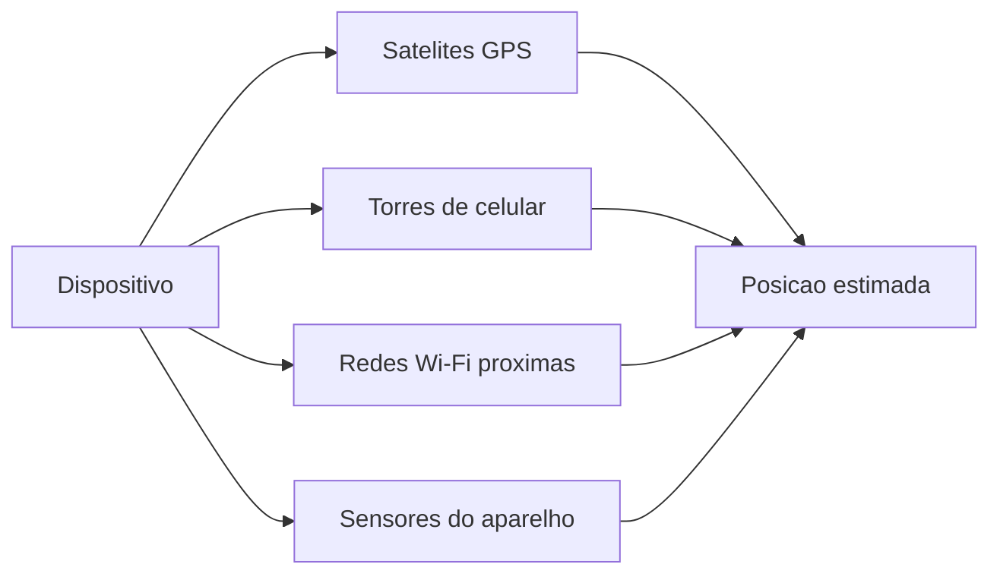

Por isso a localização tem **precisão**. O app pode receber uma latitude e uma
longitude, mas também recebe uma estimativa de erro em metros. Uma precisão de
`8 m` é muito diferente de uma precisão de `1500 m`.

Nesta aula, você não precisa transformar coordenadas em endereço. O foco é
entender o fluxo de localização, permissão e tracking. A próxima aula usa essas
coordenadas como base para mapas e marcadores.

### 1.2 Posição atual vs tracking

Existem dois usos comuns de localização:

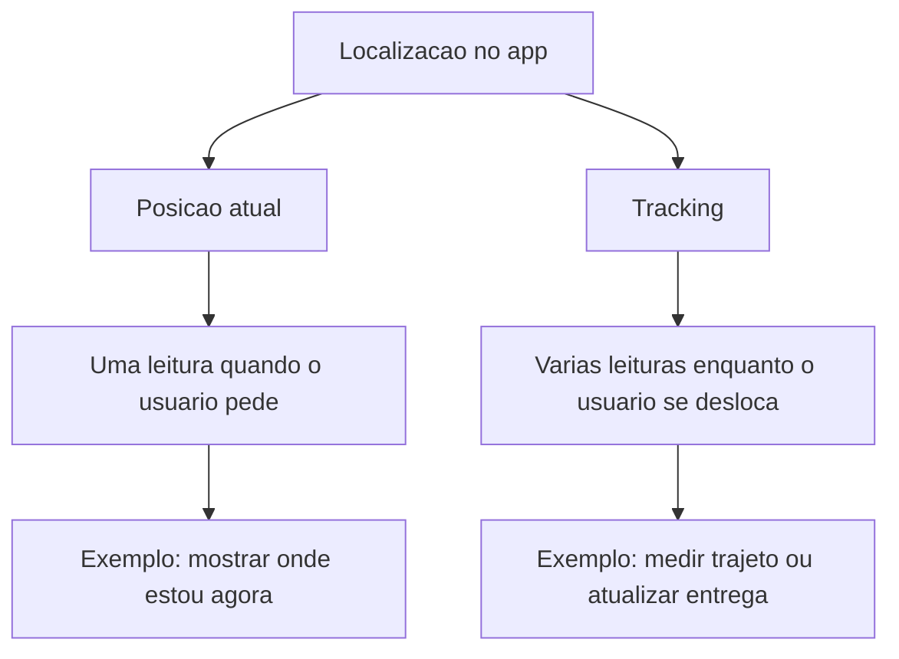

**Posição atual** é parecida com um `Future`: o app pede uma leitura e espera uma
resposta. **Tracking** é parecido com a Aula 11: o app assina um `Stream` e
recebe novas posições ao longo do tempo.

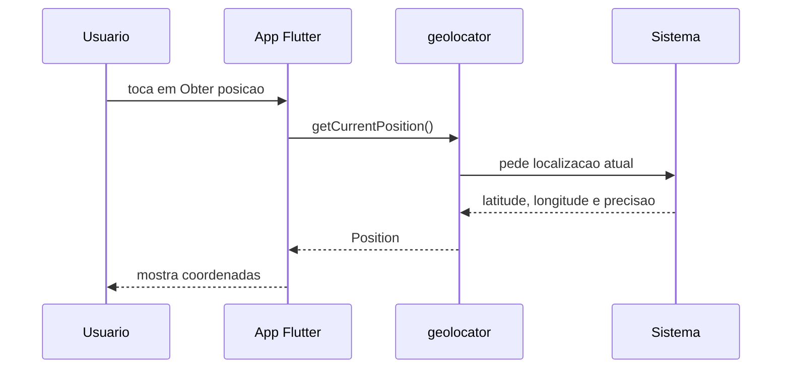

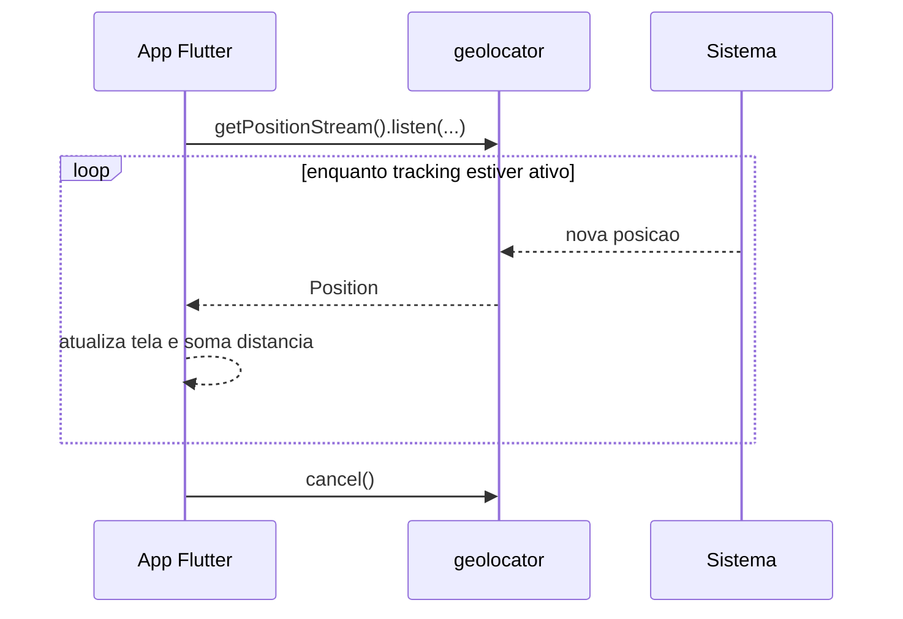

### 1.3 Permissão tem estados

O app não deve pedir localização sem motivo. O usuário precisa entender por que
o app quer esse dado. Além disso, permissão não é apenas "sim" ou "não".

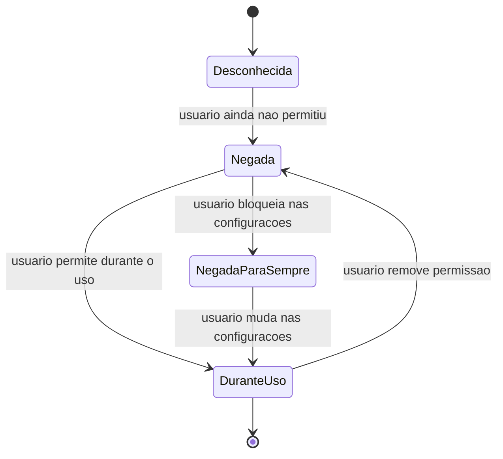

Para a aula, a regra prática será:

- se o serviço de localização estiver desligado, o app orienta o usuário;
- se a permissão estiver negada, o app solicita permissão;
- se estiver negada para sempre, o app explica que a mudança deve ser feita nas
  configurações do sistema;
- se estiver permitida, o app pode ler a posição.

### 1.4 Privacidade e bateria fazem parte do código

Localização é um dado sensível. Um app bem feito pede apenas o necessário,
explica o motivo e para a leitura quando ela não é mais útil.

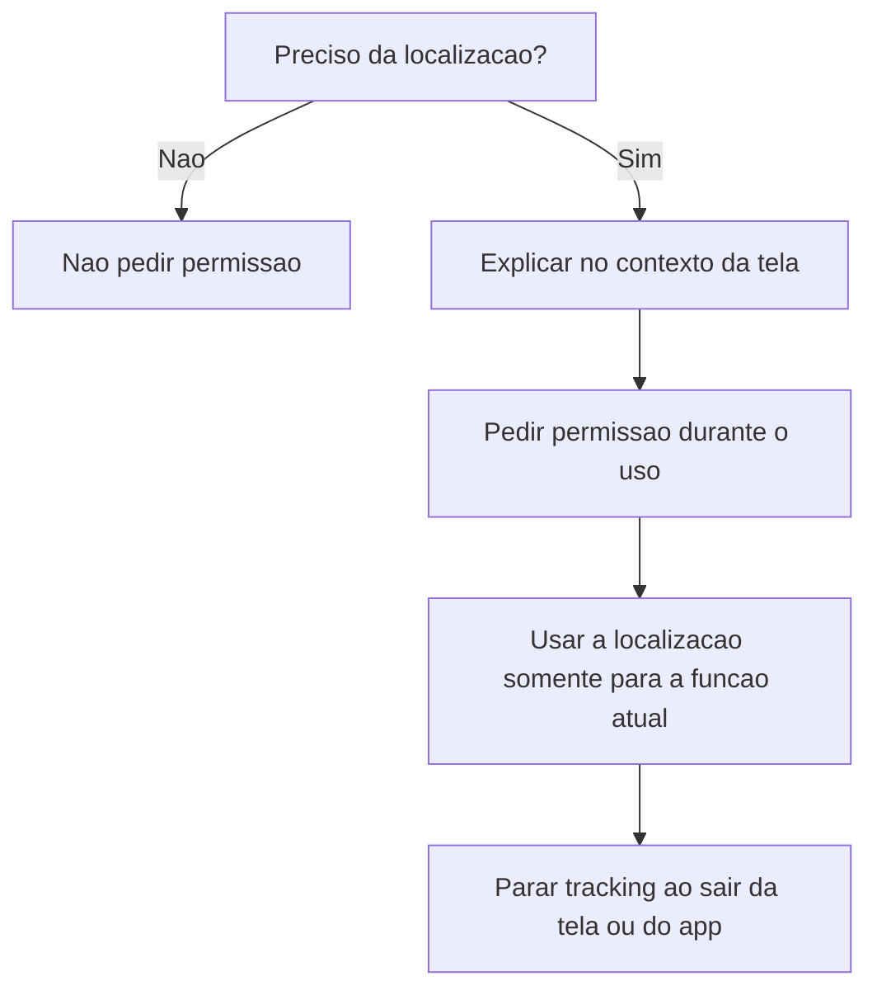

Nesta aula, o app usa localização **durante o uso**. Não vamos implementar
localização em segundo plano. Tracking em background exige justificativa real,
configuração extra, mais cuidado com bateria e revisão mais rígida nas lojas.

---

## 2. Preparar o projeto

Abra o terminal na raiz do seu projeto Flutter e instale o pacote:

```bash
flutter pub add geolocator
```

Depois confira se o pacote entrou no `pubspec.yaml`:

```yaml
dependencies:
  flutter:
    sdk: flutter
  geolocator: ^14.0.2
```

O número exato da versão pode mudar. O importante é que `geolocator` apareça em
`dependencies`.

### 2.1 Android

Abra `android/app/src/main/AndroidManifest.xml` e adicione as permissões como
filhas diretas da tag `<manifest>`, antes da tag `<application>`:

```xml
<uses-permission android:name="android.permission.ACCESS_FINE_LOCATION" />
<uses-permission android:name="android.permission.ACCESS_COARSE_LOCATION" />
```

Ficará parecido com isto:

```xml
<manifest xmlns:android="http://schemas.android.com/apk/res/android">
    <uses-permission android:name="android.permission.ACCESS_FINE_LOCATION" />
    <uses-permission android:name="android.permission.ACCESS_COARSE_LOCATION" />

    <application
        android:label="meu_app"
        android:name="${applicationName}"
        android:icon="@mipmap/ic_launcher">
        ...
    </application>
</manifest>
```

`ACCESS_FINE_LOCATION` permite localização mais precisa. `ACCESS_COARSE_LOCATION`
permite localização aproximada. Em sistemas recentes, o usuário ainda pode
escolher permitir apenas localização aproximada mesmo quando o app pede precisão.

### 2.2 iOS

Se estiver desenvolvendo para iOS, abra `ios/Runner/Info.plist` e adicione uma
justificativa de uso:

```xml
<key>NSLocationWhenInUseUsageDescription</key>
<string>Este app usa sua localizacao para mostrar onde voce esta durante a aula.</string>
```

### 2.3 Teste inicial

Execute:

```bash
flutter run
```

Se o projeto não compilar, resolva antes de seguir. Não avance para localização
com o projeto quebrado.

---

## 3. Criar a tela da aula

Para simplificar, esta aula usa um arquivo único. Substitua o conteúdo de
`lib/main.dart` pelo código abaixo.

Antes do código, entenda a estrutura:

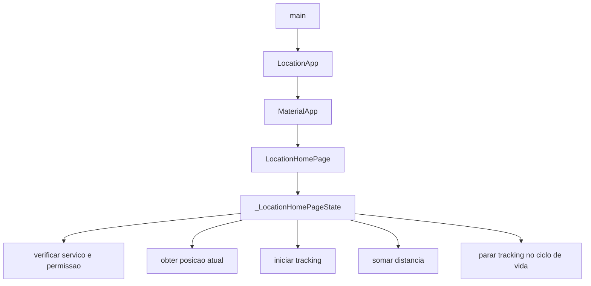

Agora implemente:

```dart
import 'dart:async';

import 'package:flutter/material.dart';
import 'package:geolocator/geolocator.dart';

void main() {
  runApp(const LocationApp());
}

class LocationApp extends StatelessWidget {
  const LocationApp({super.key});

  @override
  Widget build(BuildContext context) {
    return MaterialApp(
      debugShowCheckedModeBanner: false,
      title: 'Aula 12 - GPS',
      theme: ThemeData(
        colorScheme: ColorScheme.fromSeed(seedColor: Colors.indigo),
        useMaterial3: true,
      ),
      home: const LocationHomePage(),
    );
  }
}

class LocationHomePage extends StatefulWidget {
  const LocationHomePage({super.key});

  @override
  State<LocationHomePage> createState() => _LocationHomePageState();
}

class _LocationHomePageState extends State<LocationHomePage>
    with WidgetsBindingObserver {
  StreamSubscription<Position>? _positionSubscription;

  Position? _currentPosition;
  Position? _lastTrackedPosition;
  double _distanceMeters = 0;
  bool _isLoading = false;
  bool _isTracking = false;
  String _status = 'Toque no botao para obter sua localizacao.';

  @override
  void initState() {
    super.initState();
    WidgetsBinding.instance.addObserver(this);
  }

  Future<Position> _determinePosition() async {
    final serviceEnabled = await Geolocator.isLocationServiceEnabled();

    if (!serviceEnabled) {
      throw Exception(
        'O servico de localizacao esta desligado. Ligue o GPS nas configuracoes do aparelho.',
      );
    }

    var permission = await Geolocator.checkPermission();

    if (permission == LocationPermission.denied) {
      permission = await Geolocator.requestPermission();
    }

    if (permission == LocationPermission.denied) {
      throw Exception('Permissao de localizacao negada.');
    }

    if (permission == LocationPermission.deniedForever) {
      throw Exception(
        'Permissao negada para sempre. Altere a permissao nas configuracoes do sistema.',
      );
    }

    const locationSettings = LocationSettings(
      accuracy: LocationAccuracy.high,
    );

    return Geolocator.getCurrentPosition(
      locationSettings: locationSettings,
    );
  }

  Future<void> _getCurrentLocation() async {
    setState(() {
      _isLoading = true;
      _status = 'Buscando localizacao atual...';
    });

    try {
      final position = await _determinePosition();

      if (!mounted) {
        return;
      }

      setState(() {
        _currentPosition = position;
        _lastTrackedPosition = position;
        _status = 'Localizacao atual obtida com sucesso.';
      });
    } catch (error) {
      if (!mounted) {
        return;
      }

      setState(() {
        _status = error.toString();
      });
    } finally {
      if (mounted) {
        setState(() {
          _isLoading = false;
        });
      }
    }
  }

  Future<void> _startTracking() async {
    if (_isTracking) {
      return;
    }

    setState(() {
      _isLoading = true;
      _status = 'Preparando tracking...';
    });

    try {
      final firstPosition = await _determinePosition();

      if (!mounted) {
        return;
      }

      const locationSettings = LocationSettings(
        accuracy: LocationAccuracy.high,
        distanceFilter: 5,
      );

      _positionSubscription = Geolocator.getPositionStream(
        locationSettings: locationSettings,
      ).listen(
        _handleTrackedPosition,
        onError: (error) {
          if (!mounted) {
            return;
          }

          setState(() {
            _status = 'Erro no tracking: $error';
          });
        },
      );

      setState(() {
        _currentPosition = firstPosition;
        _lastTrackedPosition = firstPosition;
        _distanceMeters = 0;
        _isTracking = true;
        _status = 'Tracking ativo. Desloque-se para acumular distancia.';
      });
    } catch (error) {
      if (!mounted) {
        return;
      }

      setState(() {
        _status = error.toString();
      });
    } finally {
      if (mounted) {
        setState(() {
          _isLoading = false;
        });
      }
    }
  }

  void _handleTrackedPosition(Position position) {
    final previous = _lastTrackedPosition;
    var addedDistance = 0.0;

    if (previous != null) {
      addedDistance = Geolocator.distanceBetween(
        previous.latitude,
        previous.longitude,
        position.latitude,
        position.longitude,
      );
    }

    setState(() {
      _currentPosition = position;
      _lastTrackedPosition = position;
      _distanceMeters += addedDistance;
      _status = 'Tracking ativo. Ultima atualizacao recebida.';
    });
  }

  Future<void> _stopTracking() async {
    await _positionSubscription?.cancel();
    _positionSubscription = null;

    if (!mounted) {
      return;
    }

    setState(() {
      _isTracking = false;
      _status = 'Tracking pausado.';
    });
  }

  @override
  void didChangeAppLifecycleState(AppLifecycleState state) {
    if (state != AppLifecycleState.resumed && _isTracking) {
      _stopTracking();
    }
  }

  @override
  void dispose() {
    WidgetsBinding.instance.removeObserver(this);
    _positionSubscription?.cancel();
    super.dispose();
  }

  @override
  Widget build(BuildContext context) {
    final position = _currentPosition;

    return Scaffold(
      appBar: AppBar(
        title: const Text('Aula 12 - Onde Estou Agora'),
      ),
      body: SafeArea(
        child: ListView(
          padding: const EdgeInsets.all(16),
          children: [
            _StatusCard(
              status: _status,
              isTracking: _isTracking,
              isLoading: _isLoading,
            ),
            const SizedBox(height: 16),
            _PositionCard(position: position),
            const SizedBox(height: 16),
            _DistanceCard(distanceMeters: _distanceMeters),
            const SizedBox(height: 16),
            FilledButton.icon(
              onPressed: _isLoading ? null : _getCurrentLocation,
              icon: const Icon(Icons.my_location),
              label: const Text('Obter posicao atual'),
            ),
            const SizedBox(height: 12),
            FilledButton.tonalIcon(
              onPressed: _isLoading
                  ? null
                  : _isTracking
                      ? _stopTracking
                      : _startTracking,
              icon: Icon(_isTracking ? Icons.stop : Icons.play_arrow),
              label: Text(_isTracking ? 'Parar tracking' : 'Iniciar tracking'),
            ),
          ],
        ),
      ),
    );
  }
}

class _StatusCard extends StatelessWidget {
  const _StatusCard({
    required this.status,
    required this.isTracking,
    required this.isLoading,
  });

  final String status;
  final bool isTracking;
  final bool isLoading;

  @override
  Widget build(BuildContext context) {
    return Card(
      child: Padding(
        padding: const EdgeInsets.all(16),
        child: Column(
          crossAxisAlignment: CrossAxisAlignment.start,
          children: [
            Text(
              'Status',
              style: Theme.of(context).textTheme.titleLarge,
            ),
            const SizedBox(height: 8),
            Text(status),
            const SizedBox(height: 12),
            Row(
              children: [
                Icon(
                  isTracking ? Icons.location_on : Icons.location_off,
                  color: isTracking ? Colors.green : Colors.grey,
                ),
                const SizedBox(width: 8),
                Text(isTracking ? 'Tracking ativo' : 'Tracking parado'),
                const Spacer(),
                if (isLoading)
                  const SizedBox(
                    width: 20,
                    height: 20,
                    child: CircularProgressIndicator(strokeWidth: 2),
                  ),
              ],
            ),
          ],
        ),
      ),
    );
  }
}

class _PositionCard extends StatelessWidget {
  const _PositionCard({required this.position});

  final Position? position;

  @override
  Widget build(BuildContext context) {
    final position = this.position;

    if (position == null) {
      return const Card(
        child: Padding(
          padding: EdgeInsets.all(16),
          child: Text('Nenhuma posicao lida ainda.'),
        ),
      );
    }

    final mapsUrl =
        'https://www.google.com/maps/search/?api=1&query=${position.latitude},${position.longitude}';

    return Card(
      child: Padding(
        padding: const EdgeInsets.all(16),
        child: Column(
          crossAxisAlignment: CrossAxisAlignment.start,
          children: [
            Text(
              'Posicao atual',
              style: Theme.of(context).textTheme.titleLarge,
            ),
            const SizedBox(height: 12),
            _PositionLine(
              label: 'Latitude',
              value: position.latitude.toStringAsFixed(6),
            ),
            _PositionLine(
              label: 'Longitude',
              value: position.longitude.toStringAsFixed(6),
            ),
            _PositionLine(
              label: 'Precisao',
              value: '${position.accuracy.toStringAsFixed(1)} m',
            ),
            _PositionLine(
              label: 'Velocidade',
              value: '${position.speed.toStringAsFixed(1)} m/s',
            ),
            const SizedBox(height: 12),
            const Text('Link para conferir no mapa:'),
            SelectableText(mapsUrl),
          ],
        ),
      ),
    );
  }
}

class _PositionLine extends StatelessWidget {
  const _PositionLine({
    required this.label,
    required this.value,
  });

  final String label;
  final String value;

  @override
  Widget build(BuildContext context) {
    return Padding(
      padding: const EdgeInsets.symmetric(vertical: 4),
      child: Row(
        children: [
          SizedBox(
            width: 90,
            child: Text(
              label,
              style: const TextStyle(fontWeight: FontWeight.bold),
            ),
          ),
          Expanded(child: Text(value)),
        ],
      ),
    );
  }
}

class _DistanceCard extends StatelessWidget {
  const _DistanceCard({required this.distanceMeters});

  final double distanceMeters;

  @override
  Widget build(BuildContext context) {
    return Card(
      child: Padding(
        padding: const EdgeInsets.all(16),
        child: Column(
          crossAxisAlignment: CrossAxisAlignment.start,
          children: [
            Text(
              'Distancia aproximada',
              style: Theme.of(context).textTheme.titleLarge,
            ),
            const SizedBox(height: 8),
            Text(
              '${distanceMeters.toStringAsFixed(1)} m',
              style: Theme.of(context).textTheme.headlineMedium,
            ),
            const SizedBox(height: 8),
            const Text(
              'Este valor e uma estimativa calculada entre as posicoes recebidas durante o tracking.',
            ),
          ],
        ),
      ),
    );
  }
}
```

---

## 4. Entender o fluxo principal

### 4.1 `_determinePosition()`

A função `_determinePosition()` concentra a parte mais importante da aula. Ela
não começa pedindo coordenada direto. Primeiro ela verifica as condições para
que a leitura seja possível.

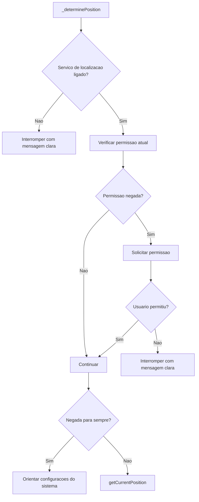

Esse fluxo evita um erro comum: chamar `getCurrentPosition()` sem saber se o
serviço está ligado ou se a permissão foi concedida.

### 4.2 `getCurrentPosition()`

`getCurrentPosition()` é usado quando você quer uma leitura única. Ele serve
para recursos como:

- mostrar onde o usuário está agora;
- preencher uma coordenada em um cadastro;
- registrar o local de uma entrega;
- centralizar um mapa na posição atual.

Ele não deve ser usado repetidamente dentro de um `Timer` para simular tracking.
Para acompanhamento contínuo, use um stream.

### 4.3 `getPositionStream()`

`getPositionStream()` cria uma sequência de posições. Nesta aula, usamos duas
configurações importantes:

```dart
const locationSettings = LocationSettings(
  accuracy: LocationAccuracy.high,
  distanceFilter: 5,
);
```

- `accuracy`: define a precisão desejada;
- `distanceFilter`: só emite nova posição depois de deslocamento aproximado de
  5 metros.

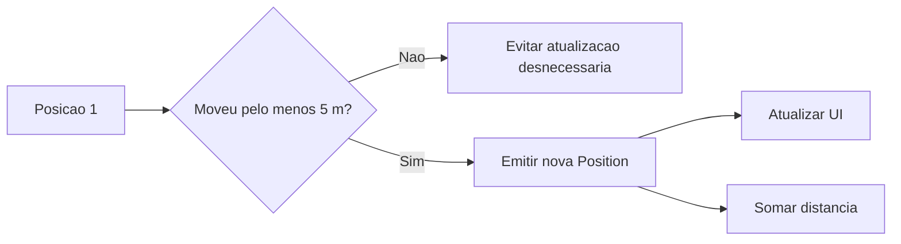

Quanto menor o `distanceFilter`, mais atualizações o app pode receber. Isso pode
deixar a interface mais responsiva, mas também pode gastar mais bateria.

### 4.4 `distanceBetween()`

O método `Geolocator.distanceBetween(...)` calcula a distância aproximada entre
duas coordenadas.

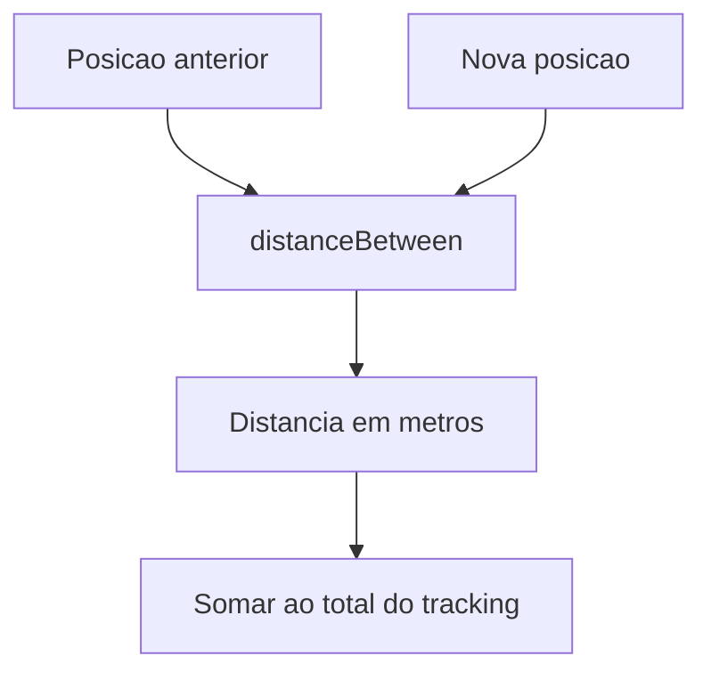

Esse cálculo é suficiente para a aula, mas não é uma prova perfeita de
deslocamento real. Leituras de GPS oscilam, principalmente dentro de prédios.
Por isso o resultado deve ser tratado como estimativa.

---

## 5. Testar no emulador ou celular

### 5.1 Teste mínimo

1. Rode o app com `flutter run`.
2. Toque em **Obter posicao atual**.
3. Aceite a permissão de localização quando o sistema pedir.
4. Confira se aparecem latitude, longitude e precisão.
5. Copie o link textual do mapa e abra no navegador.

### 5.2 Teste de permissão negada

1. Feche o app.
2. Remova a permissão de localização nas configurações do sistema.
3. Abra o app de novo.
4. Toque em **Obter posicao atual**.
5. Negue a permissão.
6. Confira se o app mostra uma mensagem clara e não quebra.

### 5.3 Teste de tracking

1. Toque em **Iniciar tracking**.
2. No emulador, altere a localização simulada.
3. No celular físico, caminhe apenas se isso for permitido e seguro.
4. Observe se a distância aproximada muda.
5. Toque em **Parar tracking**.
6. Coloque o app em segundo plano e confira se o tracking é pausado.

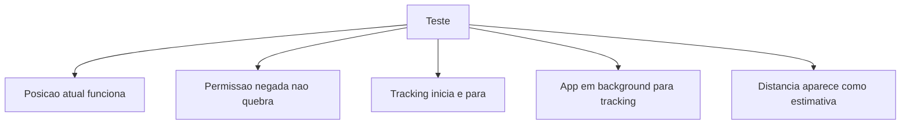

---

## 6. Erros comuns

### 6.1 "Permissão configurada, mas o app não pede acesso"

Verifique se as permissões foram adicionadas no lugar certo do
`AndroidManifest.xml`: elas devem ficar dentro de `<manifest>` e antes de
`<application>`.

### 6.2 "O app funciona, mas a precisão está ruim"

Dentro de prédios, a precisão costuma piorar. O aparelho pode depender de Wi-Fi,
torres de celular e estimativas. Confira o campo **Precisão** antes de confiar
nas coordenadas.

### 6.3 "A distância aumenta mesmo parado"

Isso pode acontecer por oscilação do GPS. O `distanceFilter` ajuda a reduzir
ruído, mas não elimina completamente. Apps reais costumam filtrar leituras com
precisão ruim antes de calcular trajeto.

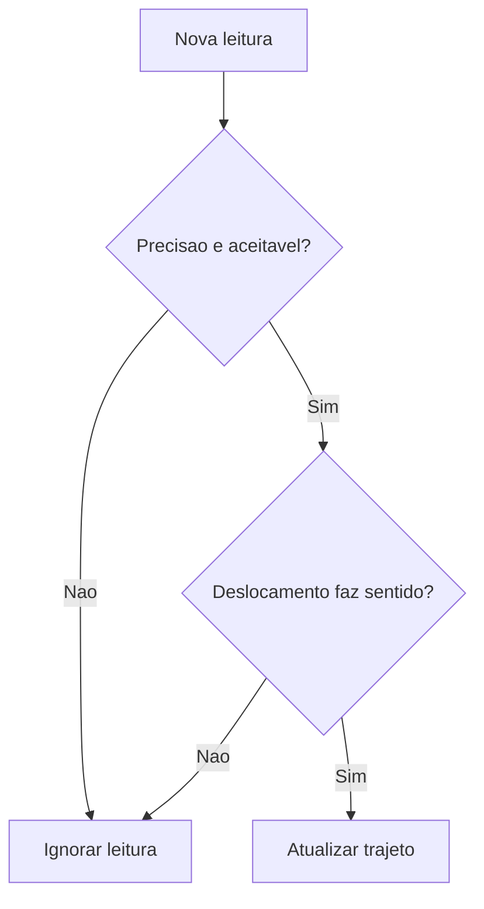

### 6.4 "O usuário negou para sempre"

Quando a permissão está `deniedForever`, o app não consegue abrir o pedido de
permissão normal de novo. O usuário precisa mudar manualmente nas configurações
do sistema. Por isso a mensagem do app deve ser clara.

---

## 7. Incrementos opcionais

Faça estes incrementos apenas depois que o roteiro principal estiver funcionando:

1. Ignore leituras com precisão maior que `100 m`.
2. Mostre a hora da última atualização.
3. Mostre um aviso quando o usuário estiver com localização aproximada.
4. Adicione um botão para zerar a distância.
5. Use as coordenadas da aula como preparação para a Aula 13 de mapas.

Exemplo de filtro simples:

```dart
if (position.accuracy > 100) {
  setState(() {
    _status = 'Leitura ignorada: precisao muito baixa.';
  });
  return;
}
```

---

## 8. Checklist de entrega

Use este checklist antes de demonstrar ao professor e preencher o Google Forms
indicado em sala:

- [ ] O projeto compila com `flutter run`.
- [ ] `geolocator` aparece no `pubspec.yaml`.
- [ ] As permissões Android foram configuradas no `AndroidManifest.xml`.
- [ ] A justificativa iOS foi configurada no `Info.plist`, se o teste for em iOS.
- [ ] O app pede permissão de localização em tempo de execução.
- [ ] O app trata permissão negada sem travar.
- [ ] O app mostra latitude, longitude e precisão.
- [ ] O app mostra um link textual de mapa com as coordenadas.
- [ ] O tracking inicia e para por botão.
- [ ] O tracking para quando o app sai de primeiro plano.
- [ ] O código cancela a assinatura no `dispose()`.
- [ ] O repositório no GitHub tem commit com a implementação da aula.

---

## 9. Perguntas para revisar

Responda no seu caderno ou no formulário indicado pelo professor:

1. Qual é a diferença entre `getCurrentPosition()` e `getPositionStream()`?
2. Por que o app precisa verificar se o serviço de localização está ligado antes
   de pedir a posição?
3. O que muda entre permissão negada e permissão negada para sempre?
4. Por que tracking em tempo real pode gastar mais bateria?
5. Por que a distância calculada pelo GPS deve ser tratada como estimativa?
6. Qual parte desta aula reaproveita o conceito de `StreamSubscription` visto na
   Aula 11?

---

## 10. Fechamento

A Aula 12 fecha a sequência de recursos nativos iniciada com câmera e sensores:
agora o app já consegue usar um dado sensível do dispositivo com permissão,
tratamento de erro e ciclo de vida.

Na Aula 13, essas coordenadas deixam de ser apenas números na tela. Elas passam
a ser usadas em mapas, marcadores e navegação visual dentro do aplicativo.
