## Data e contexto

- **Data:** 30/05/2026
- **Duração:** 5 horas-aula (250 min)
- **Horário:** sábado letivo
- **Laboratório:** 6
- **Pré-requisito direto:** Aula 12 - GPS, permissões e tracking

## Alinhamento com o PTD

- **Habilidades:** 1.1 Codificar aplicativos em tecnologia móvel; 1.5 Utilizar
  recursos avançados do dispositivo.
- **Bases:** localização; mapas; plugins; contexto geográfico; integração de
  serviços; interface reativa.

---

## Objetivo da aula

Na Aula 12, você fez o aplicativo sair do mundo fechado da interface e ler a
posição real do aparelho. A tela mostrava latitude, longitude, precisão,
permissões e tracking. Aquilo era importante, mas ainda era muito técnico para
um usuário comum: coordenadas como `-22.7832, -47.2951` não comunicam lugar de
forma visual.

Nesta aula, você vai transformar as coordenadas em um mapa interativo. O foco
não é apenas "colocar um Google Maps na tela". O foco é entender como um app
mobile usa localização para responder a perguntas mais humanas:

- Onde estou?
- Onde fica a escola?
- Que lugar eu marquei?
- O mapa está centralizado no ponto certo?
- O marcador representa uma coordenada fixa ou uma escolha do usuário?
- O que acontece quando o usuário nega permissão ou quando a chave de mapa está
  incorreta?

Ao final, você deve ter um miniapp Flutter chamado **Mapa de Check-in** com:

- mapa renderizado na tela;
- marcador fixo da escola;
- botão para centralizar o mapa na posição atual;
- integração com a lógica de permissão aprendida na Aula 12;
- marcador dinâmico criado com toque longo no mapa;
- lista simples de check-ins mantida em memória;
- mensagens claras para carregamento, erro de permissão e erro de localização;
- checklist de entrega pronto para demonstração e registro no Google Forms
  indicado pelo professor.

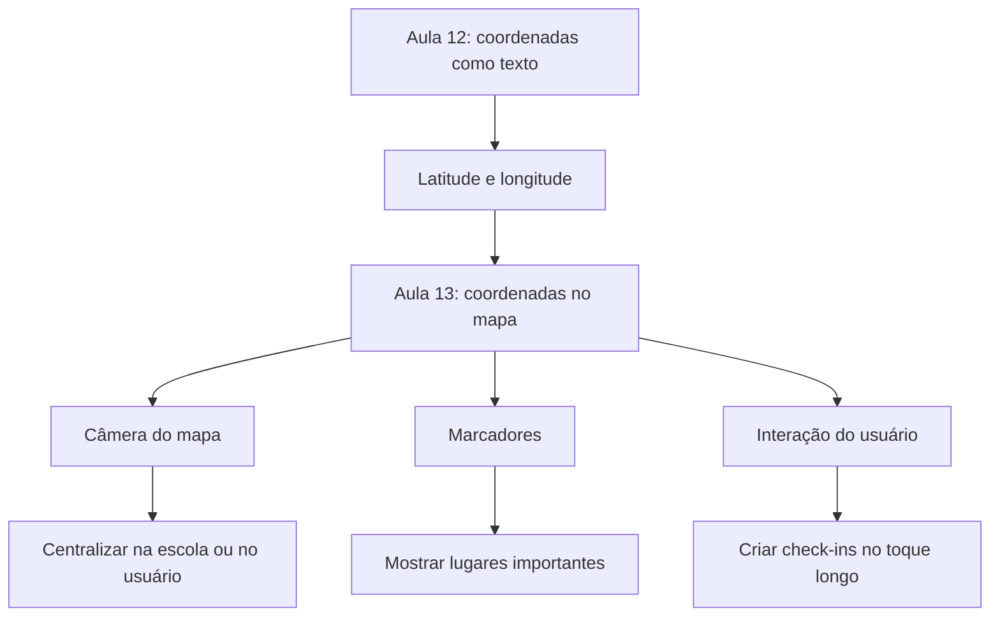

---

## Resultado esperado

Você vai construir uma tela parecida com esta estrutura:

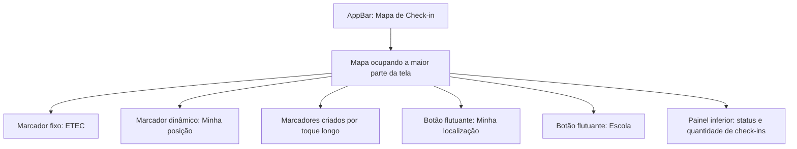

O app não precisa salvar os marcadores em banco de dados nesta aula. A lista em
memória já é suficiente para entender o fluxo. SQLite pode aparecer depois como
incremento, mas não é requisito do roteiro principal.

---

## Materiais necessários

Antes de começar, você precisa de:

- projeto Flutter funcionando;
- Android Studio ou VS Code aberto;
- emulador Android ou celular físico;
- internet para baixar pacote;
- uma chave de Google Maps disponibilizada pelo professor ou configurada no seu
  próprio Google Cloud;
- conteúdo da Aula 12 disponível para consultar a lógica de permissão.

Se a chave de mapa não estiver pronta, ainda leia o roteiro. A parte conceitual
continua útil, e o professor pode orientar a chave de teste em sala.

---

## Documentação para consulta

- [google_maps_flutter](https://pub.dev/packages/google_maps_flutter)
- [Google Maps Platform - Flutter](https://developers.google.com/maps/flutter-package)
- [Get started with Google Maps Platform](https://developers.google.com/maps/get-started)
- [geolocator](https://pub.dev/packages/geolocator)
- [Flutter - Using packages](https://docs.flutter.dev/packages-and-plugins/using-packages)

---

## Mapa rápido da aula

Siga nesta ordem:

1. Entender o papel de mapa, câmera, coordenada e marcador.
2. Preparar a chave do Google Maps.
3. Instalar `google_maps_flutter` e reaproveitar `geolocator`.
4. Configurar a chave no Android.
5. Criar a tela com `GoogleMap`.
6. Adicionar marcador fixo da escola.
7. Controlar a câmera do mapa.
8. Integrar a posição atual da Aula 12.
9. Criar marcadores com toque longo.
10. Revisar erros comuns e checklist de entrega.

---

## 1. Conceitos antes do código

### 1.1 Coordenada, lugar e mapa

Uma coordenada é um dado. Um lugar é uma interpretação desse dado. O mapa é a
interface que ajuda o usuário a entender o lugar.

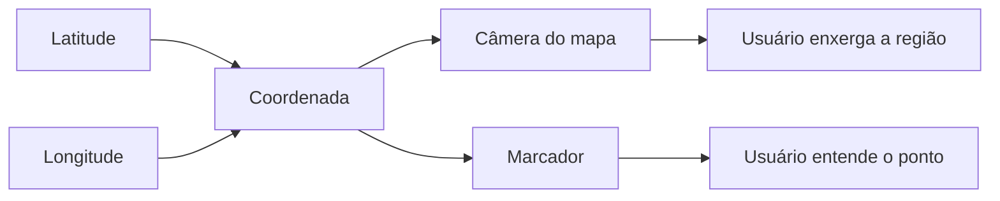

Exemplo:

- latitude: posição norte/sul;
- longitude: posição leste/oeste;
- `LatLng`: objeto usado pelo pacote do Google Maps para representar latitude e
  longitude juntas;
- `CameraPosition`: define para onde o mapa está olhando;
- `Marker`: marca um ponto no mapa.

### 1.2 A câmera do mapa não é o marcador

Um erro comum é pensar que mover a câmera cria um marcador. Não cria.

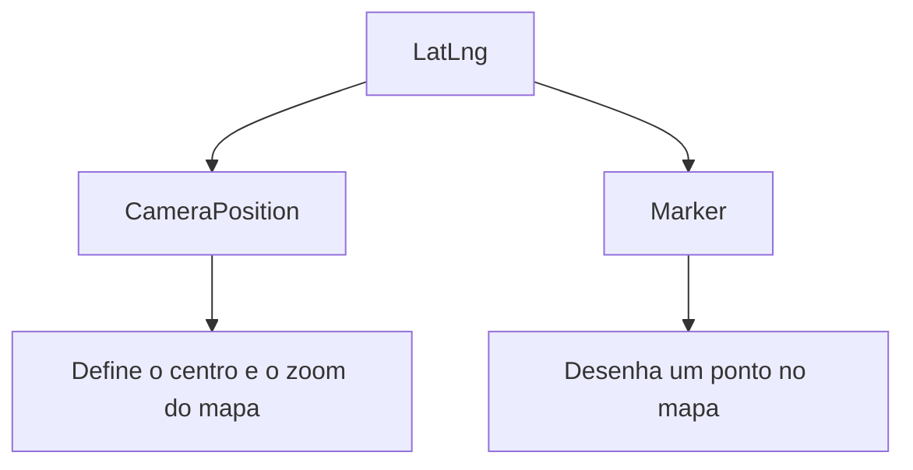

Pense assim:

- **câmera:** "para onde estou olhando?";
- **marcador:** "qual ponto quero destacar?";
- **zoom:** "quão perto estou olhando?";
- **map type:** "qual visual do mapa vou usar?".

### 1.3 Continuidade com a Aula 12

Na Aula 12, você escreveu uma lógica parecida com esta:

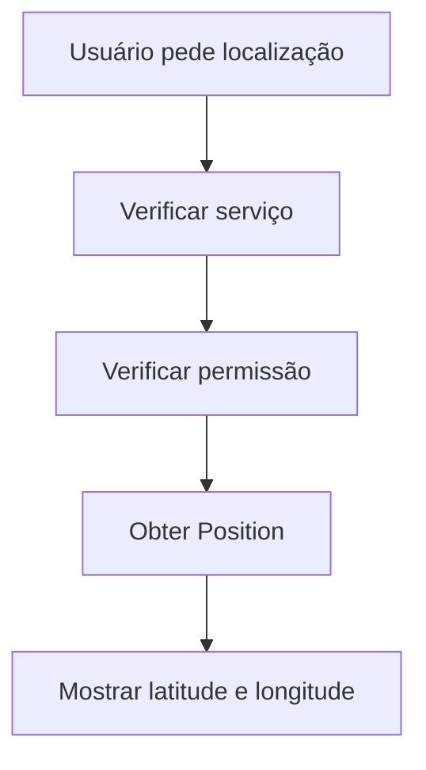

Nesta aula, o final muda:

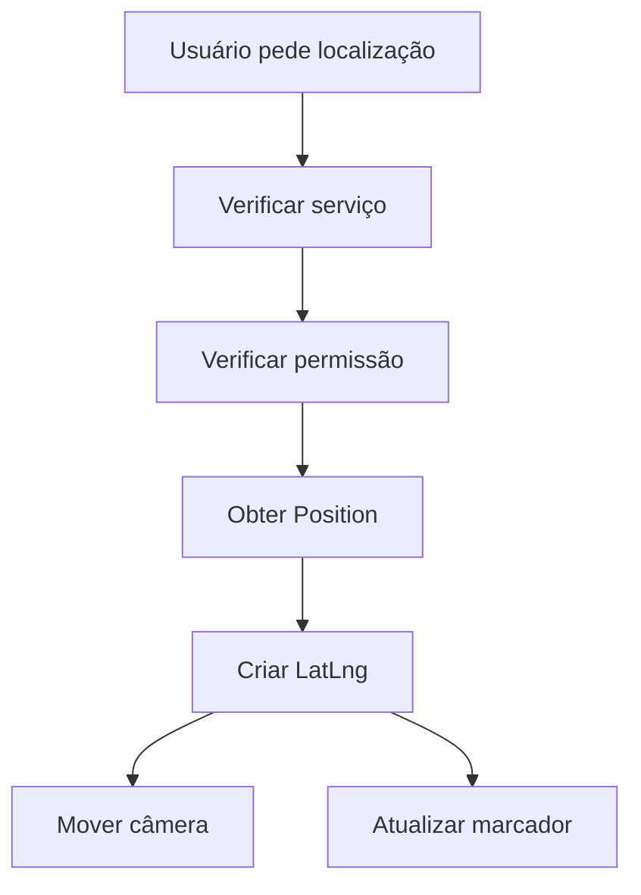

O começo é praticamente o mesmo. A complexidade nova está em transformar a
posição em comportamento visual.

---

## 2. Preparar o projeto

### 2.1 Instalar pacotes

Na raiz do projeto Flutter, rode:

```bash
flutter pub add google_maps_flutter geolocator
```

Depois confirme que o `pubspec.yaml` contém os dois pacotes.

### 2.2 Conferir versão mínima do Android

Abra `android/app/build.gradle` ou `android/app/build.gradle.kts`, dependendo da
versão do projeto.

O Google Maps exige Android compatível. Em projetos recentes, confira se o
`minSdk` está pelo menos em `21`.

Exemplo em `build.gradle`:

```gradle
defaultConfig {
    minSdkVersion 21
}
```

Exemplo em `build.gradle.kts`:

```kotlin
defaultConfig {
    minSdk = 21
}
```

Se seu arquivo já usa uma versão maior, mantenha como está.

### 2.3 Configurar permissões Android

Abra `android/app/src/main/AndroidManifest.xml`.

Antes da tag `<application>`, adicione as permissões:

```xml
<uses-permission android:name="android.permission.ACCESS_FINE_LOCATION" />
<uses-permission android:name="android.permission.ACCESS_COARSE_LOCATION" />
```

Dentro da tag `<application>`, adicione a chave do Google Maps:

```xml
<meta-data
    android:name="com.google.android.geo.API_KEY"
    android:value="SUA_CHAVE_AQUI" />
```

O arquivo ficará com uma estrutura parecida com esta:

```xml
<manifest xmlns:android="http://schemas.android.com/apk/res/android">
    <uses-permission android:name="android.permission.ACCESS_FINE_LOCATION" />
    <uses-permission android:name="android.permission.ACCESS_COARSE_LOCATION" />

    <application
        android:label="mapa_checkin"
        android:name="${applicationName}"
        android:icon="@mipmap/ic_launcher">

        <meta-data
            android:name="com.google.android.geo.API_KEY"
            android:value="SUA_CHAVE_AQUI" />

        <activity
            android:name=".MainActivity"
            android:exported="true"
            android:launchMode="singleTop"
            android:theme="@style/LaunchTheme"
            android:configChanges="orientation|keyboardHidden|keyboard|screenSize|smallestScreenSize|locale|layoutDirection|fontScale|screenLayout|density|uiMode"
            android:hardwareAccelerated="true"
            android:windowSoftInputMode="adjustResize">
            <!-- restante do arquivo -->
        </activity>
    </application>
</manifest>
```

Não publique uma chave pessoal sem restrição em repositório público. Para a aula,
use a orientação do professor.

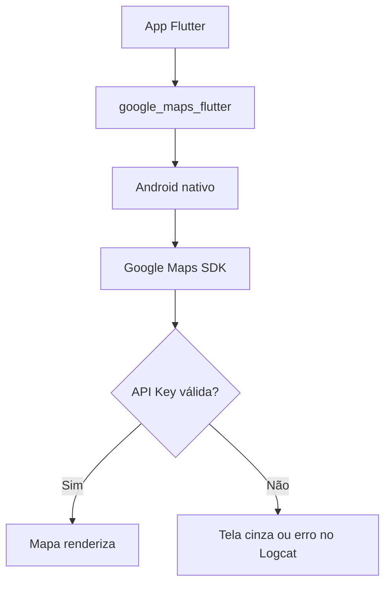

---

## 3. Criar a base do app

Abra `lib/main.dart` e substitua o conteúdo por este roteiro inicial. Leia os
comentários antes de executar.

```dart
import 'package:flutter/material.dart';
import 'package:geolocator/geolocator.dart';
import 'package:google_maps_flutter/google_maps_flutter.dart';

void main() {
  runApp(const MapaCheckinApp());
}

class MapaCheckinApp extends StatelessWidget {
  const MapaCheckinApp({super.key});

  @override
  Widget build(BuildContext context) {
    return MaterialApp(
      debugShowCheckedModeBanner: false,
      title: 'Mapa de Check-in',
      theme: ThemeData(
        colorScheme: ColorScheme.fromSeed(seedColor: Colors.green),
        useMaterial3: true,
      ),
      home: const MapaCheckinPage(),
    );
  }
}

class MapaCheckinPage extends StatefulWidget {
  const MapaCheckinPage({super.key});

  @override
  State<MapaCheckinPage> createState() => _MapaCheckinPageState();
}

class _MapaCheckinPageState extends State<MapaCheckinPage> {
  static const LatLng _etec = LatLng(-22.7832, -47.2951);

  GoogleMapController? _mapController;
  LatLng? _minhaPosicao;
  String _status = 'Mapa iniciado. Toque em Minha localização.';

  final Set<Marker> _marcadores = {
    const Marker(
      markerId: MarkerId('etec'),
      position: _etec,
      infoWindow: InfoWindow(
        title: 'ETEC Ferrucio Humberto Gazzetta',
        snippet: 'Ponto fixo da aula',
      ),
    ),
  };

  @override
  void dispose() {
    _mapController?.dispose();
    super.dispose();
  }

  @override
  Widget build(BuildContext context) {
    return Scaffold(
      appBar: AppBar(
        title: const Text('Aula 13 - Mapa de Check-in'),
      ),
      body: Stack(
        children: [
          GoogleMap(
            initialCameraPosition: const CameraPosition(
              target: _etec,
              zoom: 16,
            ),
            markers: _marcadores,
            myLocationButtonEnabled: false,
            myLocationEnabled: _minhaPosicao != null,
            onMapCreated: (controller) {
              _mapController = controller;
            },
            onLongPress: _adicionarCheckin,
          ),
          Positioned(
            left: 16,
            right: 16,
            bottom: 16,
            child: Card(
              child: Padding(
                padding: const EdgeInsets.all(16),
                child: Column(
                  mainAxisSize: MainAxisSize.min,
                  crossAxisAlignment: CrossAxisAlignment.start,
                  children: [
                    Text(
                      _status,
                      style: Theme.of(context).textTheme.bodyMedium,
                    ),
                    const SizedBox(height: 8),
                    Text('Check-ins: ${_marcadores.length - 1}'),
                  ],
                ),
              ),
            ),
          ),
        ],
      ),
      floatingActionButton: Column(
        mainAxisSize: MainAxisSize.min,
        children: [
          FloatingActionButton(
            heroTag: 'minha-localizacao',
            onPressed: _centralizarNaMinhaLocalizacao,
            child: const Icon(Icons.my_location),
          ),
          const SizedBox(height: 12),
          FloatingActionButton(
            heroTag: 'escola',
            onPressed: _centralizarNaEscola,
            child: const Icon(Icons.school),
          ),
        ],
      ),
    );
  }

  Future<void> _centralizarNaEscola() async {
    await _moverCamera(_etec, zoom: 16);

    setState(() {
      _status = 'Mapa centralizado na ETEC.';
    });
  }

  Future<void> _centralizarNaMinhaLocalizacao() async {
    setState(() {
      _status = 'Verificando permissão de localização...';
    });

    final position = await _determinarPosicaoAtual();

    if (position == null) {
      return;
    }

    final latLng = LatLng(position.latitude, position.longitude);

    setState(() {
      _minhaPosicao = latLng;
      _status =
          'Localização encontrada com precisão de ${position.accuracy.toStringAsFixed(0)} m.';
      _marcadores.removeWhere((marker) => marker.markerId.value == 'minha-posicao');
      _marcadores.add(
        Marker(
          markerId: const MarkerId('minha-posicao'),
          position: latLng,
          icon: BitmapDescriptor.defaultMarkerWithHue(BitmapDescriptor.hueAzure),
          infoWindow: const InfoWindow(
            title: 'Minha localização',
            snippet: 'Posição obtida pelo GPS',
          ),
        ),
      );
    });

    await _moverCamera(latLng, zoom: 17);
  }

  Future<Position?> _determinarPosicaoAtual() async {
    final servicoLigado = await Geolocator.isLocationServiceEnabled();

    if (!servicoLigado) {
      setState(() {
        _status = 'O serviço de localização está desligado.';
      });
      return null;
    }

    var permissao = await Geolocator.checkPermission();

    if (permissao == LocationPermission.denied) {
      permissao = await Geolocator.requestPermission();
    }

    if (permissao == LocationPermission.denied) {
      setState(() {
        _status = 'Permissão de localização negada.';
      });
      return null;
    }

    if (permissao == LocationPermission.deniedForever) {
      setState(() {
        _status =
            'Permissão negada para sempre. Abra as configurações do aplicativo.';
      });
      return null;
    }

    try {
      return await Geolocator.getCurrentPosition(
        desiredAccuracy: LocationAccuracy.high,
      );
    } catch (erro) {
      setState(() {
        _status = 'Não foi possível obter a localização: $erro';
      });
      return null;
    }
  }

  Future<void> _moverCamera(LatLng destino, {required double zoom}) async {
    final controller = _mapController;

    if (controller == null) {
      return;
    }

    await controller.animateCamera(
      CameraUpdate.newCameraPosition(
        CameraPosition(
          target: destino,
          zoom: zoom,
        ),
      ),
    );
  }

  void _adicionarCheckin(LatLng ponto) {
    final numero = _marcadores.where((marker) {
      return marker.markerId.value.startsWith('checkin-');
    }).length + 1;

    final markerId = MarkerId('checkin-$numero');

    setState(() {
      _marcadores.add(
        Marker(
          markerId: markerId,
          position: ponto,
          icon: BitmapDescriptor.defaultMarkerWithHue(BitmapDescriptor.hueOrange),
          infoWindow: InfoWindow(
            title: 'Check-in $numero',
            snippet:
                '${ponto.latitude.toStringAsFixed(5)}, ${ponto.longitude.toStringAsFixed(5)}',
          ),
        ),
      );

      _status = 'Check-in $numero criado com toque longo no mapa.';
    });
  }
}
```

---

## 4. Entender o código principal

### 4.1 `GoogleMap`

O widget `GoogleMap` é o componente visual que renderiza o mapa.

```dart
GoogleMap(
  initialCameraPosition: const CameraPosition(
    target: _etec,
    zoom: 16,
  ),
  markers: _marcadores,
  onMapCreated: (controller) {
    _mapController = controller;
  },
  onLongPress: _adicionarCheckin,
)
```

Fluxo:

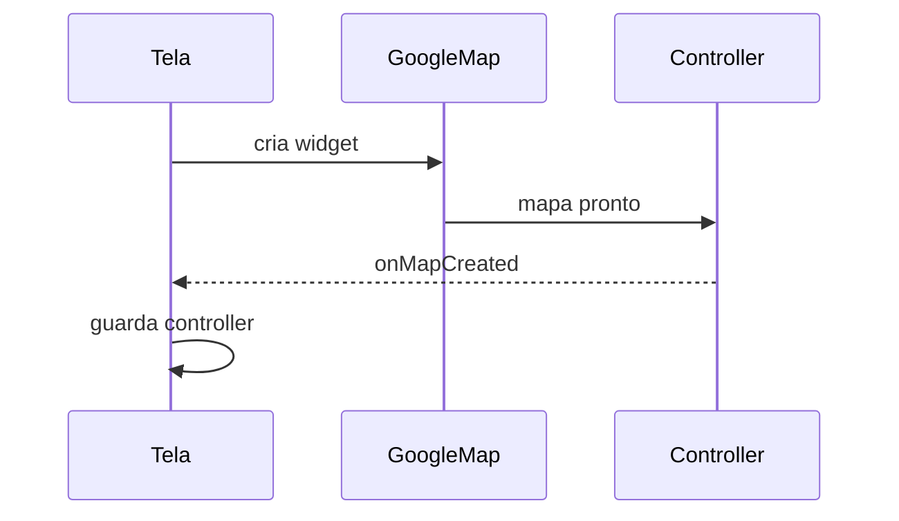

Sem o controller, o mapa até aparece, mas o app não consegue mandar comandos
como `animateCamera`.

### 4.2 `initialCameraPosition`

Esta propriedade define a primeira região exibida.

```dart
initialCameraPosition: const CameraPosition(
  target: _etec,
  zoom: 16,
)
```

Ela não deve ser confundida com a posição atual do usuário. É apenas o ponto
inicial do mapa.

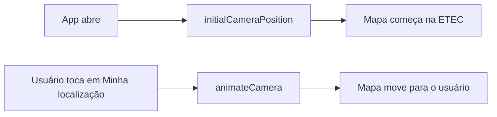

### 4.3 `Set<Marker>`

Os marcadores ficam em um `Set<Marker>` porque cada marcador precisa ter uma
identidade única (`MarkerId`).

```dart
final Set<Marker> _marcadores = {
  const Marker(
    markerId: MarkerId('etec'),
    position: _etec,
  ),
};
```

Use nomes estáveis para marcadores importantes:

- `etec`;
- `minha-posicao`;
- `checkin-1`;
- `checkin-2`;
- `checkin-3`.

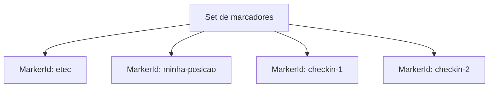

### 4.4 Por que remover o marcador da minha posição?

Quando o usuário toca várias vezes em "Minha localização", o app deve atualizar
o marcador, não criar vários marcadores repetidos.

```dart
_marcadores.removeWhere((marker) => marker.markerId.value == 'minha-posicao');
```

Depois ele adiciona o marcador atualizado.

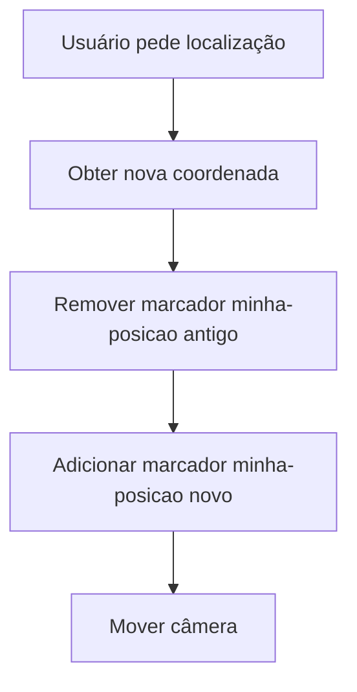

### 4.5 Toque longo no mapa

O `onLongPress` recebe um `LatLng`. Esse ponto é a coordenada escolhida pelo
usuário no mapa.

```dart
onLongPress: _adicionarCheckin
```

Isso cria uma interação simples:

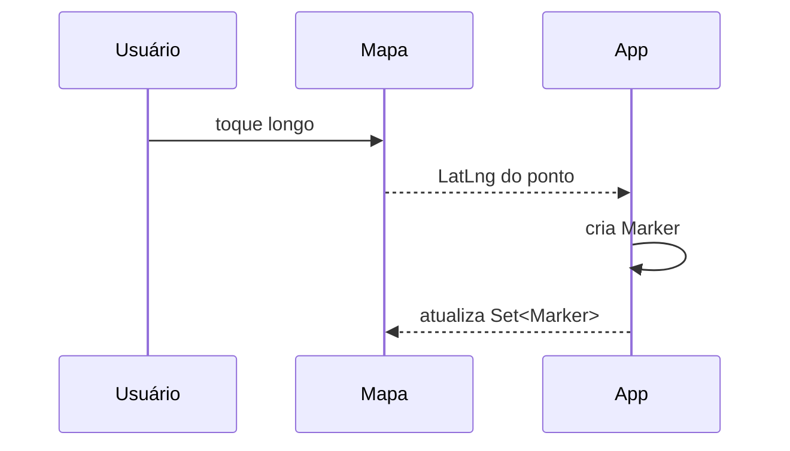

---

## 5. Testar em etapas

Não espere terminar tudo para testar. Use este roteiro de validação:

### 5.1 Primeiro teste: mapa base

Rode:

```bash
flutter run
```

Valide:

- o app compila;
- o mapa aparece;
- a tela não fica cinza;
- o marcador da ETEC aparece;
- o botão da escola move ou mantém a câmera na escola.

Se o mapa ficar cinza, veja a seção de erros comuns.

### 5.2 Segundo teste: permissão

Toque em "Minha localização".

Valide:

- o Android pede permissão;
- se você aceitar, o app tenta obter a posição;
- se você negar, o app mostra mensagem e não trava;
- se o serviço de localização estiver desligado, o app avisa.

### 5.3 Terceiro teste: marcador dinâmico

Depois da posição atual funcionar, valide:

- o mapa move para a sua posição;
- aparece um marcador azul;
- tocar novamente atualiza o marcador, sem duplicar.

### 5.4 Quarto teste: check-ins

Faça toque longo em pontos diferentes do mapa.

Valide:

- cada toque cria um novo marcador;
- o contador de check-ins aumenta;
- a janela de informação mostra latitude e longitude;
- o app continua funcionando ao mover e aproximar o mapa.

---

## 6. Erros comuns e como investigar

### 6.1 Mapa cinza com logo do Google

Possíveis causas:

- chave de API ausente;
- chave inválida;
- Maps SDK for Android não habilitado no Google Cloud;
- restrição da chave não permite o pacote do app;
- problema temporário de internet no laboratório.

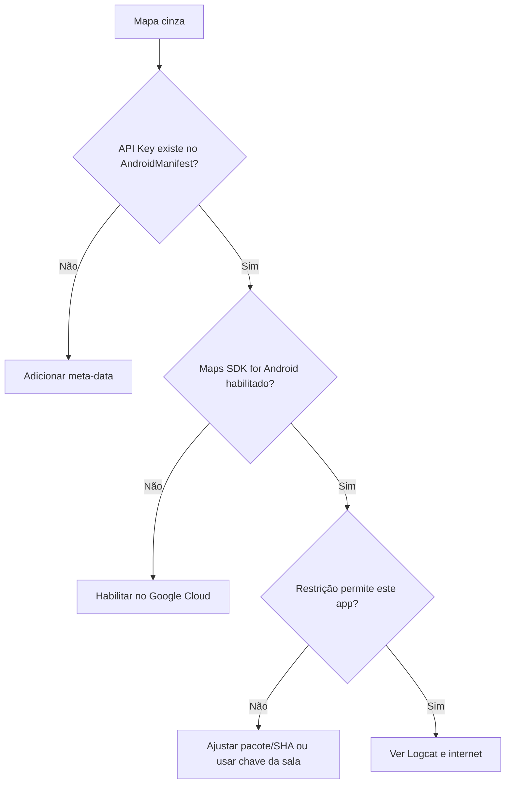

### 6.2 Erro de permissão

Se o app não pedir permissão, confira:

- permissões no `AndroidManifest.xml`;
- uso de `Geolocator.requestPermission()`;
- estado do app no Android: talvez a permissão já tenha sido negada antes.

### 6.3 Botão "Minha localização" não faz nada

Possíveis causas:

- `_mapController` ainda é `null`;
- mapa ainda não terminou de carregar;
- localização do emulador não foi simulada;
- serviço de localização do celular está desligado.

### 6.4 Build demora muito

O primeiro build com Google Maps pode demorar. Se houver erro estranho depois de
trocar pacotes ou manifest, rode:

```bash
flutter clean
flutter pub get
flutter run
```

---

## 7. Incrementos opcionais

Faça estes incrementos apenas depois que o roteiro principal estiver funcionando.

1. Adicione um botão para limpar todos os check-ins, mantendo os marcadores da
   ETEC e da minha posição.
2. Mostre a latitude e longitude da minha posição no painel inferior.
3. Troque o tipo do mapa para satélite usando `mapType: MapType.satellite`.
4. Crie uma cor diferente para check-ins próximos da escola.
5. Calcule a distância entre a minha posição e o check-in usando
   `Geolocator.distanceBetween`.
6. Adicione uma confirmação visual quando o check-in for criado.

Exemplo de cálculo de distância:

```dart
final distancia = Geolocator.distanceBetween(
  _etec.latitude,
  _etec.longitude,
  ponto.latitude,
  ponto.longitude,
);
```

Fluxo do incremento:

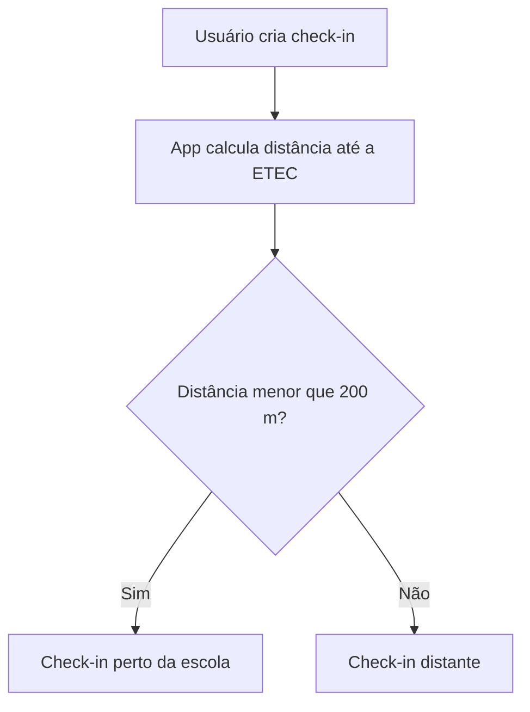

---

## 8. Entrega da aula

A entrega está embutida nesta própria aula. Não há arquivo auxiliar obrigatório.
Use o Google Forms indicado pelo professor apenas para registrar a evidência.

O que demonstrar:

- app compilando com `flutter run`;
- mapa carregado corretamente;
- marcador fixo da ETEC;
- botão de centralizar na escola;
- botão de minha localização com tratamento de permissão;
- marcador azul da posição atual;
- pelo menos três check-ins criados por toque longo;
- código enviado ao GitHub com commit da aula.

Checklist antes de preencher o formulário:

- [ ] `google_maps_flutter` aparece no `pubspec.yaml`.
- [ ] `geolocator` aparece no `pubspec.yaml`.
- [ ] `AndroidManifest.xml` contém permissões de localização.
- [ ] `AndroidManifest.xml` contém a `API_KEY` do Google Maps.
- [ ] O mapa renderiza sem tela cinza.
- [ ] O app não trava quando a permissão é negada.
- [ ] O marcador da ETEC aparece.
- [ ] O botão "Minha localização" move a câmera quando a permissão é aceita.
- [ ] O toque longo cria marcadores de check-in.
- [ ] O painel inferior mostra status e quantidade de check-ins.
- [ ] O repositório no GitHub tem commit com a implementação.

---

## 9. Perguntas para revisar

Responda no caderno ou no formulário indicado pelo professor:

1. Qual é a diferença entre latitude/longitude, `LatLng`, `Marker` e
   `CameraPosition`?
2. Por que mover a câmera do mapa não é a mesma coisa que criar um marcador?
3. Para que serve o `GoogleMapController`?
4. Por que o app precisa tratar permissão mesmo tendo a chave do Google Maps?
5. O que pode causar mapa cinza no Android?
6. Por que usamos `MarkerId` para identificar marcadores?
7. Como a Aula 13 reaproveita a lógica de permissão da Aula 12?
8. O que seria necessário mudar para salvar os check-ins mesmo depois de fechar
   o app?

---

## 10. Fechamento

A Aula 12 ensinou o app a obter coordenadas com responsabilidade: serviço ligado,
permissão, erro, precisão e ciclo de vida. A Aula 13 usa essas coordenadas para
construir uma experiência visual.

Agora você já tem a base para recursos geográficos em aplicativos reais:

- localizar o usuário;
- mostrar pontos importantes;
- permitir escolha de lugares;
- reagir a permissões;
- diferenciar dado bruto de interface útil.

Na Aula 14, essa lógica de aplicativo deixa de ser apenas local e começa a
dialogar com comunicação em tempo real. O próximo passo é pensar em dados que
mudam não só porque o usuário toca na tela, mas porque outros sistemas ou outros
usuários enviam atualizações.

**Material elaborado para o curso de PAM2 - 2026**
