## Data e contexto

- **Data:** 03/06/2026
- **Duração:** 5 horas-aula (250 min)
- **Horário:** 18h45 às 23h10 (considerando 15 min de intervalo)
- **Laboratório:** 6
- **Pré-requisito direto:** Aula 13 - mapas, marcadores e contexto geográfico

## Alinhamento com o PTD

- **Habilidades:** 1.1, 1.3, 1.4 e 1.5.
- **Bases:** conectividade avançada; WebSocket/sockets; interface reativa;
  integração com serviços; refinamento do projeto final.

---

## Objetivo da noite

Na Aula 13, você construiu um app que reage a ações do próprio usuário: tocar no
mapa, centralizar a câmera, pedir localização e criar marcadores. O app ficou
mais visual, mas ainda dependia quase sempre de uma pergunta feita pelo próprio
aplicativo.

Hoje a complexidade aumenta: o app vai manter uma **conexão aberta** com um
servidor para receber mensagens em tempo real. A ideia é entender o que muda
quando os dados não chegam apenas depois de um botão ou de uma requisição HTTP,
mas podem chegar a qualquer momento.

Ao final da aula, você deve conseguir construir um miniapp Flutter chamado
**Chat de Eco em Tempo Real** com:

- conexão WebSocket usando `web_socket_channel`;
- campo para digitar mensagem;
- envio de mensagens pelo `sink` do canal;
- recebimento de mensagens pelo `stream` do canal;
- lista visual de mensagens enviadas e recebidas;
- `StreamBuilder` para atualizar a tela quando a lista mudar;
- tratamento de conexão, erro e desconexão;
- checklist de proposta inicial do projeto final.

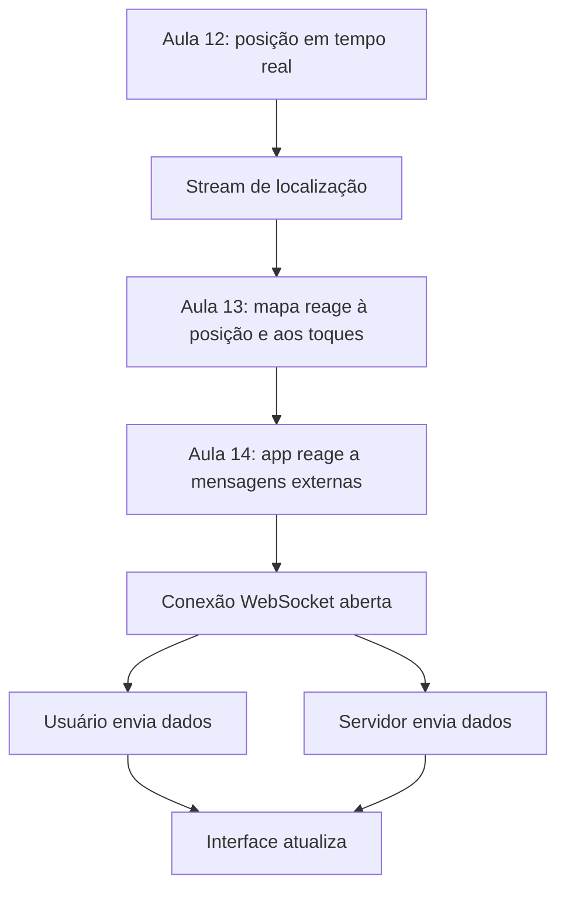

---

## Resultado esperado

Você vai construir uma tela com esta estrutura:

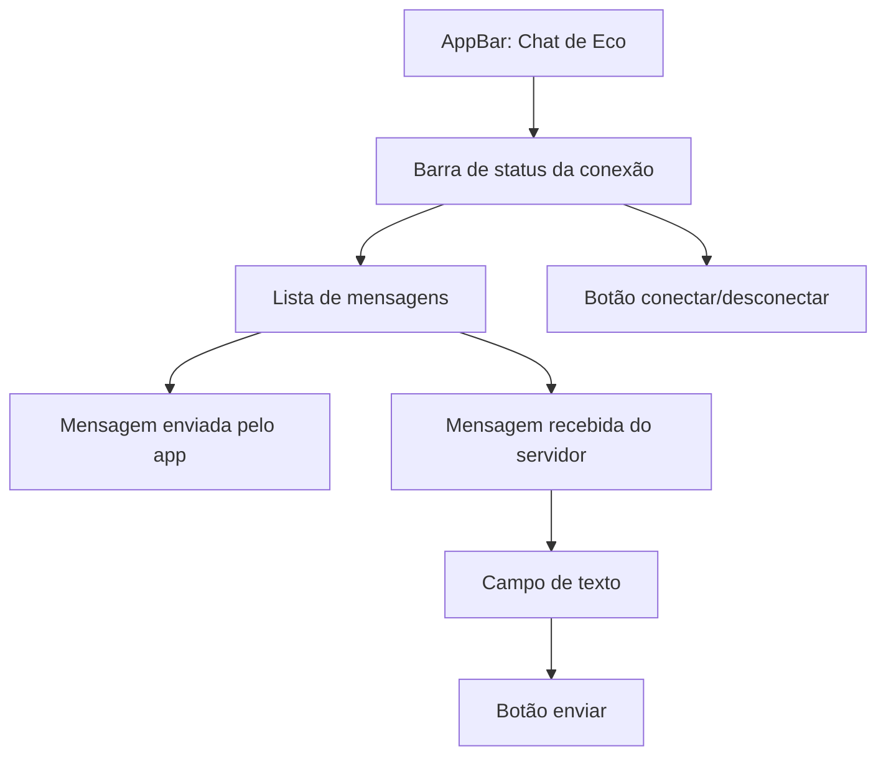

O servidor usado no roteiro é um servidor público de eco. Isso significa que
ele devolve a mesma mensagem que você envia. Em um chat real, o servidor
distribuiria a mensagem para outros usuários. Para aprender o fluxo do
WebSocket, o eco é suficiente.

Se o servidor público estiver indisponível no dia da aula, mantenha o código e
peça ao professor uma URL alternativa. O conceito principal não muda: o app se
conecta a uma URL `ws://` ou `wss://`, envia pelo `sink` e recebe pelo `stream`.

---

## Materiais necessários

Antes de começar, você precisa de:

- projeto Flutter funcionando;
- Android Studio ou VS Code aberto;
- emulador Android, celular físico ou Flutter Web;
- internet para instalar pacote e acessar o servidor de teste;
- noção de `StatefulWidget`, `setState`, `async/await`, `try/catch`,
  `Stream`, `StreamBuilder` e `dispose()`;
- código das aulas anteriores disponível para consulta, principalmente as
  ideias de `Stream` vistas em sensores, localização e mapas.

Nesta aula não há arquivo auxiliar obrigatório. Toda a entrega está descrita
neste roteiro. Use o Google Forms indicado pelo professor apenas para registrar
a evidência no final.

---

## Documentação para consulta

- [Flutter - Communicate with WebSockets](https://docs.flutter.dev/cookbook/networking/web-sockets)
- [Pacote web_socket_channel](https://pub.dev/packages/web_socket_channel)
- [`StreamBuilder`](https://api.flutter.dev/flutter/widgets/StreamBuilder-class.html)
- [`StreamController`](https://api.dart.dev/stable/dart-async/StreamController-class.html)
- [`StreamSubscription`](https://api.dart.dev/stable/dart-async/StreamSubscription-class.html)

---

## Mapa rápido da aula

Siga nesta ordem:

1. Relembrar HTTP, REST e `Stream`.
2. Entender o que muda com WebSocket.
3. Instalar `web_socket_channel`.
4. Criar o modelo simples de mensagem.
5. Criar estado para conexão, mensagens e campo de texto.
6. Conectar ao servidor WebSocket.
7. Enviar mensagem pelo `sink`.
8. Receber mensagem pelo `stream`.
9. Mostrar a conversa com `StreamBuilder`.
10. Tratar erro, desconexão e limpeza no `dispose()`.
11. Esboçar a proposta inicial do projeto final.
12. Revisar o checklist de entrega.

---

## 1. Conceitos antes do código

### 1.1 HTTP resolve pergunta e resposta

Nas aulas de API REST, o app fazia uma requisição e esperava uma resposta.
Depois que a resposta chegava, aquela conversa terminava.

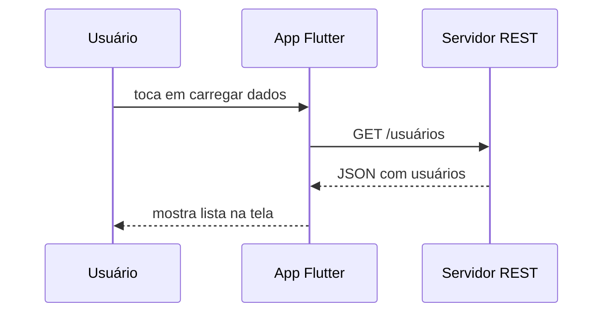

Esse modelo é ótimo para muitas situações:

- buscar uma lista;
- salvar um cadastro;
- autenticar usuário;
- enviar uma foto;
- carregar dados de um mapa.

Mas ele não é ideal quando o servidor precisa avisar o app imediatamente.

### 1.2 Polling tenta simular tempo real

Uma forma simples de simular tempo real seria perguntar ao servidor de tempos em
tempos: "tem algo novo?".

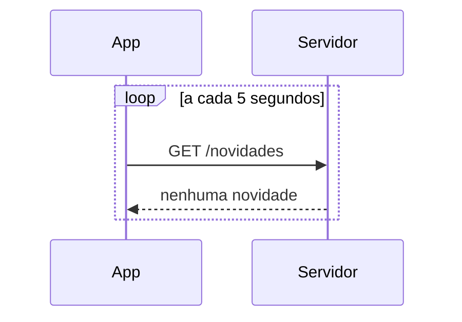

Isso se chama **polling**. Funciona, mas tem problemas:

- gasta internet e bateria;
- cria muitas requisições vazias;
- ainda pode atrasar a atualização;
- aumenta carga no servidor;
- complica a experiência em apps que precisam parecer instantâneos.

### 1.3 WebSocket mantém a conversa aberta

WebSocket é diferente: o app abre uma conexão e ela continua viva. Enquanto a
conexão existir, os dois lados podem enviar mensagens.

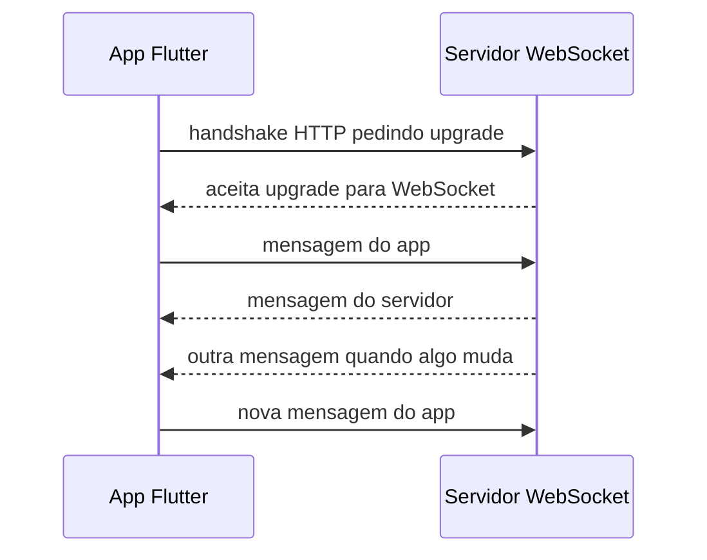

Pense assim:

| Situação                  | Melhor modelo comum |
| :------------------------ | :------------------ |
| Buscar dados uma vez      | HTTP/REST           |
| Enviar cadastro           | HTTP/REST           |
| Login                     | HTTP/REST           |
| Chat                      | WebSocket           |
| Painel com status ao vivo | WebSocket           |
| Notificação instantânea   | WebSocket           |
| Jogo multiplayer simples  | WebSocket           |

### 1.4 `sink` envia, `stream` recebe

O pacote `web_socket_channel` organiza a conexão em duas partes:

- `channel.sink`: entrada para mandar dados ao servidor;
- `channel.stream`: fluxo de dados que chegam do servidor.

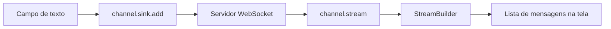

Essa ideia conversa com o que você já viu:

| Aulas anteriores              | Aula 14                                      |
| :---------------------------- | :------------------------------------------- |
| Sensor envia eventos          | Servidor envia mensagens                     |
| GPS pode enviar posições      | WebSocket pode enviar dados                  |
| App assina um `Stream`        | App escuta `channel.stream`                  |
| Precisa cancelar assinatura   | Precisa fechar conexão e cancelar assinatura |
| Interface reage com `setState` | Interface pode reagir com `StreamBuilder`    |

### 1.5 Conexão também é estado do app

Ao trabalhar com WebSocket, você não pensa apenas em "dados". Você também pensa
no estado da conexão.

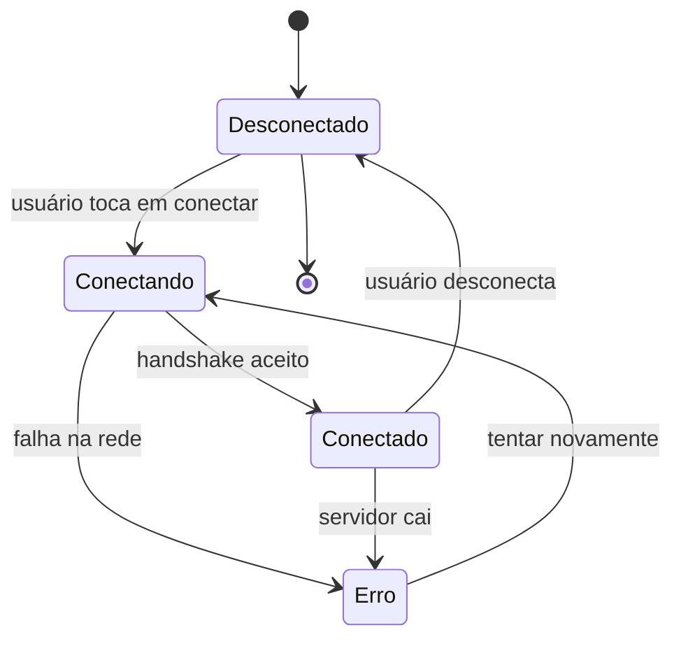

Essa máquina de estados evita mensagens confusas. O usuário precisa saber se o
app está conectado, tentando conectar, desconectado ou com erro.

---

## 2. Preparar o projeto

Abra o terminal na raiz do seu projeto Flutter e instale o pacote:

```bash
flutter pub add web_socket_channel
```

Depois rode:

```bash
flutter pub get
```

Confira no `pubspec.yaml` se apareceu algo parecido com:

```yaml
dependencies:
  web_socket_channel: ^3.0.3
```

Não copie a versão manualmente se o comando instalar outra versão mais nova. O
importante é o pacote estar nas dependências.

### Checkpoint 1

Antes de continuar, confirme:

- [ ] o projeto abre no editor;
- [ ] `flutter pub add web_socket_channel` terminou sem erro;
- [ ] `pubspec.yaml` contém `web_socket_channel`;
- [ ] `flutter run` ainda inicia o app.

---

## 3. Entender a arquitetura do miniapp

Hoje o app será pequeno, mas já terá separação de responsabilidades dentro da
tela:

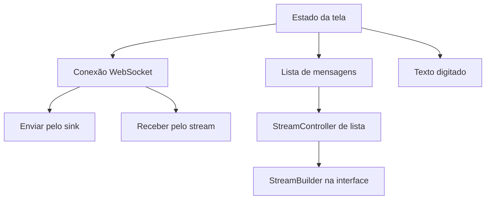

Por que usar um `StreamController<List<Mensagem>>` se o WebSocket já tem um
`stream`?

Porque o `channel.stream` entrega cada mensagem recebida separadamente. A tela,
porém, precisa mostrar uma **lista histórica** com mensagens enviadas e
recebidas. O `StreamController` será o fluxo interno da interface: sempre que a
lista mudar, ele emite a lista atualizada para o `StreamBuilder`.

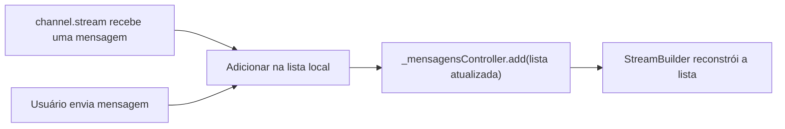

---

## 4. Substituir o `main.dart`

Para esta aula, você pode colocar todo o código no `lib/main.dart`. Em um
projeto maior, você separaria modelo, serviço e tela em arquivos próprios. Aqui
fica tudo junto para facilitar o estudo.

Substitua o conteúdo de `lib/main.dart` por:

```dart
import 'dart:async';

import 'package:flutter/material.dart';
import 'package:web_socket_channel/status.dart' as status;
import 'package:web_socket_channel/web_socket_channel.dart';

void main() {
  runApp(const ChatEcoApp());
}

class ChatEcoApp extends StatelessWidget {
  const ChatEcoApp({super.key});

  @override
  Widget build(BuildContext context) {
    return MaterialApp(
      debugShowCheckedModeBanner: false,
      title: 'Chat de Eco',
      theme: ThemeData(
        colorScheme: ColorScheme.fromSeed(seedColor: Colors.teal),
        useMaterial3: true,
      ),
      home: const ChatEcoPage(),
    );
  }
}

class Mensagem {
  const Mensagem({
    required this.texto,
    required this.origem,
    required this.horario,
  });

  final String texto;
  final String origem;
  final DateTime horario;
}

class ChatEcoPage extends StatefulWidget {
  const ChatEcoPage({super.key});

  @override
  State<ChatEcoPage> createState() => _ChatEcoPageState();
}

class _ChatEcoPageState extends State<ChatEcoPage> {
  final TextEditingController _mensagemController = TextEditingController();
  final TextEditingController _urlController = TextEditingController(
    text: 'wss://echo.websocket.events',
  );
  final StreamController<List<Mensagem>> _mensagensController =
      StreamController<List<Mensagem>>.broadcast();

  final List<Mensagem> _mensagens = [];
  WebSocketChannel? _channel;
  StreamSubscription<dynamic>? _socketSubscription;

  bool _conectado = false;
  bool _conectando = false;
  String _status = 'Desconectado';

  @override
  void initState() {
    super.initState();
    _emitirMensagens();
  }

  Future<void> _conectar() async {
    if (_conectando || _conectado) {
      return;
    }

    final url = _urlController.text.trim();
    if (url.isEmpty) {
      _atualizarStatus('Informe uma URL WebSocket.');
      return;
    }

    setState(() {
      _conectando = true;
      _status = 'Conectando...';
    });

    try {
      final uri = Uri.parse(url);
      final channel = WebSocketChannel.connect(uri);

      await channel.ready.timeout(const Duration(seconds: 8));

      _channel = channel;
      _socketSubscription = channel.stream.listen(
        (event) {
          _adicionarMensagem(
            texto: event.toString(),
            origem: 'Servidor',
          );
        },
        onError: (error) {
          _atualizarStatus('Erro na conexão: $error');
          _marcarComoDesconectado();
        },
        onDone: () {
          _atualizarStatus('Conexão encerrada pelo servidor.');
          _marcarComoDesconectado();
        },
      );

      setState(() {
        _conectado = true;
        _conectando = false;
        _status = 'Conectado em $url';
      });
    } on FormatException {
      setState(() {
        _conectando = false;
        _status = 'URL inválida. Use ws:// ou wss://.';
      });
    } on TimeoutException {
      setState(() {
        _conectando = false;
        _status = 'Tempo esgotado ao conectar.';
      });
    } catch (error) {
      setState(() {
        _conectando = false;
        _status = 'Não foi possível conectar: $error';
      });
    }
  }

  void _enviarMensagem() {
    final texto = _mensagemController.text.trim();

    if (!_conectado || _channel == null) {
      _atualizarStatus('Conecte antes de enviar.');
      return;
    }

    if (texto.isEmpty) {
      _atualizarStatus('Digite uma mensagem.');
      return;
    }

    _channel!.sink.add(texto);
    _adicionarMensagem(texto: texto, origem: 'Você');
    _mensagemController.clear();
  }

  Future<void> _desconectar() async {
    await _socketSubscription?.cancel();
    _socketSubscription = null;

    await _channel?.sink.close(status.goingAway);
    _channel = null;

    _marcarComoDesconectado(mensagem: 'Desconectado pelo usuário.');
  }

  void _adicionarMensagem({
    required String texto,
    required String origem,
  }) {
    _mensagens.add(
      Mensagem(
        texto: texto,
        origem: origem,
        horario: DateTime.now(),
      ),
    );
    _emitirMensagens();
  }

  void _emitirMensagens() {
    if (!_mensagensController.isClosed) {
      _mensagensController.add(List<Mensagem>.unmodifiable(_mensagens));
    }
  }

  void _atualizarStatus(String mensagem) {
    if (!mounted) {
      return;
    }
    setState(() {
      _status = mensagem;
    });
  }

  void _marcarComoDesconectado({String? mensagem}) {
    if (!mounted) {
      return;
    }
    setState(() {
      _conectado = false;
      _conectando = false;
      if (mensagem != null) {
        _status = mensagem;
      }
    });
  }

  @override
  void dispose() {
    _mensagemController.dispose();
    _urlController.dispose();
    _socketSubscription?.cancel();
    _channel?.sink.close(status.goingAway);
    _mensagensController.close();
    super.dispose();
  }

  @override
  Widget build(BuildContext context) {
    return Scaffold(
      appBar: AppBar(
        title: const Text('Chat de Eco'),
        actions: [
          IconButton(
            onPressed: _conectado ? _desconectar : _conectar,
            icon: Icon(_conectado ? Icons.link_off : Icons.link),
            tooltip: _conectado ? 'Desconectar' : 'Conectar',
          ),
        ],
      ),
      body: SafeArea(
        child: Padding(
          padding: const EdgeInsets.all(16),
          child: Column(
            children: [
              TextField(
                controller: _urlController,
                enabled: !_conectado && !_conectando,
                decoration: const InputDecoration(
                  labelText: 'URL WebSocket',
                  border: OutlineInputBorder(),
                ),
              ),
              const SizedBox(height: 12),
              _StatusConexao(
                conectado: _conectado,
                conectando: _conectando,
                status: _status,
              ),
              const SizedBox(height: 12),
              Expanded(
                child: StreamBuilder<List<Mensagem>>(
                  stream: _mensagensController.stream,
                  initialData: const [],
                  builder: (context, snapshot) {
                    final mensagens = snapshot.data ?? const <Mensagem>[];

                    if (mensagens.isEmpty) {
                      return const Center(
                        child: Text('Conecte e envie uma mensagem.'),
                      );
                    }

                    return ListView.builder(
                      itemCount: mensagens.length,
                      itemBuilder: (context, index) {
                        final mensagem = mensagens[index];
                        final enviadaPorMim = mensagem.origem == 'Você';

                        return Align(
                          alignment: enviadaPorMim
                              ? Alignment.centerRight
                              : Alignment.centerLeft,
                          child: Card(
                            color: enviadaPorMim
                                ? Colors.teal.shade100
                                : Colors.grey.shade200,
                            child: Padding(
                              padding: const EdgeInsets.all(12),
                              child: Column(
                                crossAxisAlignment: CrossAxisAlignment.start,
                                children: [
                                  Text(
                                    mensagem.origem,
                                    style: const TextStyle(
                                      fontWeight: FontWeight.bold,
                                    ),
                                  ),
                                  const SizedBox(height: 4),
                                  Text(mensagem.texto),
                                  const SizedBox(height: 4),
                                  Text(
                                    _formatarHorario(mensagem.horario),
                                    style: Theme.of(context).textTheme.bodySmall,
                                  ),
                                ],
                              ),
                            ),
                          ),
                        );
                      },
                    );
                  },
                ),
              ),
              const SizedBox(height: 12),
              Row(
                children: [
                  Expanded(
                    child: TextField(
                      controller: _mensagemController,
                      enabled: _conectado,
                      decoration: const InputDecoration(
                        labelText: 'Mensagem',
                        border: OutlineInputBorder(),
                      ),
                      onSubmitted: (_) => _enviarMensagem(),
                    ),
                  ),
                  const SizedBox(width: 8),
                  FilledButton(
                    onPressed: _conectado ? _enviarMensagem : null,
                    child: const Icon(Icons.send),
                  ),
                ],
              ),
            ],
          ),
        ),
      ),
    );
  }

  String _formatarHorario(DateTime horario) {
    final hora = horario.hour.toString().padLeft(2, '0');
    final minuto = horario.minute.toString().padLeft(2, '0');
    final segundo = horario.second.toString().padLeft(2, '0');
    return '$hora:$minuto:$segundo';
  }
}

class _StatusConexao extends StatelessWidget {
  const _StatusConexao({
    required this.conectado,
    required this.conectando,
    required this.status,
  });

  final bool conectado;
  final bool conectando;
  final String status;

  @override
  Widget build(BuildContext context) {
    final Color cor;
    final IconData icone;

    if (conectando) {
      cor = Colors.orange;
      icone = Icons.sync;
    } else if (conectado) {
      cor = Colors.green;
      icone = Icons.check_circle;
    } else {
      cor = Colors.red;
      icone = Icons.cancel;
    }

    return Container(
      width: double.infinity,
      padding: const EdgeInsets.all(12),
      decoration: BoxDecoration(
        color: cor.withOpacity(0.12),
        border: Border.all(color: cor),
        borderRadius: BorderRadius.circular(8),
      ),
      child: Row(
        children: [
          Icon(icone, color: cor),
          const SizedBox(width: 8),
          Expanded(child: Text(status)),
        ],
      ),
    );
  }
}
```

### Checkpoint 2

Rode:

```bash
flutter run
```

Teste:

- [ ] a tela abre sem erro;
- [ ] o campo de URL aparece;
- [ ] o botão de conexão aparece na `AppBar`;
- [ ] o campo de mensagem começa desabilitado;
- [ ] o app não trava antes de conectar.

---

## 5. Ler o código por partes

### 5.1 O modelo `Mensagem`

```dart
class Mensagem {
  const Mensagem({
    required this.texto,
    required this.origem,
    required this.horario,
  });

  final String texto;
  final String origem;
  final DateTime horario;
}
```

Esse modelo organiza o que será exibido na conversa. Em vez de guardar apenas
uma `String`, o app guarda:

- o texto da mensagem;
- quem gerou a mensagem;
- o horário local em que ela entrou na lista.

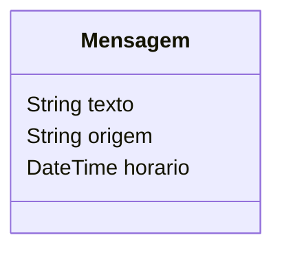

Em um chat real, esse modelo provavelmente teria mais campos:

- `id`;
- `usuarioId`;
- `nomeUsuario`;
- `salaId`;
- `lida`;
- `enviadaEm`;
- `recebidaEm`.

### 5.2 O canal WebSocket

```dart
WebSocketChannel? _channel;
StreamSubscription<dynamic>? _socketSubscription;
```

O `_channel` representa a conexão. A assinatura `_socketSubscription` representa
o ato de ouvir as mensagens que chegam. Guardar a assinatura é importante para
cancelar corretamente depois.

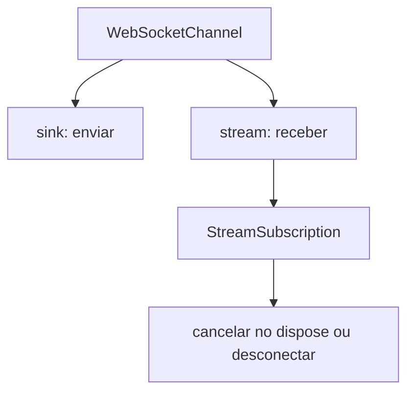

Sem cancelamento, o app pode continuar tentando receber eventos mesmo depois que
a tela saiu de uso.

### 5.3 Conectar

O método `_conectar()` faz quatro coisas:

1. valida se já não existe uma conexão em andamento;
2. lê a URL;
3. cria o `WebSocketChannel`;
4. assina o `stream` para receber mensagens.

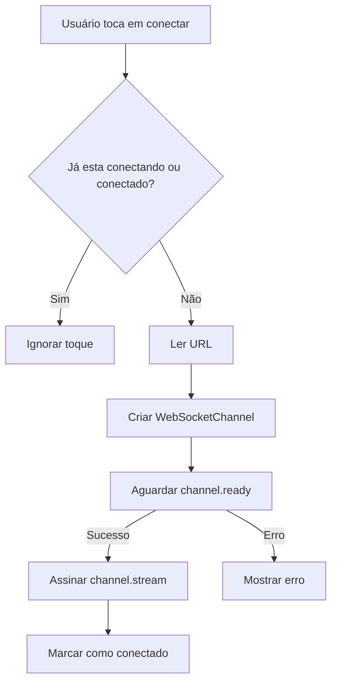

O trecho mais importante é:

```dart
final channel = WebSocketChannel.connect(uri);
await channel.ready.timeout(const Duration(seconds: 8));
```

`connect` inicia a conexão. `ready` permite esperar o canal ficar pronto. O
`timeout` evita que a tela fique presa para sempre se a rede ou o servidor não
responder.

### 5.4 Receber mensagens

```dart
_socketSubscription = channel.stream.listen(
  (event) {
    _adicionarMensagem(
      texto: event.toString(),
      origem: 'Servidor',
    );
  },
);
```

Esse trecho é parecido com a escuta de sensores e localização. A diferença é a
origem do evento: agora o evento vem da rede.

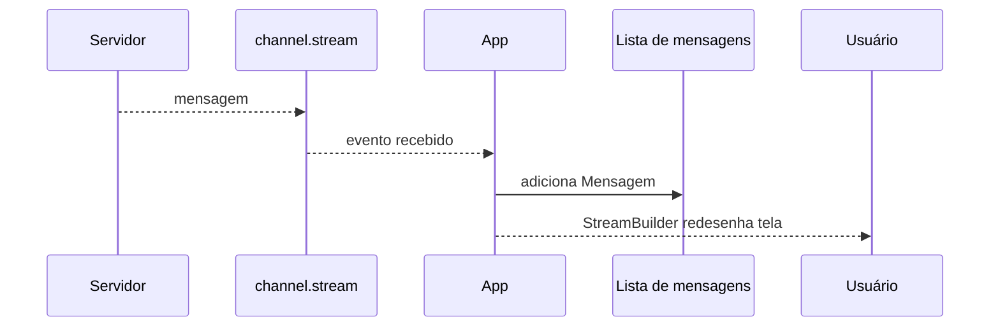

### 5.5 Enviar mensagens

```dart
_channel!.sink.add(texto);
```

O `sink` é o caminho de saída. O app empurra uma mensagem para dentro do canal,
e o pacote envia essa mensagem ao servidor.

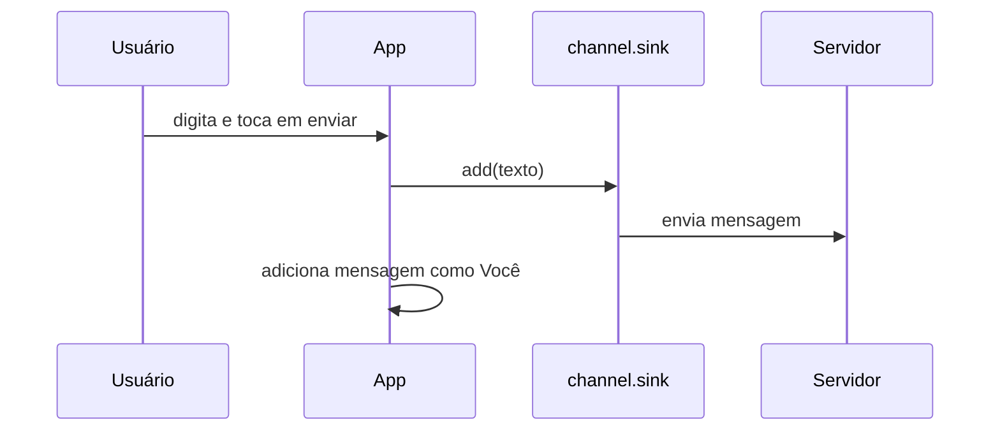

Perceba que o app também adiciona a mensagem localmente como "Você". Depois o
servidor de eco devolve a mesma mensagem, e ela aparece como "Servidor".

### 5.6 Atualizar a tela com `StreamBuilder`

```dart
StreamBuilder<List<Mensagem>>(
  stream: _mensagensController.stream,
  initialData: const [],
  builder: (context, snapshot) {
    final mensagens = snapshot.data ?? const <Mensagem>[];
    ...
  },
)
```

O `StreamBuilder` reconstrói parte da tela sempre que o stream emite um novo
valor. Neste app, o novo valor é a lista atualizada de mensagens.

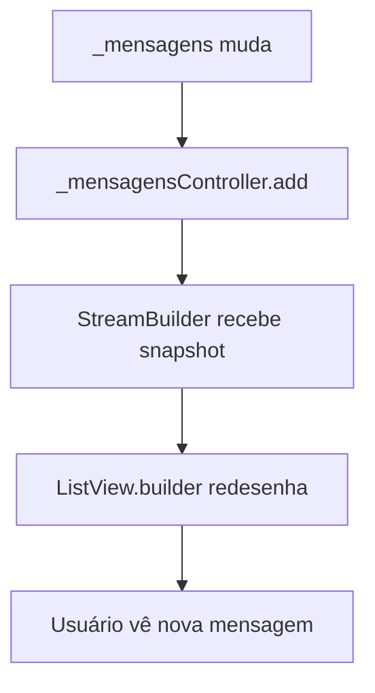

Use esta regra mental:

- `Stream` entrega eventos;
- `StreamBuilder` transforma eventos em interface;
- `ListView.builder` transforma uma lista em itens visuais.

### 5.7 Desconectar e limpar recursos

```dart
await _socketSubscription?.cancel();
await _channel?.sink.close(status.goingAway);
```

Desconectar não é apenas mudar uma variável para `false`. O app precisa cancelar
a escuta e fechar o canal.

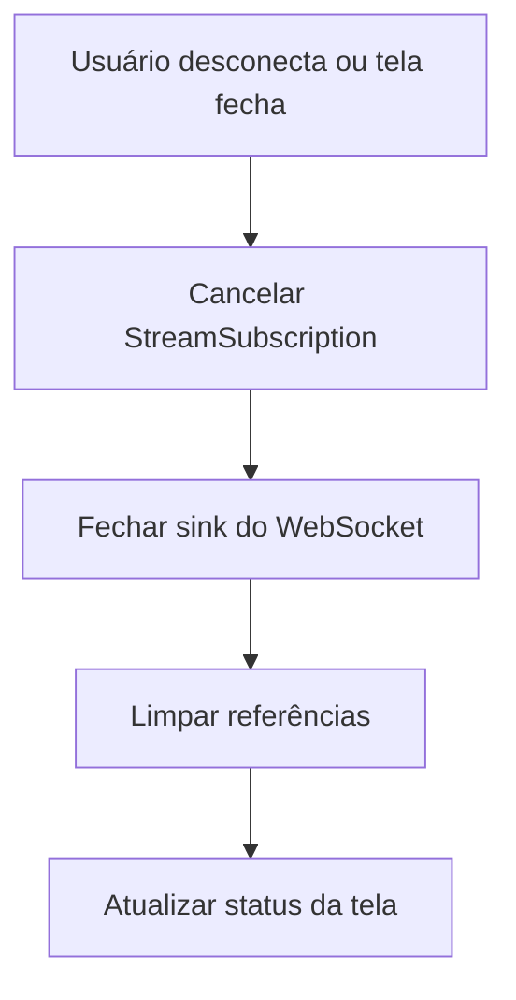

No `dispose()`, a limpeza também acontece porque a tela está sendo destruída.
Isso é equivalente ao cuidado que você teve nas aulas de sensores e localização.

---

## 6. Testes guiados

Faça estes testes na ordem.

### 6.1 Conexão

1. Rode o app.
2. Deixe a URL como `wss://echo.websocket.events`.
3. Toque no ícone de conectar.
4. Confira se o status muda para conectado.

Resultado esperado:

- o campo de mensagem fica habilitado;
- o status fica verde;
- o botão muda para desconectar.

### 6.2 Envio e eco

1. Digite `Olá WebSocket`.
2. Toque no botão enviar.
3. Aguarde a resposta.

Resultado esperado:

- aparece uma mensagem enviada por "Você";
- aparece uma mensagem recebida de "Servidor";
- o horário aparece em cada item.

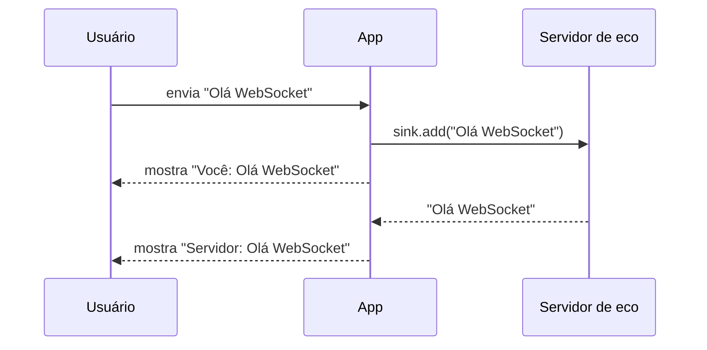

### 6.3 Desconexão

1. Toque no ícone de desconectar.
2. Tente enviar outra mensagem.

Resultado esperado:

- o campo de mensagem fica desabilitado;
- o status informa que desconectou;
- o app não quebra.

### 6.4 URL inválida

1. Desconecte.
2. Troque a URL por `teste`.
3. Toque em conectar.

Resultado esperado:

- o app mostra erro de URL inválida;
- a interface continua funcionando.

---

## 7. Erros comuns e como resolver

### 7.1 O pacote não foi encontrado

Sintoma:

```text
Target of URI doesn't exist: package:web_socket_channel/...
```

Verifique:

- você rodou `flutter pub add web_socket_channel`;
- o terminal estava na raiz do projeto;
- o `pubspec.yaml` foi salvo;
- você rodou `flutter pub get`.

### 7.2 O servidor não conecta

Possíveis causas:

- internet instável;
- firewall bloqueando WebSocket;
- servidor público temporariamente fora;
- URL digitada incorretamente;
- uso de `ws://` quando a rede exige `wss://`.

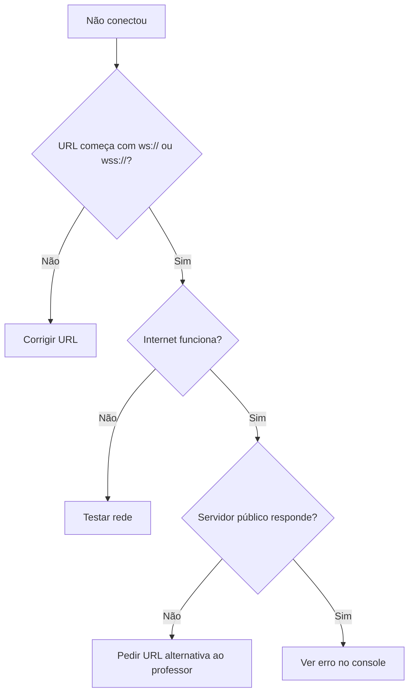

### 7.3 Mensagem enviada não aparece

Verifique:

- o app está conectado;
- o campo não está vazio;
- `_channel!.sink.add(texto)` está sendo chamado;
- `_adicionarMensagem(texto: texto, origem: 'Você')` está depois do envio.

### 7.4 Mensagem recebida não aparece

Verifique:

- `channel.stream.listen` está configurado;
- `_adicionarMensagem` está sendo chamado dentro do `listen`;
- `_mensagensController.add(...)` está sendo chamado;
- o `StreamBuilder` está escutando `_mensagensController.stream`.

## 8. Incrementos opcionais

Faça estes incrementos apenas depois que o roteiro principal estiver
funcionando.

1. Adicione um botão para limpar a conversa.
2. Mostre a quantidade de mensagens enviadas e recebidas.
3. Bloqueie o envio enquanto `_conectando` for `true`.
4. Mostre mensagens do servidor com outro ícone.
5. Adicione tentativa manual de reconexão depois de erro.
6. Crie uma lista de URLs de teste em um `DropdownButton`.
7. Adicione um campo "nome" para prefixar as mensagens enviadas.

Fluxo de reconexão manual:

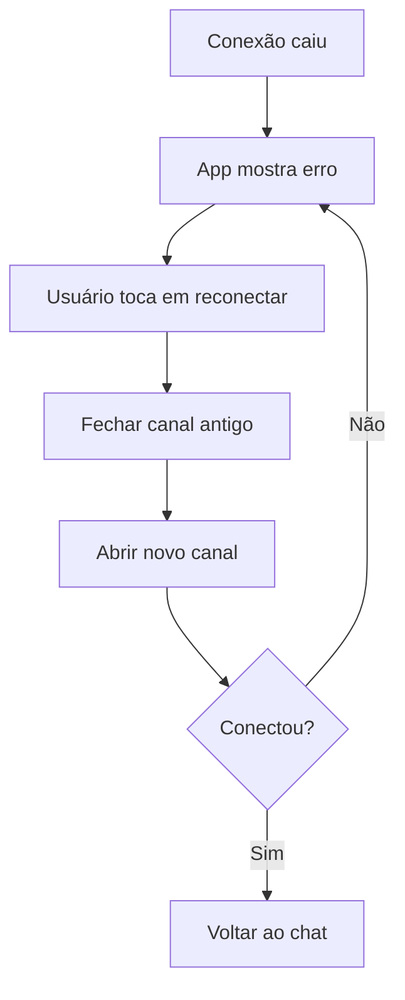

Não implemente reconexão automática infinita nesta aula. Reconectar sem limite
pode gastar bateria, gerar muitas tentativas na rede e esconder o erro real.

---

## 9. Ligação com o projeto final

Agora o curso já passou por várias peças que podem virar um app final:

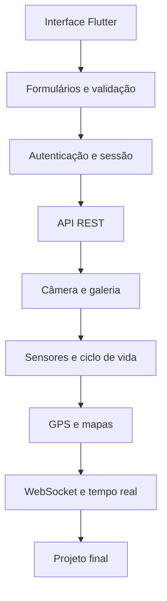

O projeto final não precisa usar tudo ao mesmo tempo, mas precisa mostrar uma
combinação coerente de recursos. O mais importante é escolher um problema
pequeno o suficiente para terminar e bom o suficiente para demonstrar técnica.

### 9.1 Requisitos mínimos sugeridos

Cada grupo deve propor um app com:

- uma tela principal funcional;
- pelo menos uma segunda tela ou fluxo de navegação;
- consumo de API REST ou serviço externo;
- pelo menos um recurso do dispositivo, como câmera, galeria, localização,
  mapa, sensor ou Bluetooth/mock;
- persistência local ou remota, quando fizer sentido;
- tratamento básico de erro;
- código versionado no GitHub;
- demonstração final executável.

### 9.2 Exemplos de escopo viável

| Ideia                  | Recursos possíveis                                      |
| :--------------------- | :------------------------------------------------------ |
| Achados e perdidos     | câmera, mapa, API, lista de itens                       |
| Check-in da escola     | GPS, mapa, histórico local, status em tempo real        |
| Inventário simples     | câmera/QR Code, API, persistência local                 |
| Painel de avisos       | REST para carregar avisos, WebSocket para aviso ao vivo |
| Diário de manutenção   | câmera, formulário, API, histórico local                |
| Monitor de sala        | sensores/mock, tempo real, dashboard simples            |

### 9.3 Corte de escopo

Um bom projeto final não é o mais ambicioso. É o que consegue ser demonstrado
com qualidade.

```mermaid
flowchart TD
    A[Ideia do grupo] --> B{Cabe em duas semanas?}
    B -->|Não| C[Cortar funcionalidades]
    B -->|Sim| D{Tem recurso mobile real?}
    D -->|Não| E[Adicionar recurso nativo simples]
    D -->|Sim| F{Dá para demonstrar funcionando?}
    F -->|Não| C
    F -->|Sim| G[Proposta viável]
```

Perguntas para decidir o escopo:

1. Qual problema o app resolve em uma frase?
2. Quem usaria esse app?
3. Qual é a tela mais importante?
4. Qual recurso mobile será demonstrado?
5. O app precisa de API real ou pode usar mock controlado?
6. O que precisa estar pronto para a primeira demonstração?
7. O que pode virar extra se sobrar tempo?

---

## 10. Entrega da aula

A entrega está embutida nesta própria aula. Não há arquivo auxiliar obrigatório.
Use o Google Forms indicado pelo professor apenas para registrar a evidência.

O que demonstrar:

- app compilando com `flutter run`;
- pacote `web_socket_channel` instalado;
- conexão feita com uma URL `wss://`;
- mensagem enviada pelo app;
- mensagem recebida pelo servidor de eco;
- lista visual atualizada por `StreamBuilder`;
- tratamento de desconexão;
- resposta curta sobre a proposta inicial do projeto final.

Checklist antes de preencher o formulário:

- [ ] `web_socket_channel` aparece no `pubspec.yaml`.
- [ ] O app abre sem erro.
- [ ] A URL WebSocket aparece na tela.
- [ ] O app mostra status de conexão.
- [ ] O botão conectar muda o estado do app.
- [ ] O campo de mensagem só fica habilitado quando conectado.
- [ ] `channel.sink.add(...)` envia a mensagem.
- [ ] `channel.stream.listen(...)` recebe a mensagem.
- [ ] `StreamBuilder` atualiza a lista de mensagens.
- [ ] A conexão é fechada ao desconectar.
- [ ] `dispose()` limpa controladores, assinatura e canal.
- [ ] O repositório no GitHub tem commit com a implementação da aula.
- [ ] O grupo tem uma proposta inicial de projeto final.

---

## 11. Perguntas para revisar

Responda no caderno ou no formulário indicado pelo professor:

1. Qual é a diferença entre HTTP/REST e WebSocket?
2. Por que polling pode desperdiçar internet e bateria?
3. O que significa dizer que WebSocket mantém uma conexão aberta?
4. Para que serve `channel.sink`?
5. Para que serve `channel.stream`?
6. Por que a tela usa `StreamBuilder`?
7. Por que precisamos cancelar a `StreamSubscription`?
8. O que pode causar falha de conexão em uma rede de laboratório?
9. Em que tipo de app WebSocket seria mais útil do que REST?
10. Qual parte do projeto final do seu grupo poderia se beneficiar de dados em
    tempo real?

---

## 12. Fechamento

A Aula 13 colocou dados geográficos na interface: coordenadas viraram mapa,
câmera e marcadores. A Aula 14 adiciona outra dimensão: dados que chegam pela
rede sem depender de uma nova requisição REST a cada atualização.

Agora você já consegue comparar três formas importantes de lidar com dados em
apps mobile:

```mermaid
flowchart LR
    A[Future] --> B[Uma resposta depois de uma ação]
    C[Stream local] --> D[Vários eventos do dispositivo]
    E[WebSocket] --> F[Vários eventos vindos da rede]
```

Essa comparação ajuda a escolher a tecnologia certa:

- use `Future` para uma operação que termina;
- use `Stream` para eventos contínuos;
- use WebSocket quando outro sistema precisa conversar com o app em tempo real.

Na próxima aula, o foco sai da prova de conceito isolada e volta para sprint:
refinar o projeto final, integrar recursos e cortar escopo para conseguir uma
entrega demonstrável.

**Material elaborado para o curso de PAM2 - 2026**
