## Data e contexto

- **Data:** 10/06/2026
- **Duração:** 5 horas-aula (250 min)
- **Horário:** 18h45 às 23h10 (considerando 15 min de intervalo)
- **Laboratório:** 6
- **Pré-requisito direto:** Aula 14 - WebSocket, tempo real e início do projeto
  final
- **Pré-requisitos de apoio:** permissões da Aula 10, `Stream` das aulas de
  sensores/GPS e organização de escopo discutida na Aula 14

## Alinhamento com o PTD

- **Habilidades:** 1.1 a 1.5.
- **Bases:** conectividade avançada; Bluetooth e/ou dispositivos embarcados
  quando aplicável; refinamento do projeto final.
- **Procedimento:** projeto orientado em sprint, code review, refatoração guiada
  e acompanhamento com foco em qualidade.

---

## Objetivo da noite

Na Aula 14, você aprendeu que o app pode manter uma conversa aberta com um
servidor usando WebSocket. O servidor podia enviar dados a qualquer momento, e a
tela precisava reagir ao `stream`.

Hoje a complexidade aumenta de novo: em vez de conversar apenas com um servidor
na internet, o app vai tentar conversar com dispositivos próximos usando
Bluetooth Low Energy (BLE). Isso aproxima o aplicativo do mundo físico: sensores,
ESP32, pulseiras, beacons, equipamentos de laboratório e outros dispositivos que
anunciam dados pelo ar.

Ao final da aula, você deve conseguir construir um miniapp Flutter chamado
**Painel BLE de Sprint** com:

- solicitação de permissões de Bluetooth;
- leitura do estado do adaptador Bluetooth;
- varredura de dispositivos BLE próximos;
- lista de dispositivos com nome, identificador e RSSI;
- conexão com um dispositivo real, quando houver hardware disponível;
- descoberta de serviços e characteristics;
- leitura e escrita em uma characteristic compatível;
- modo simulado para quem estiver sem hardware BLE;
- fechamento do incremento do projeto final para a aula de apresentação.

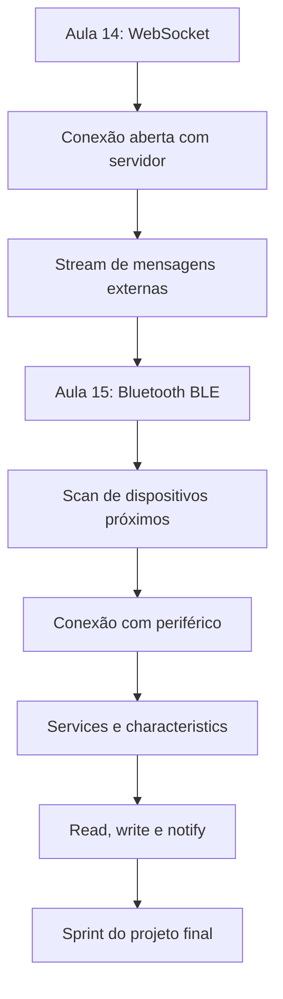

---

## Resultado esperado

Você vai construir uma tela com esta estrutura:

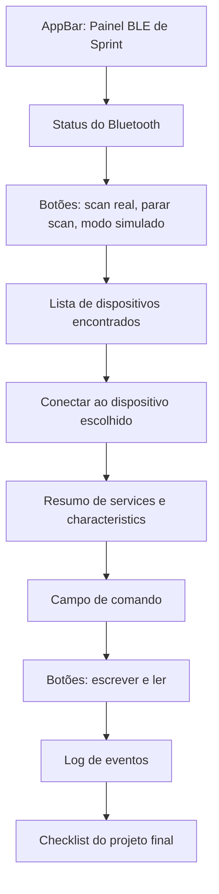

Se houver dispositivo BLE real, você deve testar scan e conexão. Se não houver,
o modo simulado já é suficiente para estudar o fluxo e entregar a evidência da
aula. O importante é entender a arquitetura e saber explicar onde o app conversa
com o dispositivo.

---

## Materiais necessários

Antes de começar, você precisa de:

- projeto Flutter funcionando;
- Android Studio ou VS Code aberto;
- celular Android físico, de preferência com Bluetooth ativado;
- cabo USB ou pareamento de depuração sem fio;
- internet para instalar pacotes;
- noção de `StatefulWidget`, `setState`, `async/await`, `StreamSubscription`,
  `try/catch` e `dispose()`;
- código da Aula 14 disponível para consulta, principalmente a lógica de estado,
  `Stream` e limpeza de recursos.

Esta aula não depende de arquivo auxiliar do curso. A entrega está descrita no
próprio roteiro. O Google Forms, quando indicado pelo professor, será usado
apenas para registrar a evidência final.

---

## Documentação para consulta

- [flutter_blue_plus no pub.dev](https://pub.dev/packages/flutter_blue_plus)
- [Exemplo oficial do flutter_blue_plus](https://pub.dev/packages/flutter_blue_plus/example)
- [API de `BluetoothDevice`](https://pub.dev/documentation/flutter_blue_plus/latest/flutter_blue_plus/BluetoothDevice-class.html)
- [API de `BluetoothCharacteristic`](https://pub.dev/documentation/flutter_blue_plus/latest/flutter_blue_plus/BluetoothCharacteristic-class.html)
- [permission_handler no pub.dev](https://pub.dev/packages/permission_handler)
- [Android Developers - Bluetooth permissions](https://developer.android.com/develop/connectivity/bluetooth/bt-permissions)

---

## Mapa rápido da aula

Siga nesta ordem:

1. Relembrar a diferença entre WebSocket e Bluetooth.
2. Entender os papéis BLE: central, periférico, service e characteristic.
3. Configurar dependências e permissões Android.
4. Criar o app base em um único `lib/main.dart`.
5. Ler o estado do Bluetooth.
6. Pedir permissões em tempo de execução.
7. Escanear dispositivos próximos.
8. Usar modo simulado se não houver hardware.
9. Conectar a um dispositivo real, se disponível.
10. Descobrir services e characteristics.
11. Tentar leitura, escrita e notificações.
12. Aplicar o aprendizado no projeto final.
13. Fechar a entrega da aula com evidências.

---

## 1. Conceitos antes do código

### 1.1 WebSocket conversa com servidor; BLE conversa com dispositivo próximo

Na aula anterior, a conexão era feita pela internet ou pela rede local. Hoje, a
conexão acontece pelo rádio Bluetooth do celular.

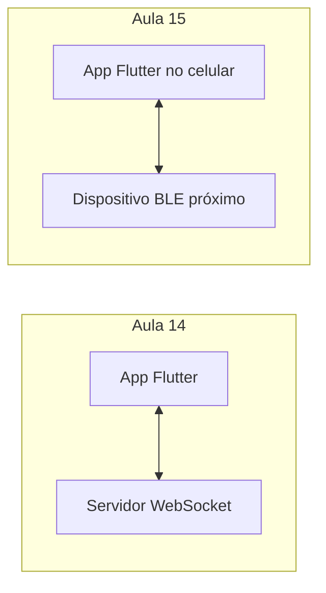

O ponto em comum é que os dois modelos lidam com comunicação contínua. A
diferença é o ambiente:

| Pergunta                              | WebSocket                  | BLE                                      |
| :------------------------------------ | :------------------------- | :--------------------------------------- |
| Com quem o app conversa?              | Servidor                   | Dispositivo próximo                     |
| Qual rede usa?                        | Internet ou rede local     | Rádio Bluetooth                         |
| Precisa de permissão do dispositivo?  | Normalmente não            | Sim, permissões de Bluetooth/localização |
| Pode receber dados sem apertar botão? | Sim                        | Sim, por notificações                    |
| Exemplo                               | chat, painel em tempo real | sensor, ESP32, beacon, wearable          |

### 1.2 Bluetooth Classic não é a mesma coisa que BLE

Bluetooth Classic e Bluetooth Low Energy resolvem problemas diferentes. Para
apps Flutter modernos que falam com sensores e dispositivos IoT, BLE costuma ser
o caminho mais comum.

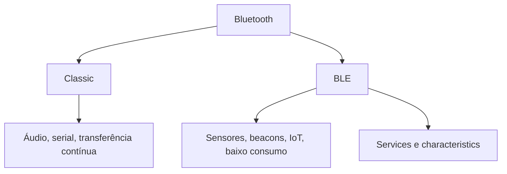

Nesta aula vamos focar em BLE. Se o grupo usar um módulo Bluetooth Classic no
projeto final, como HC-05/HC-06, o pacote e o fluxo podem mudar. Para a aula de
hoje, pense em BLE como o modelo de sensores e pequenos comandos.

### 1.3 Central, periférico, service e characteristic

No BLE, o celular normalmente assume o papel de **central**. O dispositivo, como
um ESP32 ou sensor, assume o papel de **periférico**. O periférico anuncia que
existe, a central faz scan, conecta e pergunta quais serviços estão disponíveis.

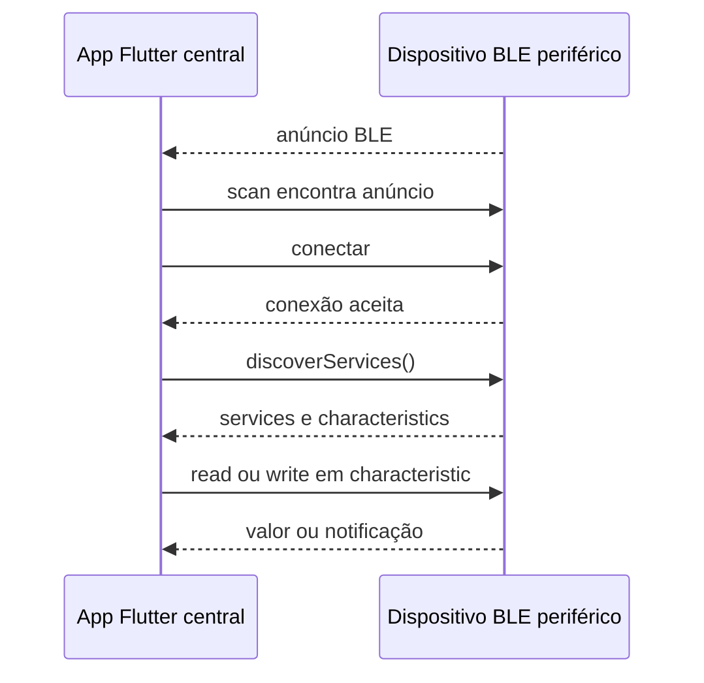

O vocabulário principal:

| Termo              | Significado prático                                                        |
| :----------------- | :------------------------------------------------------------------------- |
| Central            | Quem procura e inicia conexão. No roteiro, é o app Flutter no celular.     |
| Periférico         | Quem anuncia dados. Pode ser ESP32, sensor, pulseira ou beacon.            |
| Service            | Grupo de funcionalidades oferecidas pelo periférico.                       |
| Characteristic     | Canal específico de dado dentro de um service. Pode permitir read/write.   |
| Read               | O app pede um valor atual.                                                 |
| Write              | O app envia um comando ou valor.                                           |
| Notify / Indicate  | O periférico envia atualizações sem o app pedir toda hora.                 |
| RSSI               | Intensidade aproximada do sinal recebido. Quanto menos negativo, melhor.   |

### 1.4 GATT organiza a conversa

GATT é a estrutura usada pelo BLE para organizar services e characteristics.
Pense nele como um pequeno cardápio técnico do dispositivo.

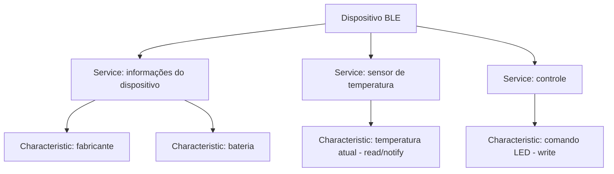

Quando o app descobre os services, ele ainda não sabe automaticamente o que cada
UUID significa. Em dispositivos reais, você precisa consultar a documentação do
hardware ou do firmware para saber qual characteristic deve ser lida ou escrita.

### 1.5 Permissão faz parte da arquitetura

Bluetooth não é apenas uma chamada de API. O sistema operacional protege o
recurso porque o scan pode revelar dispositivos próximos.

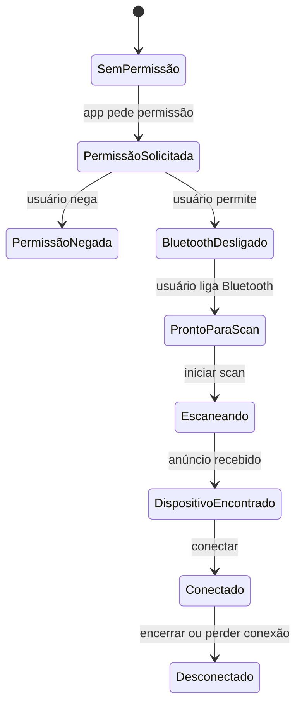

Se o app não mostrar claramente em que estado está, o usuário não sabe se o
problema é permissão, Bluetooth desligado, falta de dispositivo ou falha de
conexão.

---

## 2. Preparar o projeto

Você pode fazer esta aula em um projeto de estudo separado ou em uma branch do
projeto final. Se o seu projeto final já está instável, crie um projeto limpo
para aprender o fluxo primeiro.

No terminal, na raiz do projeto Flutter, execute:

```bash
flutter pub add flutter_blue_plus permission_handler
flutter pub get
```

Confira se os pacotes apareceram no `pubspec.yaml`:

```yaml
dependencies:
  flutter:
    sdk: flutter
  flutter_blue_plus: ^2.3.2
  permission_handler: ^12.0.1
```

Não copie versões manualmente se o `flutter pub add` instalar versões mais
novas. O importante é que os pacotes estejam em `dependencies`, não em
`dev_dependencies`.

### 2.1 Conferir `minSdkVersion`

O `flutter_blue_plus` exige Android SDK mínimo 21. Abra
`android/app/build.gradle` ou `android/app/build.gradle.kts` e confirme que o
`minSdkVersion`/`minSdk` está em `21` ou maior.

```gradle
defaultConfig {
    minSdkVersion 21
}
```

Se o seu projeto já usa valor maior, mantenha o valor maior.

### 2.2 Ajustar permissões Android

Abra `android/app/src/main/AndroidManifest.xml` e coloque as permissões dentro
de `<manifest>`, antes de `<application>`.

```xml
<!-- Android 11 ou inferior -->
<uses-permission android:name="android.permission.BLUETOOTH"
    android:maxSdkVersion="30" />
<uses-permission android:name="android.permission.BLUETOOTH_ADMIN"
    android:maxSdkVersion="30" />
<uses-permission android:name="android.permission.ACCESS_FINE_LOCATION"
    android:maxSdkVersion="30" />

<!-- Android 12 ou superior -->
<uses-permission android:name="android.permission.BLUETOOTH_SCAN"
    android:usesPermissionFlags="neverForLocation" />
<uses-permission android:name="android.permission.BLUETOOTH_CONNECT" />

<!-- O app pode funcionar sem BLE usando o modo simulado. -->
<uses-feature android:name="android.hardware.bluetooth_le"
    android:required="false" />
```

O `neverForLocation` deve ser usado apenas quando o app não usa o scan para
descobrir localização física do usuário. O nosso app de aula usa scan apenas
para aprendizagem e diagnóstico de dispositivos.

### Checkpoint 1

Antes de continuar, confirme:

- [ ] o projeto abre no editor;
- [ ] `flutter pub get` terminou sem erro;
- [ ] os pacotes estão em `dependencies`;
- [ ] o `AndroidManifest.xml` tem permissões antes de `<application>`;
- [ ] você está testando em celular físico quando quiser usar scan real;
- [ ] você sabe usar o modo simulado se não houver hardware.

---

## 3. Arquitetura do miniapp

O app terá uma tela única, mas com responsabilidades separadas por função.

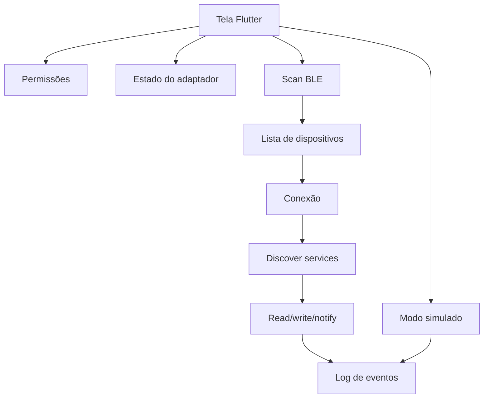

A parte real e a parte simulada aparecem na mesma interface. Isso evita que a
aula dependa totalmente de um ESP32, sensor ou celular extra.

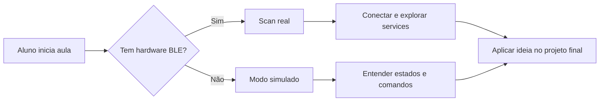

---

## 4. Substituir o `main.dart`

Para estudar o fluxo sem criar arquivos auxiliares, coloque todo o código em
`lib/main.dart`. Em um projeto final, você separaria tela, serviço e modelos
depois que o comportamento estivesse entendido.

Substitua o conteúdo de `lib/main.dart` por:

```dart
import 'dart:async';
import 'dart:convert';

import 'package:flutter/material.dart';
import 'package:flutter_blue_plus/flutter_blue_plus.dart';
import 'package:permission_handler/permission_handler.dart';

void main() {
  runApp(const BleSprintApp());
}

class BleSprintApp extends StatelessWidget {
  const BleSprintApp({super.key});

  @override
  Widget build(BuildContext context) {
    return MaterialApp(
      debugShowCheckedModeBanner: false,
      title: 'Painel BLE de Sprint',
      theme: ThemeData(
        colorScheme: ColorScheme.fromSeed(seedColor: Colors.indigo),
        useMaterial3: true,
      ),
      home: const BleSprintPage(),
    );
  }
}

class DispositivoEncontrado {
  const DispositivoEncontrado({
    required this.nome,
    required this.id,
    required this.rssi,
    this.device,
  });

  final String nome;
  final String id;
  final int rssi;
  final BluetoothDevice? device;

  bool get simulado => device == null;
}

class BleSprintPage extends StatefulWidget {
  const BleSprintPage({super.key});

  @override
  State<BleSprintPage> createState() => _BleSprintPageState();
}

class _BleSprintPageState extends State<BleSprintPage> {
  final TextEditingController _comandoController =
      TextEditingController(text: 'LED_ON');

  final List<DispositivoEncontrado> _dispositivos = [];
  final List<String> _log = [];
  final List<BluetoothService> _servicos = [];

  StreamSubscription<BluetoothAdapterState>? _adapterSubscription;
  StreamSubscription<List<ScanResult>>? _scanSubscription;
  StreamSubscription<BluetoothConnectionState>? _connectionSubscription;
  StreamSubscription<List<int>>? _notifySubscription;

  BluetoothAdapterState _adapterState = BluetoothAdapterState.unknown;
  BluetoothDevice? _dispositivoConectado;
  BluetoothCharacteristic? _characteristicLeitura;
  BluetoothCharacteristic? _characteristicEscrita;

  bool _escaneando = false;
  bool _modoSimulado = false;
  String _status = 'Aguardando início.';

  @override
  void initState() {
    super.initState();

    _adapterSubscription = FlutterBluePlus.adapterState.listen((state) {
      if (!mounted) return;
      setState(() {
        _adapterState = state;
      });
    });

    _scanSubscription = FlutterBluePlus.scanResults.listen(_receberResultados);
  }

  Future<void> _pedirPermissoes() async {
    final statuses = await [
      Permission.bluetoothScan,
      Permission.bluetoothConnect,
      Permission.locationWhenInUse,
    ].request();

    final negadas = statuses.entries
        .where((entry) =>
            entry.value.isDenied || entry.value.isPermanentlyDenied)
        .map((entry) => entry.key.toString())
        .toList();

    if (negadas.isEmpty) {
      _registrar('Permissões concedidas ou não exigidas nesta versão.');
    } else {
      _registrar('Permissões pendentes: ${negadas.join(', ')}');
    }
  }

  Future<void> _iniciarScan() async {
    await _pedirPermissoes();
    await _notifySubscription?.cancel();
    await FlutterBluePlus.stopScan();

    setState(() {
      _modoSimulado = false;
      _escaneando = true;
      _status = 'Escaneando por 8 segundos...';
      _dispositivos.clear();
      _servicos.clear();
      _dispositivoConectado = null;
      _characteristicLeitura = null;
      _characteristicEscrita = null;
    });

    try {
      _registrar('Scan real iniciado.');
      await FlutterBluePlus.startScan(timeout: const Duration(seconds: 8));
      await FlutterBluePlus.isScanning.where((value) => value == false).first;
      _registrar('Scan encerrado. Dispositivos encontrados: ${_dispositivos.length}.');
    } catch (error) {
      _registrar('Falha no scan: $error');
    } finally {
      if (mounted) {
        setState(() {
          _escaneando = false;
          _status = 'Scan finalizado.';
        });
      }
    }
  }

  Future<void> _pararScan() async {
    await FlutterBluePlus.stopScan();
    if (!mounted) return;
    setState(() {
      _escaneando = false;
      _status = 'Scan parado manualmente.';
    });
    _registrar('Scan parado pelo usuário.');
  }

  void _receberResultados(List<ScanResult> resultados) {
    if (!mounted || _modoSimulado) return;

    final atualizados = <String, DispositivoEncontrado>{
      for (final dispositivo in _dispositivos) dispositivo.id: dispositivo,
    };

    for (final resultado in resultados) {
      final device = resultado.device;
      final id = device.remoteId.toString();
      final nome = resultado.advertisementData.advName.isNotEmpty
          ? resultado.advertisementData.advName
          : device.platformName.isNotEmpty
              ? device.platformName
              : 'Sem nome';

      atualizados[id] = DispositivoEncontrado(
        nome: nome,
        id: id,
        rssi: resultado.rssi,
        device: device,
      );
    }

    final ordenados = atualizados.values.toList()
      ..sort((a, b) => b.rssi.compareTo(a.rssi));

    setState(() {
      _dispositivos
        ..clear()
        ..addAll(ordenados);
    });
  }

  void _usarModoSimulado() {
    FlutterBluePlus.stopScan();

    setState(() {
      _modoSimulado = true;
      _escaneando = false;
      _status = 'Modo simulado ativo.';
      _dispositivoConectado = null;
      _servicos.clear();
      _characteristicLeitura = null;
      _characteristicEscrita = null;
      _dispositivos
        ..clear()
        ..addAll(const [
          DispositivoEncontrado(
            nome: 'ESP32-Sala-Simulado',
            id: 'SIM-ESP32-001',
            rssi: -42,
          ),
          DispositivoEncontrado(
            nome: 'Sensor-Temperatura-Simulado',
            id: 'SIM-TEMP-002',
            rssi: -61,
          ),
        ]);
    });

    _registrar('Modo simulado pronto. Use-o se não houver hardware BLE.');
  }

  Future<void> _conectar(DispositivoEncontrado item) async {
    await FlutterBluePlus.stopScan();
    await _connectionSubscription?.cancel();
    await _notifySubscription?.cancel();

    if (item.simulado) {
      setState(() {
        _modoSimulado = true;
        _status = 'Conectado ao dispositivo simulado ${item.nome}.';
        _dispositivoConectado = null;
        _servicos.clear();
      });
      _registrar('Simulador conectado: ${item.nome}.');
      return;
    }

    final device = item.device!;

    setState(() {
      _status = 'Conectando a ${item.nome}...';
      _servicos.clear();
      _characteristicLeitura = null;
      _characteristicEscrita = null;
    });

    try {
      await device.connect(
        license: License.free,
        timeout: const Duration(seconds: 12),
      );

      _connectionSubscription = device.connectionState.listen((state) {
        if (!mounted) return;
        if (state == BluetoothConnectionState.disconnected) {
          setState(() {
            _status = 'Dispositivo desconectado.';
            _dispositivoConectado = null;
            _servicos.clear();
            _characteristicLeitura = null;
            _characteristicEscrita = null;
          });
          _registrar('Conexão encerrada.');
        }
      });

      final services = await device.discoverServices();
      BluetoothCharacteristic? leitura;
      BluetoothCharacteristic? escrita;

      for (final service in services) {
        for (final characteristic in service.characteristics) {
          if (leitura == null &&
              (characteristic.properties.read ||
                  characteristic.properties.notify ||
                  characteristic.properties.indicate)) {
            leitura = characteristic;
          }

          if (escrita == null &&
              (characteristic.properties.write ||
                  characteristic.properties.writeWithoutResponse)) {
            escrita = characteristic;
          }
        }
      }

      setState(() {
        _status = 'Conectado a ${item.nome}.';
        _dispositivoConectado = device;
        _servicos
          ..clear()
          ..addAll(services);
        _characteristicLeitura = leitura;
        _characteristicEscrita = escrita;
      });

      _registrar('Services encontrados: ${services.length}.');
      _registrar('Characteristic de leitura: ${leitura?.uuid ?? 'nenhuma'}.');
      _registrar('Characteristic de escrita: ${escrita?.uuid ?? 'nenhuma'}.');

      if (leitura != null &&
          (leitura.properties.notify || leitura.properties.indicate)) {
        await leitura.setNotifyValue(true);
        _notifySubscription = leitura.lastValueStream.listen((value) {
          if (value.isEmpty) return;
          _registrar('Notificação recebida: ${_formatarBytes(value)}');
        });
        _registrar('Notificações ativadas na characteristic ${leitura.uuid}.');
      }
    } catch (error) {
      setState(() {
        _status = 'Falha ao conectar.';
      });
      _registrar('Erro de conexao: $error');
    }
  }

  Future<void> _lerValor() async {
    if (_modoSimulado) {
      _registrar('Simulado leu: temperatura=25.4; bateria=88%.');
      return;
    }

    final characteristic = _characteristicLeitura;
    if (characteristic == null) {
      _registrar('Nenhuma characteristic com leitura/notify foi encontrada.');
      return;
    }

    try {
      final value = await characteristic.read();
      _registrar('Read ${characteristic.uuid}: ${_formatarBytes(value)}');
    } catch (error) {
      _registrar('Erro ao ler characteristic: $error');
    }
  }

  Future<void> _escreverValor() async {
    final comando = _comandoController.text.trim();
    if (comando.isEmpty) {
      _registrar('Digite um comando antes de escrever.');
      return;
    }

    if (_modoSimulado) {
      _registrar('Simulado recebeu comando: $comando');
      _registrar('Simulado respondeu: OK');
      return;
    }

    final characteristic = _characteristicEscrita;
    if (characteristic == null) {
      _registrar('Nenhuma characteristic com escrita foi encontrada.');
      return;
    }

    try {
      await characteristic.write(
        utf8.encode(comando),
        withoutResponse: characteristic.properties.writeWithoutResponse,
      );
      _registrar('Write ${characteristic.uuid}: $comando');
    } catch (error) {
      _registrar('Erro ao escrever characteristic: $error');
    }
  }

  Future<void> _desconectar() async {
    await _notifySubscription?.cancel();
    await _connectionSubscription?.cancel();
    await _dispositivoConectado?.disconnect();

    if (!mounted) return;
    setState(() {
      _status = 'Desconectado.';
      _dispositivoConectado = null;
      _servicos.clear();
      _characteristicLeitura = null;
      _characteristicEscrita = null;
      _modoSimulado = false;
    });
    _registrar('Desconectado pelo usuário.');
  }

  void _registrar(String mensagem) {
    if (!mounted) return;
    final horario = TimeOfDay.now().format(context);
    setState(() {
      _log.insert(0, '[$horario] $mensagem');
      if (_log.length > 40) {
        _log.removeLast();
      }
    });
  }

  String _formatarBytes(List<int> value) {
    if (value.isEmpty) return '[]';

    final texto = utf8.decode(value, allowMalformed: true).trim();
    final hex = value
        .map((byte) => byte.toRadixString(16).padLeft(2, '0'))
        .join(' ');

    if (texto.isEmpty) {
      return 'hex=[$hex]';
    }
    return 'texto="$texto"; hex=[$hex]';
  }

  @override
  void dispose() {
    _comandoController.dispose();
    _adapterSubscription?.cancel();
    _scanSubscription?.cancel();
    _connectionSubscription?.cancel();
    _notifySubscription?.cancel();
    FlutterBluePlus.stopScan();
    _dispositivoConectado?.disconnect();
    super.dispose();
  }

  @override
  Widget build(BuildContext context) {
    final conectadoReal = _dispositivoConectado != null;

    return Scaffold(
      appBar: AppBar(
        title: const Text('Painel BLE de Sprint'),
        actions: [
          IconButton(
            onPressed: conectadoReal || _modoSimulado ? _desconectar : null,
            icon: const Icon(Icons.link_off),
            tooltip: 'Desconectar',
          ),
        ],
      ),
      body: SafeArea(
        child: Padding(
          padding: const EdgeInsets.all(16),
          child: Column(
            crossAxisAlignment: CrossAxisAlignment.stretch,
            children: [
              _StatusCard(
                adapterState: _adapterState,
                status: _status,
                modoSimulado: _modoSimulado,
              ),
              const SizedBox(height: 12),
              Wrap(
                spacing: 8,
                runSpacing: 8,
                children: [
                  FilledButton.icon(
                    onPressed: _escaneando ? null : _iniciarScan,
                    icon: const Icon(Icons.bluetooth_searching),
                    label: const Text('Scan real'),
                  ),
                  OutlinedButton.icon(
                    onPressed: _escaneando ? _pararScan : null,
                    icon: const Icon(Icons.stop),
                    label: const Text('Parar scan'),
                  ),
                  OutlinedButton.icon(
                    onPressed: _usarModoSimulado,
                    icon: const Icon(Icons.science),
                    label: const Text('Modo simulado'),
                  ),
                ],
              ),
              const SizedBox(height: 12),
              Expanded(
                flex: 2,
                child: _DeviceList(
                  dispositivos: _dispositivos,
                  onConnect: _conectar,
                ),
              ),
              const SizedBox(height: 12),
              _ServicesSummary(
                servicos: _servicos,
                characteristicLeitura: _characteristicLeitura,
                characteristicEscrita: _characteristicEscrita,
                modoSimulado: _modoSimulado,
              ),
              const SizedBox(height: 12),
              TextField(
                controller: _comandoController,
                decoration: const InputDecoration(
                  labelText: 'Comando para escrita',
                  hintText: 'Ex.: LED_ON',
                  border: OutlineInputBorder(),
                ),
              ),
              const SizedBox(height: 8),
              Wrap(
                spacing: 8,
                runSpacing: 8,
                children: [
                  FilledButton.icon(
                    onPressed: _modoSimulado || conectadoReal
                        ? _escreverValor
                        : null,
                    icon: const Icon(Icons.send),
                    label: const Text('Escrever'),
                  ),
                  OutlinedButton.icon(
                    onPressed:
                        _modoSimulado || conectadoReal ? _lerValor : null,
                    icon: const Icon(Icons.download),
                    label: const Text('Ler'),
                  ),
                ],
              ),
              const SizedBox(height: 12),
              Expanded(
                flex: 2,
                child: _LogList(log: _log),
              ),
            ],
          ),
        ),
      ),
    );
  }
}

class _StatusCard extends StatelessWidget {
  const _StatusCard({
    required this.adapterState,
    required this.status,
    required this.modoSimulado,
  });

  final BluetoothAdapterState adapterState;
  final String status;
  final bool modoSimulado;

  @override
  Widget build(BuildContext context) {
    final color = modoSimulado
        ? Colors.orange
        : adapterState == BluetoothAdapterState.on
            ? Colors.green
            : Colors.red;

    return Card(
      child: Padding(
        padding: const EdgeInsets.all(12),
        child: Row(
          crossAxisAlignment: CrossAxisAlignment.start,
          children: [
            Icon(Icons.bluetooth, color: color),
            const SizedBox(width: 12),
            Expanded(
              child: Column(
                crossAxisAlignment: CrossAxisAlignment.start,
                children: [
                  Text('Adaptador: $adapterState'),
                  Text(status),
                ],
              ),
            ),
          ],
        ),
      ),
    );
  }
}

class _DeviceList extends StatelessWidget {
  const _DeviceList({
    required this.dispositivos,
    required this.onConnect,
  });

  final List<DispositivoEncontrado> dispositivos;
  final ValueChanged<DispositivoEncontrado> onConnect;

  @override
  Widget build(BuildContext context) {
    if (dispositivos.isEmpty) {
      return const Center(
        child: Text('Nenhum dispositivo ainda. Use scan real ou modo simulado.'),
      );
    }

    return ListView.separated(
      itemCount: dispositivos.length,
      separatorBuilder: (_, __) => const Divider(height: 1),
      itemBuilder: (context, index) {
        final item = dispositivos[index];
        return ListTile(
          leading: Icon(
            item.simulado ? Icons.science : Icons.bluetooth,
          ),
          title: Text(item.nome),
          subtitle: Text('${item.id} | RSSI ${item.rssi} dBm'),
          trailing: FilledButton(
            onPressed: () => onConnect(item),
            child: const Text('Conectar'),
          ),
        );
      },
    );
  }
}

class _ServicesSummary extends StatelessWidget {
  const _ServicesSummary({
    required this.servicos,
    required this.characteristicLeitura,
    required this.characteristicEscrita,
    required this.modoSimulado,
  });

  final List<BluetoothService> servicos;
  final BluetoothCharacteristic? characteristicLeitura;
  final BluetoothCharacteristic? characteristicEscrita;
  final bool modoSimulado;

  @override
  Widget build(BuildContext context) {
    if (modoSimulado) {
      return const Card(
        child: Padding(
          padding: EdgeInsets.all(12),
          child: Text(
            'Simulador: 1 serviço fictício, leitura de temperatura e escrita de comandos.',
          ),
        ),
      );
    }

    return Card(
      child: Padding(
        padding: const EdgeInsets.all(12),
        child: Column(
          crossAxisAlignment: CrossAxisAlignment.start,
          children: [
            Text('Services encontrados: ${servicos.length}'),
            Text('Leitura/notify: ${characteristicLeitura?.uuid ?? 'nenhuma'}'),
            Text('Escrita: ${characteristicEscrita?.uuid ?? 'nenhuma'}'),
          ],
        ),
      ),
    );
  }
}

class _LogList extends StatelessWidget {
  const _LogList({required this.log});

  final List<String> log;

  @override
  Widget build(BuildContext context) {
    if (log.isEmpty) {
      return const Center(child: Text('O log de eventos aparecerá aqui.'));
    }

    return ListView.builder(
      itemCount: log.length,
      itemBuilder: (context, index) {
        return Text(log[index]);
      },
    );
  }
}
```

### Observação sobre licença do pacote

Nas versões atuais do `flutter_blue_plus`, a chamada `device.connect()` exige o
argumento `license`. Para uso em instituição educacional, o exemplo usa
`License.free`. Se no futuro a API mudar, consulte a documentação do pacote
antes de corrigir o código.

---

## 5. Entender o código por partes

### 5.1 O app acompanha o estado do adaptador

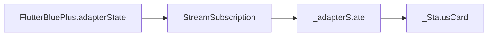

O Bluetooth pode estar ligado, desligado, sem autorização ou em estado
desconhecido. Por isso, o app não deve assumir que o recurso está pronto só
porque o celular tem Bluetooth.

### 5.2 O scan produz uma lista que muda com o tempo

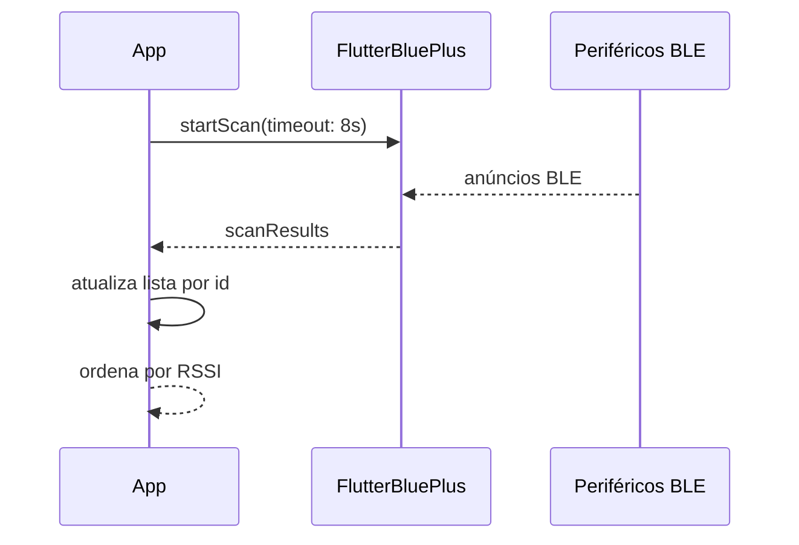

O RSSI não é distância exata. Ele é apenas uma pista. Um valor como `-42 dBm`
normalmente indica sinal mais forte do que `-80 dBm`, mas paredes, corpo humano,
capas e interferência podem alterar a leitura.

### 5.3 Conectar não basta: precisa descobrir services

Depois da conexão, o app chama `discoverServices()`. Só depois disso ele sabe
quais services e characteristics aquele dispositivo oferece.

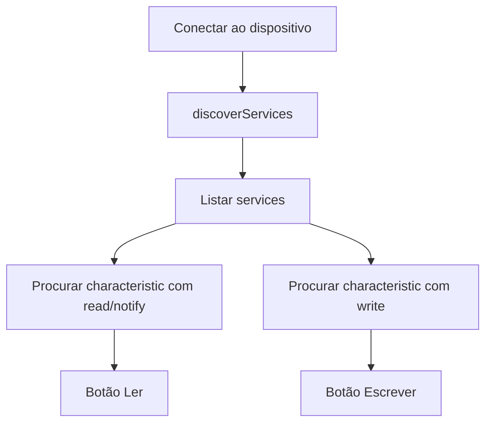

O roteiro escolhe automaticamente a primeira characteristic compatível com
leitura/notificação e a primeira compatível com escrita. Isso serve para estudo.
Em um projeto real, você deve escolher pelo UUID documentado do dispositivo.

### 5.4 Notify é parecido com Stream

Quando uma characteristic permite `notify`, o periférico pode enviar valores
sem que o app fique perguntando repetidamente.

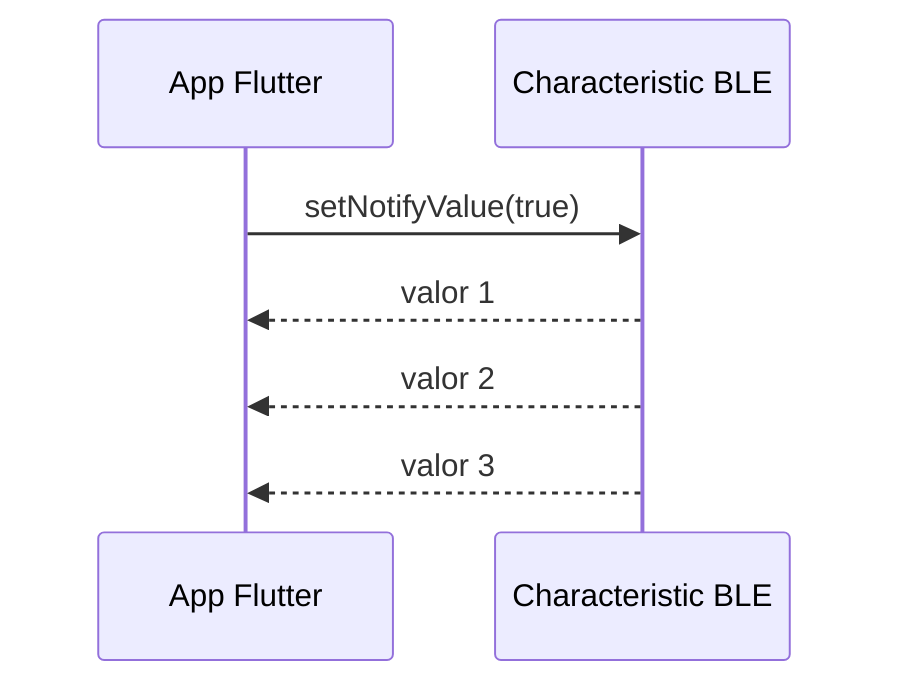

Isso se conecta diretamente com o que você já viu:

| Aula anterior                  | Aula 15                                         |
| :----------------------------- | :---------------------------------------------- |
| `Stream` de sensor             | `lastValueStream` da characteristic             |
| WebSocket recebe mensagem      | Notify recebe bytes do periférico               |
| `StreamSubscription.cancel()`  | Cancelar assinatura ao desconectar              |
| `dispose()` fecha recurso      | `dispose()` para scan, conexão e subscriptions  |

### 5.5 Bytes precisam ser interpretados

BLE envia bytes. O app tenta mostrar os dados como texto e também como
hexadecimal.

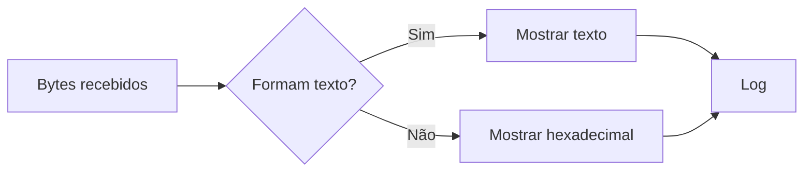

Se o dispositivo enviar temperatura como texto, por exemplo `25.4`, a leitura
fica fácil. Se enviar bytes binários, você precisa da documentação do protocolo
para converter corretamente.

---

## 6. Testar a aula sem hardware

Se você não tiver dispositivo BLE real, use **Modo simulado**. O objetivo é
verificar se você entendeu o fluxo de estados.

Faça assim:

1. Rode o app.
2. Toque em **Modo simulado**.
3. Toque em **Conectar** no `ESP32-Sala-Simulado`.
4. Escreva `LED_ON`.
5. Toque em **Escrever**.
6. Toque em **Ler**.
7. Leia o log.

Fluxo esperado:

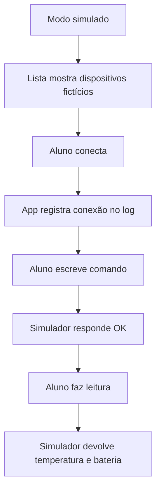

### Checkpoint 2

Você está no caminho certo se consegue mostrar:

- [ ] tela abrindo sem erro;
- [ ] modo simulado com pelo menos dois dispositivos;
- [ ] conexão simulada;
- [ ] comando escrito no log;
- [ ] leitura simulada;
- [ ] explicação verbal do que seria real em um dispositivo BLE.

---

## 7. Testar com hardware real

Se houver um ESP32, sensor BLE, beacon ou outro periférico disponível:

1. Ative Bluetooth no celular.
2. Dê permissões quando o app pedir.
3. Toque em **Scan real**.
4. Aguarde até 8 segundos.
5. Escolha um dispositivo conhecido.
6. Toque em **Conectar**.
7. Observe quantos services foram descobertos.
8. Tente **Ler**.
9. Se houver characteristic de escrita, tente enviar um comando simples.

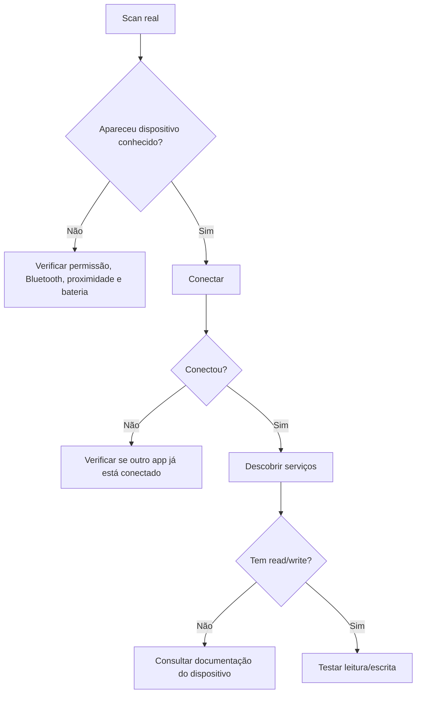

Não espere que qualquer dispositivo aceite escrita. Muitos dispositivos só
anunciam dados ou exigem autenticação, pareamento ou UUID específico.

### Checkpoint 3

Com hardware real, registre:

- [ ] nome ou identificador do dispositivo encontrado;
- [ ] RSSI aproximado;
- [ ] se a conexão funcionou;
- [ ] quantidade de services encontrados;
- [ ] UUID de uma characteristic de leitura ou escrita, se existir;
- [ ] erro encontrado, caso não tenha conseguido conectar.

---

## 8. Erros comuns e como diagnosticar

| Sintoma                                    | Causa provável                                      | O que fazer                                                        |
| :----------------------------------------- | :-------------------------------------------------- | :----------------------------------------------------------------- |
| Nenhum dispositivo aparece                 | Bluetooth desligado, permissão negada ou sem BLE    | Ativar Bluetooth, revisar permissões e testar modo simulado         |
| Aparece dispositivo sem nome               | O periférico não anuncia nome                       | Use o identificador e o RSSI para reconhecer                        |
| Conecta e desconecta logo depois           | Dispositivo ocupado, longe ou exigindo pareamento   | Aproximar, fechar outros apps BLE, tentar novamente                 |
| `read` falha                               | Characteristic não permite leitura                  | Consultar UUID correto ou usar outra characteristic                 |
| `write` falha                              | Characteristic não permite escrita                  | Confirmar propriedades `write`/`writeWithoutResponse`               |
| Valor aparece só em hexadecimal            | O dado não é texto UTF-8 simples                    | Consultar documentação do protocolo                                |
| Funciona no simulado, mas não no real      | Problema de hardware/permissão/protocolo            | Separar diagnóstico: scan, conexão, service, characteristic, bytes  |
| O emulador não encontra dispositivos       | Emulador geralmente não expõe BLE físico            | Usar celular físico                                                |

O diagnóstico deve seguir uma ordem. Não tente corrigir escrita se o scan ainda
não funciona.

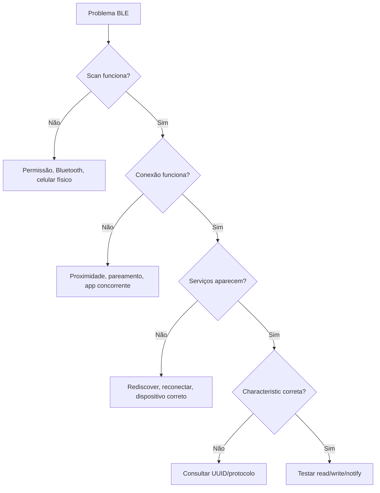

---

## 9. Ligação com o projeto final

Bluetooth não precisa aparecer obrigatoriamente no projeto final. Ele é uma
opção de recurso avançado. O grupo deve escolher recursos que façam sentido para
o problema escolhido e que caibam no tempo restante.

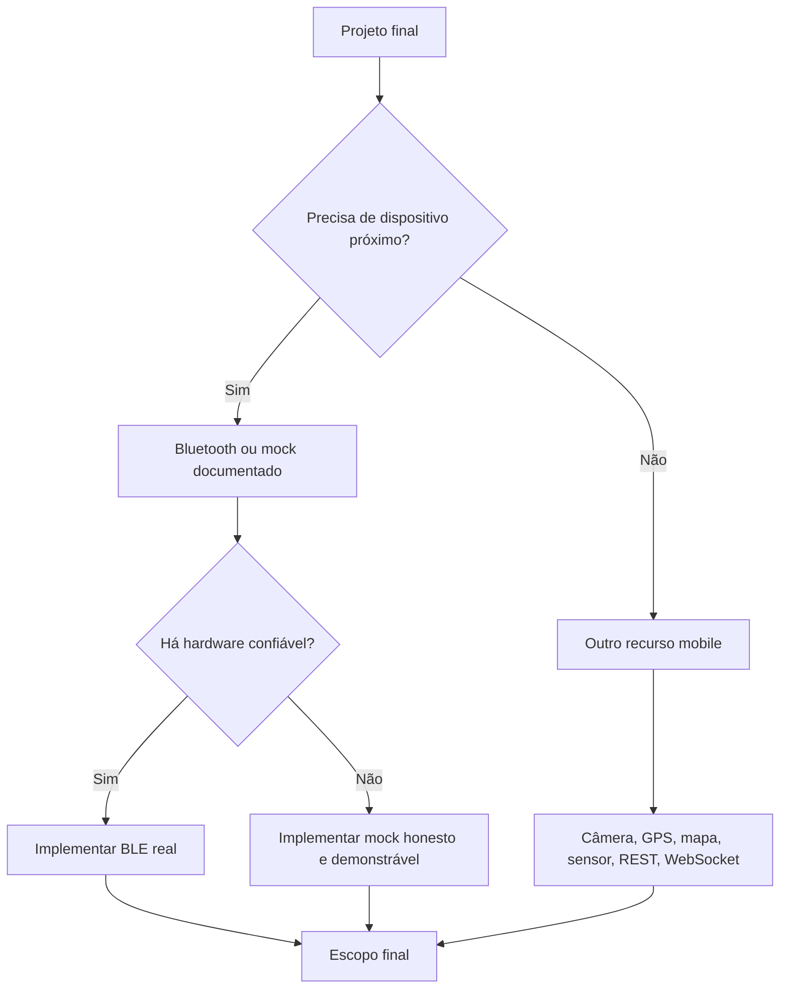

Para o projeto final, use a seguinte regra:

| Se o grupo tem...                         | Melhor decisão prática                                      |
| :---------------------------------------- | :----------------------------------------------------------- |
| hardware BLE real e tempo para testar     | usar Bluetooth como diferencial técnico                      |
| ideia boa, mas sem hardware confiável     | usar mock e explicar claramente o limite                     |
| app já atrasado                           | priorizar REST, câmera, GPS, mapa ou sensor já conhecido     |
| muita funcionalidade solta                | cortar escopo e entregar fluxo principal funcionando         |

### Sprint de fechamento

Use os últimos 50 minutos para transformar o projeto final em plano executável.

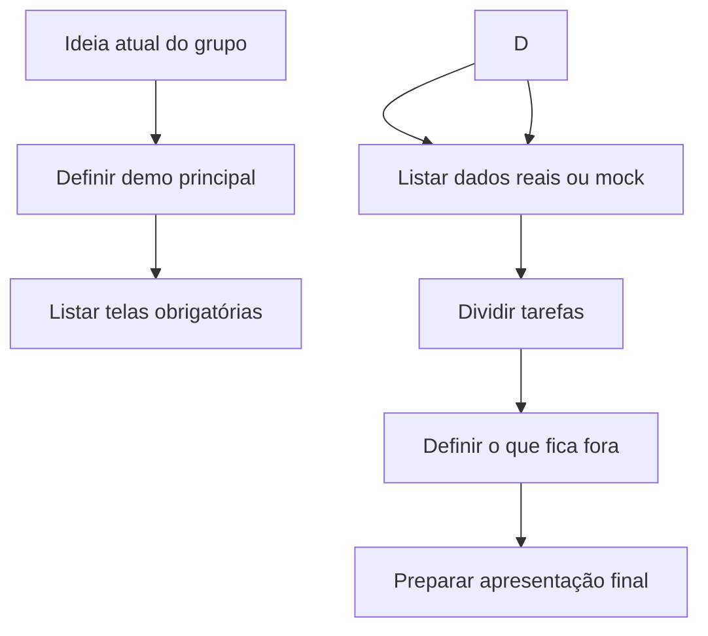

Preencha no caderno, README ou issue do repositório do grupo:

1. Nome do projeto.
2. Problema resolvido em uma frase.
3. Tela principal da demonstração.
4. Recurso mobile principal.
5. Dados usados: API, mock, local ou sensor.
6. O que já funciona hoje.
7. O que falta até a apresentação.
8. O que será cortado se faltar tempo.

---

## 10. Entrega da aula

A entrega está embutida nesta própria aula. Não há arquivo auxiliar obrigatório
e não há formulário novo criado aqui.

Quando o professor pedir o registro no Google Forms, envie:

1. link do repositório ou branch usada;
2. print ou descrição do app rodando;
3. evidência do modo simulado ou do scan real;
4. resposta curta: o que é uma characteristic no BLE?
5. status do projeto final do grupo;
6. principal risco para a apresentação final.

### Critérios mínimos

Para considerar a aula concluída, você deve demonstrar pelo menos:

- [ ] app compilando;
- [ ] permissões e estado do Bluetooth explicados;
- [ ] modo simulado funcionando;
- [ ] tentativa de scan real, se houver celular físico;
- [ ] log mostrando leitura/escrita simulada ou real;
- [ ] explicação do fluxo central -> periférico -> service -> characteristic;
- [ ] plano atualizado do projeto final.

### Perguntas de revisão

Responda com suas palavras:

1. Por que BLE não é igual a WebSocket?
2. Qual é o papel do app Flutter em uma conexão BLE comum?
3. O que o scan encontra?
4. O que `discoverServices()` descobre?
5. Por que nem toda characteristic aceita escrita?
6. Por que o modo simulado ainda é útil para o projeto final?
7. Qual recurso mobile o seu grupo vai demonstrar na apresentação?

---

## Fechamento

Nesta aula, você saiu do tempo real pela internet e entrou na comunicação com
dispositivos próximos. O salto conceitual é importante: agora o app precisa
lidar com permissão, hardware, sinal, conexão, protocolo e bytes.

Para a apresentação final, não tente usar tudo que o curso mostrou. Escolha uma
combinação coerente, demonstre funcionando e explique as decisões técnicas com
clareza.
