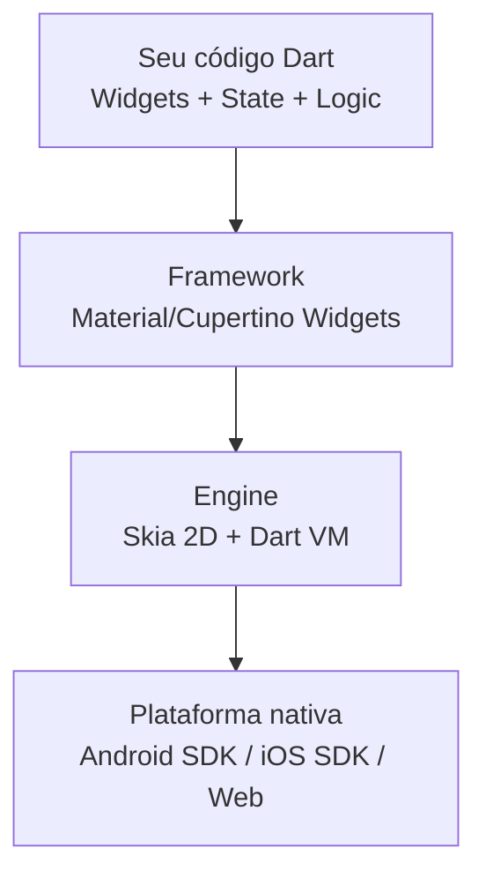
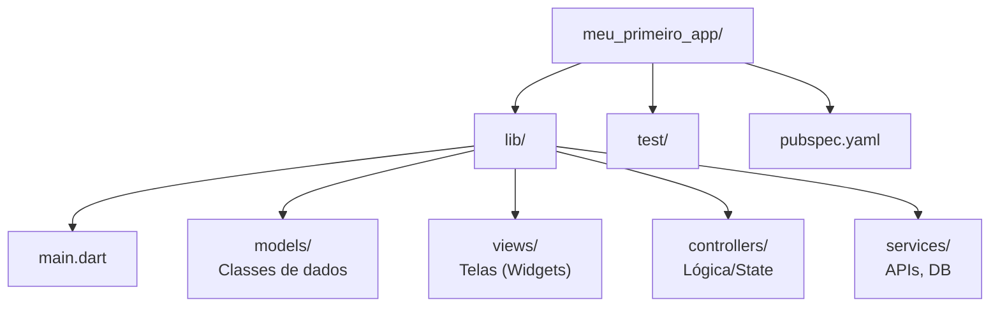

## Programação de Aplicativos Mobile II

**ETEC Ferrucio Humberto Gazzetta - Nova Odessa**

**Professor:** Gustavo de Oliveira Villalta

**Data:** 18/03/2026

---

# Visão Geral da Disciplina

---

## 📱 Programação de Aplicativos Mobile II

### Informações Básicas

| Item              | Detalhe                   |
| ----------------- | ------------------------- |
| **Componente**    | 5044                      |
| **Curso**         | DS - MTEC-PI / Novotec    |
| **Módulo**        | 2º Módulo                 |
| **Carga Horária** | 35 aulas (5 aulas/semana) |
| **Horário**       | 18h45 às 22h45 (Noturno)  |
| **Laboratório**   | Windows                   |

---

## 🎯 Objetivos da Disciplina

Desenvolver competências para:

✅ **Criar aplicativos mobile** multiplataforma com Flutter  
✅ **Desenvolver interfaces** responsivas e intuitivas  
✅ **Consumir APIs REST** e comunicação em tempo real  
✅ **Integrar recursos nativos:** câmera, GPS, sensores, Bluetooth  
✅ **Implementar autenticação** e segurança  
✅ **Publicar aplicativos** nas lojas oficiais (Google Play/App Store)

---

## 📚 Conteúdo Programático

### 1. Conectividade

- Consumo de APIs REST
- Comunicação TCP (sockets)
- Integração com dispositivos embarcados via **Bluetooth**

### 2. Autenticação

- Mecanismos de autenticação em apps mobile
- Segurança de dados do usuário

### 3. Recursos do Dispositivo

- **Câmera** e galeria de imagens
- **Sensores:** acelerômetro, giroscópio, etc.
- **Localização, orientação e mapas** (GPS)
- **Telefonia e SMS**

### 4. Empacotamento e Distribuição

- Geração de APK/IPA
- Assinatura de aplicativos
- Publicação nas lojas

---

## 📊 Avaliação

| Avaliação        | Peso | Quando   | Conteúdo                         |
| ---------------- | ---- | -------- | -------------------------------- |
| **P1**           | 30%  | Aula 15  | Flutter básico e UI              |
| **P2**           | 30%  | Aula 26  | Conectividade e recursos nativos |
| **Trabalho**     | 30%  | Aula 35  | Projeto Final                    |
| **Participação** | 10%  | Contínuo | Atividades em sala               |

---

## 🛠️ Tecnologia Principal: Flutter

**Framework de desenvolvimento multiplataforma da Google**

### Ferramentas:

- **Flutter SDK** (Windows)
- **Android Studio** / VS Code
- **Dart** - Linguagem de programação
- **Git e GitHub** - Controle de versão

### Por que Flutter?

- 📱 Um código → Android, iOS, Web, Desktop
- ⚡ Performance nativa (60/120 FPS)
- 🔥 Hot Reload (sub-segundo)
- 🎨 UI consistente em todas plataformas

---

## 👨‍🏫 Equipe

- **Professor:** Gustavo de Oliveira Villalta
- **Coordenador Pedagógico:** Prof. Lucas Serafim
- **Contato:** Coordenação pedagógica da unidade
- **Disponibilidade:** Segunda a Sexta (noite)

---

# Parte 1: Apresentação Rápida

---

## Sobre a Turma

Vocês já têm fluência em programação!

**Então vamos acelerar:**

- ✅ POO já é familiar
- ✅ Lógica de programação dominada
- ✅ Conceitos de frontend conhecidos
- 🎯 Foco: Mobile + Flutter específicos

---

## Objetivos da Disciplina

Aproveitando conhecimento prévio:

🔥 **Imersão direta em:**

- Arquitetura Flutter (Widgets tree)
- State Management (setState → Provider → Riverpod)
- Consumo de APIs REST real
- Recursos nativos (câmera, GPS, Bluetooth)
- Padrões de projeto mobile (MVC, MVVM)
- Publicação e CI/CD

---

# Parte 2: Flutter em 15 Minutos

---

## Por que Flutter?

**Problema:** Duas equipes (Android + iOS) = Custo alto + Manutenção dupla

**Solução Flutter:**

- 📱 **Um código** → Android, iOS, Web, Desktop
- ⚡ **Performance nativa** (60/120 FPS, compilação AOT)
- 🔥 **Hot Reload** (sub-segundo)
- 🎨 **UI consistente** em todas plataformas

---

## Arquitetura Flutter



**Key Point:** Sem bridge JavaScript! Código Dart compila diretamente para
ARM/x64

---

## Tudo é Widget!

```dart
// Árvore de widgets
MaterialApp(
  home: Scaffold(
    appBar: AppBar(
      title: Text('Meu App'),  // Widget
    ),
    body: Center(
      child: Column(
        children: [
          Icon(Icons.star),     // Widget
          Text('Olá'),          // Widget
          ElevatedButton(...),  // Widget
        ],
      ),
    ),
  ),
)
```

**Immutable Widget Tree + Stateful State = Performance**

---

# Parte 3: Configuração no Windows

---

## Checklist de Instalação

### 1. Flutter SDK

```powershell
# Download em: https://docs.flutter.dev/get-started/install
# Extrair para: C:\flutter

# Adicionar ao Path do sistema
[Environment]::SetEnvironmentVariable(
  "Path",
  $env:Path + ";C:\flutter\bin",
  "User"
)
```

### 2. Verificar

```bash
flutter doctor
```

---

## Android Studio + SDK

### Instalação Rápida:

1. Baixar Android Studio
2. Durante setup: **Marcar Android SDK + Emulator**
3. SDK Manager → Instalar:
   - Android API 34
   - Android SDK Build-Tools
   - Android Emulator
   - Intel HAXM (se CPU Intel)

### Aceitar Licenças:

```bash
flutter doctor --android-licenses
# Digitar 'y' para todas
```

---

## VS Code (Recomendado)

```
1. Instalar VS Code
2. Extensões → Flutter (instala Dart automaticamente)
3. Ctrl+Shift+P → Flutter: New Project
```

---

# Parte 4: Emulador Android no Windows

---

## Opção 1: Emulador Android Studio (Recomendado)

### Criar AVD:

```
Android Studio → Configure → AVD Manager
→ Create Virtual Device
→ Pixel 7
→ System Image: API 34 (Android 14)
→ Graphics: Hardware - GLES 2.0
→ RAM: 2048 MB (ou mais se possível)
→ Finish
```

### Iniciar:

```bash
# Listar emuladores
flutter emulators

# Iniciar específico
flutter emulators --launch Pixel_7_API_34

# Ou iniciar pelo AVD Manager
```

---

## Opção 2: Emulador via Linha de Comando

```bash
# Ver todos dispositivos/emuladores
flutter devices

# Exemplo saída:
# • emulator-5554 • Android SDK built for x86 • android-x86
# • SM-G973F      • Samsung Galaxy S10        • android-arm64

# Executar no emulador específico
flutter run -d emulator-5554

# Ou deixar o Flutter escolher
flutter run
```

---

## Opção 3: Dispositivo Físico (Melhor Performance)

### Ativar Depuração USB:

```
1. Configurações → Sobre o telefone
2. Toque 7x em "Número da versão" (ativa modo dev)
3. Configurações → Sistema → Opções do desenvolvedor
4. Ativar: "Depuração USB"
5. Conectar cabo USB
6. Aceitar permissão no celular
```

### Verificar:

```bash
flutter devices
# Deve aparecer: SM-G973F • device
```

---

## Configuração de Performance (Windows)

### Para Emulador mais rápido:

1. **Habilitar Virtualização (BIOS)**
   - Intel: VT-x
   - AMD: AMD-V

2. **Instalar Intel HAXM** (se Intel)

   ```
   Android Studio → SDK Manager
   → SDK Tools → Intel x86 Emulator Accelerator
   ```

3. **Windows Hypervisor Platform** (alternativa moderna)
   ```powershell
   # PowerShell como Admin
   dism.exe /Online /Enable-Feature /FeatureName:HypervisorPlatform
   ```

---

# Parte 5: Projeto Prático Avançado

---

## Criar Projeto

```bash
# Criar com nome organizado
flutter create --org br.com.etec meu_primeiro_app
```

**Estrutura de pacotes sugerida:**



---

## Executar no Emulador

```bash
# 1. Iniciar emulador (se não estiver rodando)
flutter emulators --launch Pixel_7_API_34

# 2. Verificar se detectou
flutter devices

# Saída esperada:
# 2 connected devices:
# • Pixel 7 (mobile) • emulator-5554 • android-x86 • Android 14

# 3. Rodar!
flutter run -d emulator-5554

# Flags úteis:
flutter run --hot            # Hot reload ativado
flutter run --verbose        # Ver logs detalhados
flutter run --release        # Modo release (rápido)
```

---

## Hot Reload em Ação

```dart
// App rodando...

// Altere o código:
Text('Olá')  →  Text('Olá, Mundo!')

// Salve (Ctrl+S)
// → App atualiza em < 1 segundo!
// → Estado preservado!
```

**Diferença Hot Reload vs Hot Restart:**

- **Reload:** Mantém estado, só atualiza UI (rápido)
- **Restart:** Reinicia app do zero (mais lento)

---

# Parte 6: Além do Hello World

---

## Exercício 1: App Interativo com Estado

```dart
import 'package:flutter/material.dart';

void main() => runApp(const MyApp());

class MyApp extends StatelessWidget {
  const MyApp({super.key});

  @override
  Widget build(BuildContext context) {
    return MaterialApp(
      debugShowCheckedModeBanner: false,
      theme: ThemeData.dark(),
      home: const ContadorApp(),
    );
  }
}

class ContadorApp extends StatefulWidget {
  const ContadorApp({super.key});

  @override
  State<ContadorApp> createState() => _ContadorAppState();
}

class _ContadorAppState extends State<ContadorApp> {
  int _contador = 0;
  final List<int> _historico = [];

  void _incrementar() {
    setState(() {
      _contador++;
      _historico.add(_contador);
    });
  }

  void _decrementar() {
    setState(() {
      if (_contador > 0) {
        _contador--;
        _historico.add(_contador);
      }
    });
  }

  void _resetar() {
    setState(() {
      _contador = 0;
      _historico.clear();
    });
  }

  @override
  Widget build(BuildContext context) {
    return Scaffold(
      appBar: AppBar(
        title: const Text('Contador Avançado'),
        actions: [
          IconButton(
            icon: const Icon(Icons.refresh),
            onPressed: _resetar,
          ),
        ],
      ),
      body: Column(
        children: [
          Expanded(
            flex: 2,
            child: Center(
              child: Column(
                mainAxisAlignment: MainAxisAlignment.center,
                children: [
                  Text(
                    '$_contador',
                    style: const TextStyle(
                      fontSize: 120,
                      fontWeight: FontWeight.bold,
                    ),
                  ),
                  Text(
                    _contador == 0
                      ? 'Início'
                      : _contador % 2 == 0
                        ? 'Par'
                        : 'Ímpar',
                    style: TextStyle(
                      fontSize: 24,
                      color: _contador == 0
                        ? Colors.grey
                        : _contador % 2 == 0
                          ? Colors.green
                          : Colors.orange,
                    ),
                  ),
                ],
              ),
            ),
          ),
          Expanded(
            flex: 1,
            child: Container(
              padding: const EdgeInsets.all(16),
              child: Column(
                crossAxisAlignment: CrossAxisAlignment.start,
                children: [
                  const Text(
                    'Histórico:',
                    style: TextStyle(fontSize: 18, fontWeight: FontWeight.bold),
                  ),
                  const SizedBox(height: 8),
                  Expanded(
                    child: _historico.isEmpty
                      ? const Center(
                          child: Text(
                            'Nenhum valor registrado',
                            style: TextStyle(color: Colors.grey),
                          ),
                        )
                      : ListView.builder(
                          scrollDirection: Axis.horizontal,
                          itemCount: _historico.length,
                          itemBuilder: (context, index) {
                            return Container(
                              margin: const EdgeInsets.only(right: 8),
                              padding: const EdgeInsets.all(12),
                              decoration: BoxDecoration(
                                color: Colors.blue.withOpacity(0.2),
                                borderRadius: BorderRadius.circular(8),
                              ),
                              child: Text(
                                '${_historico[index]}',
                                style: const TextStyle(fontSize: 16),
                              ),
                            );
                          },
                        ),
                  ),
                ],
              ),
            ),
          ),
        ],
      ),
      floatingActionButton: Row(
        mainAxisAlignment: MainAxisAlignment.end,
        children: [
          FloatingActionButton(
            heroTag: 'decrement',
            onPressed: _decrementar,
            backgroundColor: Colors.red,
            child: const Icon(Icons.remove),
          ),
          const SizedBox(width: 16),
          FloatingActionButton(
            heroTag: 'increment',
            onPressed: _incrementar,
            backgroundColor: Colors.green,
            child: const Icon(Icons.add),
          ),
        ],
      ),
    );
  }
}
```

---

## Conceitos Explorados no Exercício

### ✅ StatefulWidget

- Estado mutável com `setState()`
- Ciclo de vida: `initState()`, `build()`, `dispose()`

### ✅ Layout Responsivo

- `Expanded()` com flex
- `Column`, `Row`, `Stack`
- Proporções adaptáveis

### ✅ Listas Dinâmicas

- `ListView.builder()` (performance)
- Renderização sob demanda
- `itemBuilder` pattern

### ✅ UI/UX

- `ThemeData.dark()`
- Cores semânticas (green/red)
- Feedback visual (par/ímpar)

---

## Exercício 2: Consumo de API Fake

```dart
import 'package:flutter/material.dart';
import 'dart:convert';
import 'dart:io';

void main() => runApp(const MyApp());

class MyApp extends StatelessWidget {
  const MyApp({super.key});

  @override
  Widget build(BuildContext context) {
    return MaterialApp(
      debugShowCheckedModeBanner: false,
      title: 'Lista de Usuários',
      theme: ThemeData(primarySwatch: Colors.indigo),
      home: const ListaUsuariosScreen(),
    );
  }
}

class Usuario {
  final int id;
  final String nome;
  final String email;
  final String avatar;

  Usuario({
    required this.id,
    required this.nome,
    required this.email,
    required this.avatar,
  });

  factory Usuario.fromJson(Map<String, dynamic> json) {
    return Usuario(
      id: json['id'],
      nome: json['name'],
      email: json['email'],
      avatar: 'https://i.pravatar.cc/150?img=${json['id']}',
    );
  }
}

class ListaUsuariosScreen extends StatefulWidget {
  const ListaUsuariosScreen({super.key});

  @override
  State<ListaUsuariosScreen> createState() => _ListaUsuariosScreenState();
}

class _ListaUsuariosScreenState extends State<ListaUsuariosScreen> {
  List<Usuario> _usuarios = [];
  bool _carregando = true;
  String? _erro;

  @override
  void initState() {
    super.initState();
    _carregarUsuarios();
  }

  Future<void> _carregarUsuarios() async {
    try {
      // Simulando delay de API
      await Future.delayed(const Duration(seconds: 2));

      // Dados mockados (simulando API)
      final dadosMock = [
        {'id': 1, 'name': 'Ana Silva', 'email': 'ana@etec.sp.gov.br'},
        {'id': 2, 'name': 'Bruno Costa', 'email': 'bruno@etec.sp.gov.br'},
        {'id': 3, 'name': 'Carla Santos', 'email': 'carla@etec.sp.gov.br'},
        {'id': 4, 'name': 'Daniel Lima', 'email': 'daniel@etec.sp.gov.br'},
        {'id': 5, 'name': 'Elena Souza', 'email': 'elena@etec.sp.gov.br'},
      ];

      setState(() {
        _usuarios = dadosMock.map((u) => Usuario.fromJson(u)).toList();
        _carregando = false;
      });
    } catch (e) {
      setState(() {
        _erro = 'Erro ao carregar: $e';
        _carregando = false;
      });
    }
  }

  @override
  Widget build(BuildContext context) {
    return Scaffold(
      appBar: AppBar(
        title: const Text('Usuários ETEC'),
        actions: [
          IconButton(
            icon: const Icon(Icons.refresh),
            onPressed: _carregando ? null : _carregarUsuarios,
          ),
        ],
      ),
      body: _construirBody(),
    );
  }

  Widget _construirBody() {
    if (_carregando) {
      return const Center(
        child: Column(
          mainAxisAlignment: MainAxisAlignment.center,
          children: [
            CircularProgressIndicator(),
            SizedBox(height: 16),
            Text('Carregando usuários...'),
          ],
        ),
      );
    }

    if (_erro != null) {
      return Center(
        child: Column(
          mainAxisAlignment: MainAxisAlignment.center,
          children: [
            const Icon(Icons.error_outline, size: 64, color: Colors.red),
            const SizedBox(height: 16),
            Text(_erro!, textAlign: TextAlign.center),
            const SizedBox(height: 16),
            ElevatedButton(
              onPressed: _carregarUsuarios,
              child: const Text('Tentar novamente'),
            ),
          ],
        ),
      );
    }

    return ListView.builder(
      itemCount: _usuarios.length,
      itemBuilder: (context, index) {
        final usuario = _usuarios[index];
        return Card(
          margin: const EdgeInsets.symmetric(horizontal: 16, vertical: 8),
          child: ListTile(
            leading: CircleAvatar(
              backgroundImage: NetworkImage(usuario.avatar),
            ),
            title: Text(usuario.nome),
            subtitle: Text(usuario.email),
            trailing: const Icon(Icons.arrow_forward_ios, size: 16),
            onTap: () {
              // Navegar para detalhes
              ScaffoldMessenger.of(context).showSnackBar(
                SnackBar(content: Text('Selecionou: ${usuario.nome}')),
              );
            },
          ),
        );
      },
    );
  }
}
```

---

## O que esse exercício ensina:

### 🔄 Async/Await

- `Future` e `async/await`
- `Future.delayed()` para simular API
- Estados de loading/sucesso/erro

### 📱 Padrões Mobile

- Pull-to-refresh
- Estados vazios
- Error handling amigável
- Skeleton loading (CircularProgressIndicator)

### 🎨 UI Avançada

- Cards com ListTile
- CircleAvatar com imagens
- SnackBar para feedback
- AppBar com actions

### 🏗️ Arquitetura

- Separação Model/View
- Factory constructors
- Inicialização no `initState()`

---

## Exercício 3: Navegação entre Telas

```dart
import 'package:flutter/material.dart';

void main() => runApp(const MyApp());

class MyApp extends StatelessWidget {
  const MyApp({super.key});

  @override
  Widget build(BuildContext context) {
    return MaterialApp(
      debugShowCheckedModeBanner: false,
      title: 'Navegação Flutter',
      theme: ThemeData(primarySwatch: Colors.deepPurple),
      initialRoute: '/',
      routes: {
        '/': (context) => const HomeScreen(),
        '/perfil': (context) => const PerfilScreen(),
        '/configuracoes': (context) => const ConfigScreen(),
      },
    );
  }
}

class HomeScreen extends StatelessWidget {
  const HomeScreen({super.key});

  @override
  Widget build(BuildContext context) {
    return Scaffold(
      appBar: AppBar(
        title: const Text('Tela Principal'),
      ),
      drawer: Drawer(
        child: ListView(
          padding: EdgeInsets.zero,
          children: [
            const DrawerHeader(
              decoration: BoxDecoration(
                color: Colors.deepPurple,
              ),
              child: Column(
                crossAxisAlignment: CrossAxisAlignment.start,
                children: [
                  CircleAvatar(
                    radius: 40,
                    backgroundColor: Colors.white,
                    child: Icon(Icons.person, size: 40),
                  ),
                  SizedBox(height: 16),
                  Text(
                    'ETEC Nova Odessa',
                    style: TextStyle(
                      color: Colors.white,
                      fontSize: 18,
                    ),
                  ),
                ],
              ),
            ),
            ListTile(
              leading: const Icon(Icons.home),
              title: const Text('Início'),
              onTap: () => Navigator.pop(context),
            ),
            ListTile(
              leading: const Icon(Icons.person),
              title: const Text('Perfil'),
              onTap: () {
                Navigator.pop(context);
                Navigator.pushNamed(context, '/perfil');
              },
            ),
            ListTile(
              leading: const Icon(Icons.settings),
              title: const Text('Configurações'),
              onTap: () {
                Navigator.pop(context);
                Navigator.pushNamed(context, '/configuracoes');
              },
            ),
          ],
        ),
      ),
      body: Center(
        child: Column(
          mainAxisAlignment: MainAxisAlignment.center,
          children: [
            const Icon(Icons.flutter_dash, size: 100, color: Colors.deepPurple),
            const SizedBox(height: 24),
            const Text(
              'Bem-vindo ao Flutter!',
              style: TextStyle(fontSize: 24, fontWeight: FontWeight.bold),
            ),
            const SizedBox(height: 32),
            ElevatedButton.icon(
              onPressed: () {
                Navigator.pushNamed(context, '/perfil');
              },
              icon: const Icon(Icons.arrow_forward),
              label: const Text('Ver Perfil'),
              style: ElevatedButton.styleFrom(
                padding: const EdgeInsets.symmetric(horizontal: 32, vertical: 16),
              ),
            ),
          ],
        ),
      ),
    );
  }
}

class PerfilScreen extends StatelessWidget {
  const PerfilScreen({super.key});

  @override
  Widget build(BuildContext context) {
    return Scaffold(
      appBar: AppBar(
        title: const Text('Perfil'),
      ),
      body: Padding(
        padding: const EdgeInsets.all(16.0),
        child: Column(
          crossAxisAlignment: CrossAxisAlignment.start,
          children: [
            const Center(
              child: CircleAvatar(
                radius: 60,
                child: Icon(Icons.person, size: 60),
              ),
            ),
            const SizedBox(height: 24),
            _buildInfoCard('Nome', 'Aluno ETEC'),
            _buildInfoCard('Curso', 'Desenvolvimento de Sistemas'),
            _buildInfoCard('Módulo', '2º Módulo'),
            _buildInfoCard('Tecnologia', 'Flutter'),
            const Spacer(),
            SizedBox(
              width: double.infinity,
              child: ElevatedButton(
                onPressed: () {
                  Navigator.pop(context);
                },
                child: const Text('Voltar'),
              ),
            ),
          ],
        ),
      ),
    );
  }

  Widget _buildInfoCard(String label, String value) {
    return Card(
      margin: const EdgeInsets.only(bottom: 12),
      child: Padding(
        padding: const EdgeInsets.all(16.0),
        child: Row(
          children: [
            Text(
              '$label: ',
              style: const TextStyle(
                fontWeight: FontWeight.bold,
                fontSize: 16,
              ),
            ),
            Text(
              value,
              style: const TextStyle(fontSize: 16),
            ),
          ],
        ),
      ),
    );
  }
}

class ConfigScreen extends StatelessWidget {
  const ConfigScreen({super.key});

  @override
  Widget build(BuildContext context) {
    return Scaffold(
      appBar: AppBar(
        title: const Text('Configurações'),
      ),
      body: ListView(
        children: [
          SwitchListTile(
            title: const Text('Modo Escuro'),
            subtitle: const Text('Ativar tema escuro'),
            value: false,
            onChanged: (value) {},
          ),
          const Divider(),
          ListTile(
            leading: const Icon(Icons.notifications),
            title: const Text('Notificações'),
            trailing: const Icon(Icons.arrow_forward_ios, size: 16),
            onTap: () {},
          ),
          ListTile(
            leading: const Icon(Icons.language),
            title: const Text('Idioma'),
            subtitle: const Text('Português (Brasil)'),
            trailing: const Icon(Icons.arrow_forward_ios, size: 16),
            onTap: () {},
          ),
          const Divider(),
          ListTile(
            leading: const Icon(Icons.info),
            title: const Text('Sobre'),
            subtitle: const Text('Versão 1.0.0'),
          ),
        ],
      ),
    );
  }
}
```

---

## Conceitos de Navegação

### 🛣️ Rotas Nomeadas

```dart
MaterialApp(
  initialRoute: '/',
  routes: {
    '/': (context) => HomeScreen(),
    '/detalhes': (context) => DetalhesScreen(),
  },
)
```

### 🔄 Navegação

```dart
// Ir para tela
Navigator.pushNamed(context, '/perfil');

// Voltar
Navigator.pop(context);

// Substituir tela (não volta)
Navigator.pushReplacementNamed(context, '/home');

// Limpar pilha e ir
Navigator.pushNamedAndRemoveUntil(context, '/home', (route) => false);
```

### 📋 Drawer (Menu Lateral)

```dart
Scaffold(
  drawer: Drawer(
    child: ListView(
      children: [DrawerHeader(...), ListTile(...)],
    ),
  ),
)
```

---

## Resumo da Aula Avançada

### ✅ Vocês aprenderam:

1. **Configuração profissional no Windows**
   - Emulador Android otimizado
   - HAXM / Hyper-V
   - Depuração USB

2. **StatefulWidget completo**
   - setState() gerenciando estado
   - Ciclo de vida dos widgets
   - Padrões de atualização

3. **Async programming**
   - Future, async, await
   - Estados: loading, success, error
   - Tratamento de erros

4. **Navegação em apps reais**
   - Rotas nomeadas
   - Drawer navigation
   - Passagem de dados

5. **UI/UX profissional**
   - Loading states
   - Error states
   - Empty states
   - Feedback ao usuário

---

## Desafio para Casa 🎯

Crie um app de **Catálogo de Produtos** com:

### Requisitos:

1. ✅ Lista de produtos (nome, preço, imagem)
2. ✅ Tela de detalhes do produto
3. ✅ Carrinho de compras (contador)
4. ✅ Animações nas transições
5. ✅ Filtro por categoria
6. ✅ Busca por nome

### Dicas:

- Use `Navigator.push()` com arguments
- Gerencie estado com StatefulWidget
- Use `Hero` widget para animações
- Mock os dados inicialmente

---

## Comandos Úteis no Windows

```bash
# Verificar ambiente
flutter doctor -v

# Listar dispositivos
flutter devices

# Listar emuladores
flutter emulators

# Iniciar emulador específico
flutter emulators --launch <nome>

# Rodar com hot reload
flutter run -d <device_id> --hot

# Build APK
flutter build apk --release

# Limpar build
flutter clean
flutter pub get
```

---

## Recursos

### Documentação:

- [Flutter Widgets](https://docs.flutter.dev/ui/widgets)
- [Cookbook](https://docs.flutter.dev/cookbook)
- [API Reference](https://api.flutter.dev)

### Cursos Avançados:

- Flutterando (YouTube)
- Deivid Willyan (YouTube)
- Academia do Flutter (Udemy)

### Prática:

- [Flutter Gallery](https://gallery.flutter.dev)
- [Flutter Samples](https://flutter.github.io/samples/)

---

# Obrigado!

## Dúvidas?

**Prof. Gustavo Villalta**

ETEC Ferrucio Humberto Gazzetta - Nova Odessa

---

**"Code is like humor. When you have to explain it, it's bad."** — Cory House
