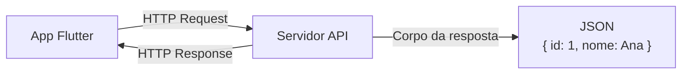
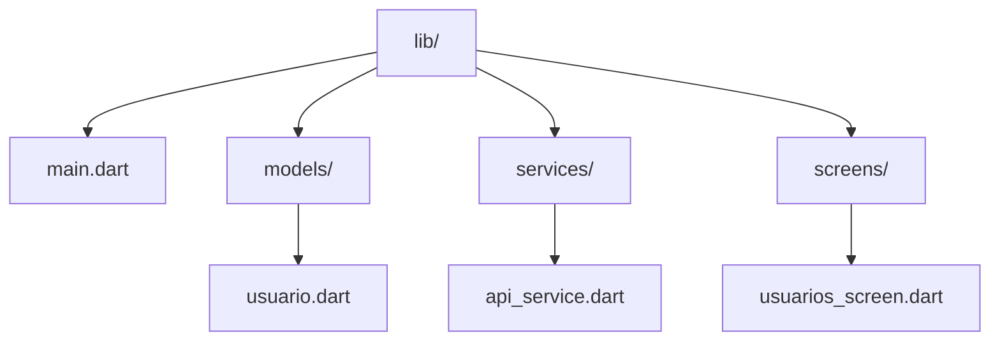

# 🌐 Consumo de APIs REST em Flutter

Este guia ensina como fazer seu aplicativo Flutter se comunicar com servidores
externos através de APIs REST, utilizando o pacote `http` e boas práticas de
desenvolvimento.

---

## O que é uma API REST?

**API** (Application Programming Interface) é um conjunto de regras que permite
que diferentes softwares se comuniquem.

**REST** (Representational State Transfer) é um padrão arquitetural que usa HTTP
para transferir dados.



---

## Configuração Inicial

### 1. Adicionar Dependência

No arquivo `pubspec.yaml`:

```yaml
dependencies:
  flutter:
    sdk: flutter
  http: ^1.2.0
```

Execute no terminal:

```bash
flutter pub get
```

### 2. Permissão de Internet (Android)

No arquivo `android/app/src/main/AndroidManifest.xml`, adicione:

```xml
<manifest>
    <uses-permission android:name="android.permission.INTERNET" />
    <application ...>
        ...
    </application>
</manifest>
```

---

## Métodos HTTP Principais

| Método     | Operação  | Uso                        |
| ---------- | --------- | -------------------------- |
| **GET**    | Ler       | Buscar dados do servidor   |
| **POST**   | Criar     | Enviar novos dados         |
| **PUT**    | Atualizar | Modificar dados existentes |
| **DELETE** | Remover   | Excluir dados              |

---

## Exemplo Prático: Lista de Usuários

### Estrutura do Projeto



### 1. Modelo (models/usuario.dart)

```dart
class Usuario {
  final int id;
  final String nome;
  final String email;
  final String? avatar;

  Usuario({
    required this.id,
    required this.nome,
    required this.email,
    this.avatar,
  });

  // Converter JSON para Objeto
  factory Usuario.fromJson(Map<String, dynamic> json) {
    return Usuario(
      id: json['id'],
      nome: json['name'] ?? json['nome'],
      email: json['email'],
      avatar: json['avatar'] ?? json['image'],
    );
  }

  // Converter Objeto para JSON
  Map<String, dynamic> toJson() {
    return {
      'id': id,
      'name': nome,
      'email': email,
      'avatar': avatar,
    };
  }

  @override
  String toString() => 'Usuario(id: $id, nome: $nome)';
}
```

### 2. Service API (services/api_service.dart)

```dart
import 'dart:convert';
import 'package:http/http.dart' as http;
import '../models/usuario.dart';

class ApiService {
  // URL base da API (usando JSONPlaceholder para testes)
  static const String baseUrl = 'https://jsonplaceholder.typicode.com';

  // GET - Listar usuários
  static Future<List<Usuario>> getUsuarios() async {
    try {
      final response = await http.get(
        Uri.parse('$baseUrl/users'),
      );

      if (response.statusCode == 200) {
        List<dynamic> jsonList = json.decode(response.body);
        return jsonList.map((json) => Usuario.fromJson(json)).toList();
      } else {
        throw Exception('Erro ao carregar usuários: ${response.statusCode}');
      }
    } catch (e) {
      throw Exception('Erro de conexão: $e');
    }
  }

  // GET - Buscar usuário por ID
  static Future<Usuario> getUsuario(int id) async {
    final response = await http.get(
      Uri.parse('$baseUrl/users/$id'),
    );

    if (response.statusCode == 200) {
      return Usuario.fromJson(json.decode(response.body));
    } else {
      throw Exception('Usuário não encontrado');
    }
  }

  // POST - Criar usuário
  static Future<Usuario> criarUsuario(Usuario usuario) async {
    final response = await http.post(
      Uri.parse('$baseUrl/users'),
      headers: {'Content-Type': 'application/json'},
      body: json.encode(usuario.toJson()),
    );

    if (response.statusCode == 201) {
      return Usuario.fromJson(json.decode(response.body));
    } else {
      throw Exception('Erro ao criar usuário');
    }
  }

  // PUT - Atualizar usuário
  static Future<Usuario> atualizarUsuario(Usuario usuario) async {
    final response = await http.put(
      Uri.parse('$baseUrl/users/${usuario.id}'),
      headers: {'Content-Type': 'application/json'},
      body: json.encode(usuario.toJson()),
    );

    if (response.statusCode == 200) {
      return Usuario.fromJson(json.decode(response.body));
    } else {
      throw Exception('Erro ao atualizar usuário');
    }
  }

  // DELETE - Remover usuário
  static Future<void> deletarUsuario(int id) async {
    final response = await http.delete(
      Uri.parse('$baseUrl/users/$id'),
    );

    if (response.statusCode != 200) {
      throw Exception('Erro ao deletar usuário');
    }
  }
}
```

### 3. Tela (screens/usuarios_screen.dart)

```dart
import 'package:flutter/material.dart';
import '../models/usuario.dart';
import '../services/api_service.dart';

class UsuariosScreen extends StatefulWidget {
  const UsuariosScreen({super.key});

  @override
  State<UsuariosScreen> createState() => _UsuariosScreenState();
}

class _UsuariosScreenState extends State<UsuariosScreen> {
  List<Usuario> _usuarios = [];
  bool _carregando = true;
  String? _erro;

  @override
  void initState() {
    super.initState();
    _carregarUsuarios();
  }

  Future<void> _carregarUsuarios() async {
    setState(() {
      _carregando = true;
      _erro = null;
    });

    try {
      final usuarios = await ApiService.getUsuarios();
      setState(() {
        _usuarios = usuarios;
        _carregando = false;
      });
    } catch (e) {
      setState(() {
        _erro = e.toString();
        _carregando = false;
      });
    }
  }

  @override
  Widget build(BuildContext context) {
    return Scaffold(
      appBar: AppBar(
        title: const Text('Usuários'),
        actions: [
          IconButton(
            icon: const Icon(Icons.refresh),
            onPressed: _carregarUsuarios,
          ),
        ],
      ),
      body: _construirBody(),
      floatingActionButton: FloatingActionButton(
        onPressed: () {
          // Abrir tela de adicionar usuário
        },
        child: const Icon(Icons.add),
      ),
    );
  }

  Widget _construirBody() {
    if (_carregando) {
      return const Center(
        child: Column(
          mainAxisAlignment: MainAxisAlignment.center,
          children: [
            CircularProgressIndicator(),
            SizedBox(height: 16),
            Text('Carregando usuários...'),
          ],
        ),
      );
    }

    if (_erro != null) {
      return Center(
        child: Column(
          mainAxisAlignment: MainAxisAlignment.center,
          children: [
            const Icon(Icons.error_outline, size: 64, color: Colors.red),
            const SizedBox(height: 16),
            Text('Erro: $_erro'),
            const SizedBox(height: 16),
            ElevatedButton(
              onPressed: _carregarUsuarios,
              child: const Text('Tentar novamente'),
            ),
          ],
        ),
      );
    }

    if (_usuarios.isEmpty) {
      return const Center(
        child: Text('Nenhum usuário encontrado'),
      );
    }

    return ListView.builder(
      itemCount: _usuarios.length,
      itemBuilder: (context, index) {
        final usuario = _usuarios[index];
        return ListTile(
          leading: CircleAvatar(
            child: Text(usuario.nome[0]),
          ),
          title: Text(usuario.nome),
          subtitle: Text(usuario.email),
          trailing: const Icon(Icons.arrow_forward_ios),
          onTap: () {
            // Navegar para detalhes
          },
        );
      },
    );
  }
}
```

---

## Códigos de Status HTTP

| Código | Significado  | Quando ocorre              |
| ------ | ------------ | -------------------------- |
| 200    | OK           | Requisição bem-sucedida    |
| 201    | Created      | Recurso criado com sucesso |
| 400    | Bad Request  | Dados enviados incorretos  |
| 401    | Unauthorized | Não autenticado            |
| 403    | Forbidden    | Sem permissão              |
| 404    | Not Found    | Recurso não existe         |
| 500    | Server Error | Erro no servidor           |

---

## Tratamento de Erros

### Padrão try-catch

```dart
Future<void> fetchData() async {
  try {
    final response = await http.get(url);

    if (response.statusCode == 200) {
      // Sucesso
    } else if (response.statusCode == 404) {
      // Recurso não encontrado
    } else {
      // Outros erros
    }
  } on SocketException {
    // Sem internet
  } on TimeoutException {
    // Timeout
  } catch (e) {
    // Erro genérico
  }
}
```

---

## Boas Práticas

1. **Sempre use HTTPS** em produção
2. **Trate todos os estados**: loading, error, empty, success
3. **Use modelos** (classes) para tipar os dados
4. **Separe a lógica** em services/repositories
5. **Adicione timeouts** nas requisições

---

## APIs Públicas para Testes

| API             | Descrição                    | URL Base                     |
| --------------- | ---------------------------- | ---------------------------- |
| JSONPlaceholder | Posts, usuários, comentários | jsonplaceholder.typicode.com |
| ReqRes          | Usuários fictícios           | reqres.in                    |
| PokeAPI         | Dados de Pokémon             | pokeapi.co                   |
| ViaCEP          | Consulta de CEP              | viacep.com.br/ws             |

---

## Referências

- **Documentação Oficial Flutter**:
  [Networking (HTTP)](https://docs.flutter.dev/data-and-backend/networking)
- **Pacote HTTP**: [pub.dev/packages/http](https://pub.dev/packages/http)
- **JSONPlaceholder**:
  [jsonplaceholder.typicode.com](https://jsonplaceholder.typicode.com/)
- **Dart JSON Documentation**:
  [dart.dev/guides/libraries/library-tour#json](https://dart.dev/guides/libraries/library-tour#json)

---

**Material elaborado para Mobile II - 2026**  
Prof. Gustavo Villalta
