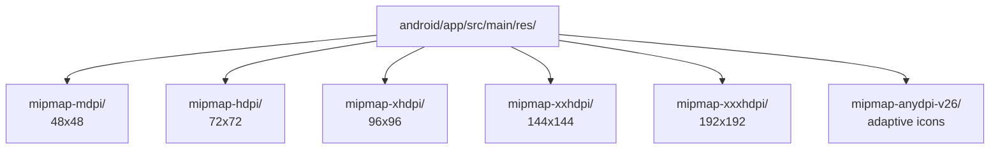

# 🚀 Publicação na Google Play Store

Guia completo para gerar o APK/AAB do seu aplicativo Flutter e publicar na
Google Play Store.

---

## Tipos de Build

| Formato | Descrição          | Uso                                    |
| ------- | ------------------ | -------------------------------------- |
| **APK** | Android Package    | Testes internos, distribuição direta   |
| **AAB** | Android App Bundle | Publicação na Play Store (recomendado) |

> **Nota:** A partir de agosto de 2021, a Play Store exige o formato AAB.

---

## Preparação do App

### 1. Ícone do Aplicativo

Crie ícones em todas as resoluções necessárias:



**Ferramenta recomendada:**

- [Icon Kitchen](https://icon.kitchen/) - Gera ícones automaticamente

### 2. Nome e Configurações

No `android/app/src/main/AndroidManifest.xml`:

```xml
<application
    android:label="Nome do Seu App"  <!-- Nome visível -->
    android:icon="@mipmap/ic_launcher"
    android:roundIcon="@mipmap/ic_launcher_round"
    android:allowBackup="false">
    ...
</application>
```

### 3. Versão do App

No `pubspec.yaml`:

```yaml
name: meu_app
description: Descrição do aplicativo

version: 1.0.0+1 # Versão+Build
#        ↑    ↑
#    Versão  Número do build (deve aumentar sempre)

environment:
  sdk: ">=3.0.0 <4.0.0"
```

Formato: `versão+build`

- **versão:** `1.0.0` (visível para usuários)
- **build:** `1` (número interno, deve ser incremental)

---

## Assinatura do Aplicativo

### Criar Keystore (Chave de Assinatura)

No terminal, execute:

```bash
keytool -genkey -v -keystore ~/upload-keystore.jks -keyalg RSA \
  -keysize 2048 -validity 10000 -alias upload
```

**Preencha as informações solicitadas:**

- Senha da keystore
- Dados pessoais (nome, organização, etc.)

> ⚠️ **IMPORTANTE:** Guarde o arquivo `upload-keystore.jks` e as senhas com
> segurança! Sem eles você não poderá atualizar o app.

### Configurar Assinatura

Crie o arquivo `android/key.properties`:

```properties
storePassword=SUA_SENHA_AQUI
keyPassword=SUA_SENHA_AQUI
keyAlias=upload
storeFile=/caminho/completo/para/upload-keystore.jks
```

> Adicione `key.properties` ao `.gitignore`!

### Configurar Gradle

No `android/app/build.gradle`:

```gradle
def keystoreProperties = new Properties()
def keystorePropertiesFile = rootProject.file('key.properties')
if (keystorePropertiesFile.exists()) {
    keystoreProperties.load(new FileInputStream(keystorePropertiesFile))
}

android {
    ...

    signingConfigs {
        release {
            keyAlias keystoreProperties['keyAlias']
            keyPassword keystoreProperties['keyPassword']
            storeFile keystoreProperties['storeFile'] ? file(keystoreProperties['storeFile']) : null
            storePassword keystoreProperties['storePassword']
        }
    }

    buildTypes {
        release {
            signingConfig signingConfigs.release
            minifyEnabled true  // ProGuard
            shrinkResources true
            proguardFiles getDefaultProguardFile('proguard-android.txt'), 'proguard-rules.pro'
        }
    }
}
```

---

## Gerar o Build

### Gerar AAB (para Play Store)

```bash
flutter build appbundle
```

Saída: `build/app/outputs/bundle/release/app-release.aab`

### Gerar APK (para testes)

```bash
flutter build apk --release
```

Saída: `build/app/outputs/flutter-apk/app-release.apk`

### APK para arquitetura específica

```bash
# Apenas ARM64 (tamanho menor)
flutter build apk --target-platform android-arm64 --split-per-abi
```

---

## Google Play Console

### 1. Criar Conta de Desenvolvedor

1. Acesse [play.google.com/console](https://play.google.com/console)
2. Pague a taxa única de US$ 25
3. Complete seu perfil de desenvolvedor

### 2. Criar Novo App

1. Clique em "Criar app"
2. Escolha o idioma padrão
3. Defina o título (pode mudar depois)
4. Selecione o tipo de app

### 3. Configurações Obrigatórias

#### Informações do App

- **Descrição curta:** Até 80 caracteres
- **Descrição completa:** Até 4000 caracteres
- **Ícone:** 512x512 PNG
- **Imagens de feature graphic:** 1024x500 PNG/JPG
- **Screenshots:** Pelo menos 2 por tipo de dispositivo (phone, tablet)

#### Classificação de Conteúdo

1. Preencha o questionário de classificação
2. Determina a faixa etária do app

#### Preço e Distribuição

- Países disponíveis
- Gratuito ou pago
- Contém anúncios?

### 4. Upload do AAB

1. Vá em "Produção" → "Criar nova versão"
2. Faça upload do arquivo `.aab`
3. Preencha as notas de release
4. Clique em "Revisar e lançar"

---

## Políticas da Play Store

### Proibido:

- Conteúdo sexual explícito
- Violência gráfica
- Discurso de ódio
- Malware ou vírus
- Informações enganosas
- Violação de direitos autorais

### Obrigatório:

- Política de privacidade (se coletar dados)
- Divulgação de permissões
- Funcionalidade mínima (não pode ser vazio)

---

## Checklist Pré-Publicação

- [ ] Ícone em todas as resoluções
- [ ] Screenshots de qualidade
- [ ] Descrição clara e atrativa
- [ ] Política de privacidade (se necessário)
- [ ] Teste em múltiplos dispositivos
- [ ] Versão+build atualizados
- [ ] Keystore salva em local seguro
- [ ] Build release testado
- [ ] Logs de debug removidos
- [ ] Teste em modo avião

---

## Comandos Úteis

```bash
# Verificar configuração
flutter doctor

# Limpar build anterior
flutter clean
flutter pub get

# Build release com verbose
flutter build appbundle --verbose

# Analisar tamanho do app
flutter build apk --analyze-size

# Instalar APK diretamente no device
flutter install
```

---

## Solução de Problemas

### "Keystore file not found"

- Verifique o caminho em `key.properties`
- Use caminho absoluto

### "JAR signing error"

- Verifique as senhas no `key.properties`
- Keystore pode estar corrompida

### App muito grande

- Use `flutter build appbundle` (otimização automática)
- Remova recursos não utilizados
- Comprima imagens

---

## Referências

- **Publicação Flutter**:
  [docs.flutter.dev/deployment/android](https://docs.flutter.dev/deployment/android)
- **Play Console Help**:
  [support.google.com/googleplay](https://support.google.com/googleplay/android-developer)
- **Android App Bundle**:
  [developer.android.com/guide/app-bundle](https://developer.android.com/guide/app-bundle)
- **Play Policy Center**:
  [support.google.com/googleplay](https://support.google.com/googleplay/android-developer/topic/9858052)

---

**Material elaborado para Mobile II - 2026**  
Prof. Gustavo Villalta
