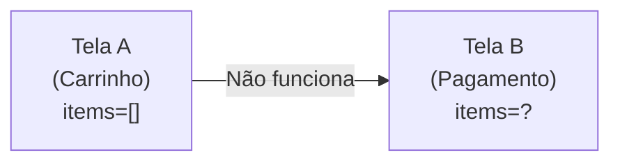
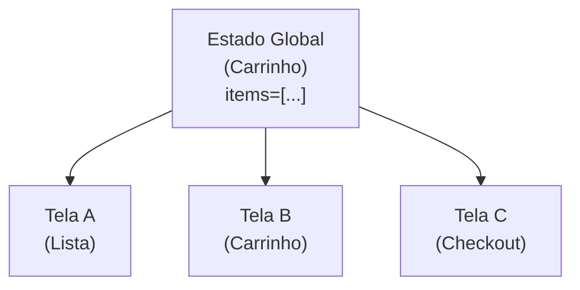
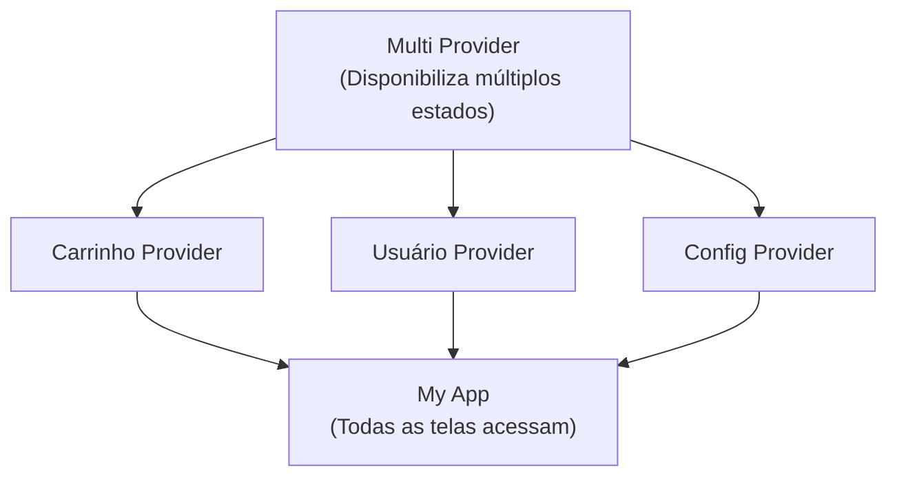

# 🏗️ State Management com Provider

Guia completo sobre gerenciamento de estado em Flutter usando o pacote Provider,
permitindo compartilhar dados entre telas de forma eficiente e organizada.

---

## Por que Gerenciar Estado?

### O Problema

Sem gerenciamento de estado, dados ficam presos em uma única tela:



### A Solução: Estado Global



---

## Provider: Conceitos Fundamentais

### O que é o Provider?

Provider é um pacote que facilita o gerenciamento de estado através do padrão
**InheritedWidget**, permitindo:

- ✅ Compartilhar dados entre widgets
- ✅ Atualização automática da UI quando os dados mudam
- ✅ Separação clara entre UI e lógica de negócio
- ✅ Facilidade de teste

### Arquitetura



---

## Configuração

### Dependências

```yaml
dependencies:
  flutter:
    sdk: flutter
  provider: ^6.1.2
```

Execute:

```bash
flutter pub get
```

---

## Implementação Passo a Passo

### Exemplo: Carrinho de Compras

#### 1. Modelo de Dados

```dart
// models/produto.dart
class Produto {
  final String id;
  final String nome;
  final double preco;
  final String imagem;

  Produto({
    required this.id,
    required this.nome,
    required this.preco,
    required this.imagem,
  });
}

// models/item_carrinho.dart
class ItemCarrinho {
  final Produto produto;
  int quantidade;

  ItemCarrinho({
    required this.produto,
    this.quantidade = 1,
  });

  double get total => produto.preco * quantidade;
}
```

#### 2. Classe Provider (Estado)

```dart
// providers/carrinho_provider.dart
import 'package:flutter/foundation.dart';
import '../models/produto.dart';
import '../models/item_carrinho.dart';

class CarrinhoProvider extends ChangeNotifier {
  // Lista privada de itens
  final List<ItemCarrinho> _itens = [];

  // Getter para acessar os itens (imutável)
  List<ItemCarrinho> get itens => List.unmodifiable(_itens);

  // Getter para quantidade total de itens
  int get quantidadeTotal {
    return _itens.fold(0, (sum, item) => sum + item.quantidade);
  }

  // Getter para valor total do carrinho
  double get valorTotal {
    return _itens.fold(0, (sum, item) => sum + item.total);
  }

  // Adicionar produto ao carrinho
  void adicionarProduto(Produto produto) {
    // Verificar se já existe
    final indexExistente = _itens.indexWhere(
      (item) => item.produto.id == produto.id,
    );

    if (indexExistente >= 0) {
      // Incrementar quantidade
      _itens[indexExistente].quantidade++;
    } else {
      // Adicionar novo item
      _itens.add(ItemCarrinho(produto: produto));
    }

    // Notificar listeners (atualizar UI)
    notifyListeners();
  }

  // Remover produto
  void removerProduto(String produtoId) {
    _itens.removeWhere((item) => item.produto.id == produtoId);
    notifyListeners();
  }

  // Incrementar quantidade
  void incrementarQuantidade(String produtoId) {
    final index = _itens.indexWhere((item) => item.produto.id == produtoId);
    if (index >= 0) {
      _itens[index].quantidade++;
      notifyListeners();
    }
  }

  // Decrementar quantidade
  void decrementarQuantidade(String produtoId) {
    final index = _itens.indexWhere((item) => item.produto.id == produtoId);
    if (index >= 0) {
      if (_itens[index].quantidade > 1) {
        _itens[index].quantidade--;
      } else {
        _itens.removeAt(index);
      }
      notifyListeners();
    }
  }

  // Limpar carrinho
  void limparCarrinho() {
    _itens.clear();
    notifyListeners();
  }
}
```

#### 3. Configuração no main.dart

```dart
// main.dart
import 'package:flutter/material.dart';
import 'package:provider/provider.dart';
import 'providers/carrinho_provider.dart';
import 'screens/catalogo_screen.dart';

void main() {
  runApp(const MyApp());
}

class MyApp extends StatelessWidget {
  const MyApp({super.key});

  @override
  Widget build(BuildContext context) {
    return MultiProvider(
      providers: [
        // Provider do Carrinho
        ChangeNotifierProvider(
          create: (_) => CarrinhoProvider(),
        ),
        // Pode adicionar mais providers aqui
        // ChangeNotifierProvider(create: (_) => UsuarioProvider()),
        // ChangeNotifierProvider(create: (_) => ConfigProvider()),
      ],
      child: MaterialApp(
        title: 'Loja com Provider',
        debugShowCheckedModeBanner: false,
        theme: ThemeData(
          primarySwatch: Colors.blue,
          useMaterial3: true,
        ),
        home: const CatalogoScreen(),
      ),
    );
  }
}
```

#### 4. Tela de Catálogo (Adicionar ao Carrinho)

```dart
// screens/catalogo_screen.dart
import 'package:flutter/material.dart';
import 'package:provider/provider.dart';
import '../models/produto.dart';
import '../providers/carrinho_provider.dart';
import 'carrinho_screen.dart';

class CatalogoScreen extends StatelessWidget {
  const CatalogoScreen({super.key});

  @override
  Widget build(BuildContext context) {
    // Dados mockados
    final produtos = [
      Produto(
        id: '1',
        nome: 'Notebook',
        preco: 4500.00,
        imagem: '💻',
      ),
      Produto(
        id: '2',
        nome: 'Mouse Gamer',
        preco: 150.00,
        imagem: '🖱️',
      ),
      Produto(
        id: '3',
        nome: 'Teclado Mecânico',
        preco: 350.00,
        imagem: '⌨️',
      ),
      Produto(
        id: '4',
        nome: 'Monitor 27"',
        preco: 1200.00,
        imagem: '🖥️',
      ),
    ];

    return Scaffold(
      appBar: AppBar(
        title: const Text('Catálogo'),
        actions: [
          // Badge com quantidade de itens no carrinho
          Consumer<CarrinhoProvider>(
            builder: (context, carrinho, child) {
              return Badge(
                label: Text('${carrinho.quantidadeTotal}'),
                isLabelVisible: carrinho.quantidadeTotal > 0,
                child: IconButton(
                  icon: const Icon(Icons.shopping_cart),
                  onPressed: () {
                    Navigator.push(
                      context,
                      MaterialPageRoute(
                        builder: (_) => const CarrinhoScreen(),
                      ),
                    );
                  },
                ),
              );
            },
          ),
        ],
      ),
      body: GridView.builder(
        padding: const EdgeInsets.all(16),
        gridDelegate: const SliverGridDelegateWithFixedCrossAxisCount(
          crossAxisCount: 2,
          childAspectRatio: 0.75,
          crossAxisSpacing: 16,
          mainAxisSpacing: 16,
        ),
        itemCount: produtos.length,
        itemBuilder: (context, index) {
          final produto = produtos[index];
          return _buildProdutoCard(context, produto);
        },
      ),
    );
  }

  Widget _buildProdutoCard(BuildContext context, Produto produto) {
    return Card(
      elevation: 4,
      child: Column(
        mainAxisAlignment: MainAxisAlignment.center,
        children: [
          Text(
            produto.imagem,
            style: const TextStyle(fontSize: 64),
          ),
          const SizedBox(height: 8),
          Text(
            produto.nome,
            style: const TextStyle(
              fontSize: 16,
              fontWeight: FontWeight.bold,
            ),
          ),
          const SizedBox(height: 4),
          Text(
            'R$ ${produto.preco.toStringAsFixed(2)}',
            style: TextStyle(
              fontSize: 18,
              color: Colors.green[700],
              fontWeight: FontWeight.bold,
            ),
          ),
          const SizedBox(height: 16),
          ElevatedButton.icon(
            onPressed: () {
              // ACESSAR PROVIDER E ADICIONAR PRODUTO
              context.read<CarrinhoProvider>().adicionarProduto(produto);

              ScaffoldMessenger.of(context).showSnackBar(
                SnackBar(
                  content: Text('${produto.nome} adicionado!'),
                  duration: const Duration(seconds: 1),
                ),
              );
            },
            icon: const Icon(Icons.add_shopping_cart),
            label: const Text('Adicionar'),
          ),
        ],
      ),
    );
  }
}
```

#### 5. Tela do Carrinho (Ler e Modificar)

```dart
// screens/carrinho_screen.dart
import 'package:flutter/material.dart';
import 'package:provider/provider.dart';
import '../providers/carrinho_provider.dart';

class CarrinhoScreen extends StatelessWidget {
  const CarrinhoScreen({super.key});

  @override
  Widget build(BuildContext context) {
    return Scaffold(
      appBar: AppBar(
        title: const Text('Carrinho'),
        actions: [
          // Botão para limpar carrinho
          TextButton.icon(
            onPressed: () {
              showDialog(
                context: context,
                builder: (_) => AlertDialog(
                  title: const Text('Limpar Carrinho?'),
                  content: const Text('Todos os itens serão removidos.'),
                  actions: [
                    TextButton(
                      onPressed: () => Navigator.pop(context),
                      child: const Text('Cancelar'),
                    ),
                    TextButton(
                      onPressed: () {
                        context.read<CarrinhoProvider>().limparCarrinho();
                        Navigator.pop(context);
                      },
                      child: const Text('Limpar'),
                    ),
                  ],
                ),
              );
            },
            icon: const Icon(Icons.delete_outline, color: Colors.red),
            label: const Text('Limpar', style: TextStyle(color: Colors.red)),
          ),
        ],
      ),
      body: Consumer<CarrinhoProvider>(
        builder: (context, carrinho, child) {
          if (carrinho.itens.isEmpty) {
            return const Center(
              child: Column(
                mainAxisAlignment: MainAxisAlignment.center,
                children: [
                  Icon(Icons.shopping_cart_outlined, size: 100, color: Colors.grey),
                  SizedBox(height: 16),
                  Text(
                    'Carrinho vazio',
                    style: TextStyle(fontSize: 18, color: Colors.grey),
                  ),
                ],
              ),
            );
          }

          return Column(
            children: [
              // Lista de itens
              Expanded(
                child: ListView.builder(
                  itemCount: carrinho.itens.length,
                  itemBuilder: (context, index) {
                    final item = carrinho.itens[index];
                    return Card(
                      margin: const EdgeInsets.symmetric(
                        horizontal: 16,
                        vertical: 4,
                      ),
                      child: ListTile(
                        leading: Text(
                          item.produto.imagem,
                          style: const TextStyle(fontSize: 32),
                        ),
                        title: Text(item.produto.nome),
                        subtitle: Text(
                          'R$ ${item.produto.preco.toStringAsFixed(2)} cada',
                        ),
                        trailing: SizedBox(
                          width: 120,
                          child: Row(
                            children: [
                              // Botão diminuir
                              IconButton(
                                icon: const Icon(Icons.remove_circle_outline),
                                onPressed: () {
                                  carrinho.decrementarQuantidade(
                                    item.produto.id,
                                  );
                                },
                              ),
                              // Quantidade
                              Text(
                                '${item.quantidade}',
                                style: const TextStyle(
                                  fontSize: 16,
                                  fontWeight: FontWeight.bold,
                                ),
                              ),
                              // Botão aumentar
                              IconButton(
                                icon: const Icon(Icons.add_circle_outline),
                                onPressed: () {
                                  carrinho.incrementarQuantidade(
                                    item.produto.id,
                                  );
                                },
                              ),
                            ],
                          ),
                        ),
                      ),
                    );
                  },
                ),
              ),

              // Resumo do pedido
              Container(
                padding: const EdgeInsets.all(16),
                decoration: BoxDecoration(
                  color: Colors.grey[100],
                  borderRadius: const BorderRadius.vertical(
                    top: Radius.circular(20),
                  ),
                  boxShadow: [
                    BoxShadow(
                      color: Colors.black.withOpacity(0.1),
                      blurRadius: 10,
                      offset: const Offset(0, -5),
                    ),
                  ],
                ),
                child: SafeArea(
                  child: Column(
                    children: [
                      // Quantidade total
                      Row(
                        mainAxisAlignment: MainAxisAlignment.spaceBetween,
                        children: [
                          const Text('Itens:'),
                          Text(
                            '${carrinho.quantidadeTotal}',
                            style: const TextStyle(fontWeight: FontWeight.bold),
                          ),
                        ],
                      ),
                      const Divider(),
                      // Valor total
                      Row(
                        mainAxisAlignment: MainAxisAlignment.spaceBetween,
                        children: [
                          const Text(
                            'Total:',
                            style: TextStyle(fontSize: 18),
                          ),
                          Text(
                            'R$ ${carrinho.valorTotal.toStringAsFixed(2)}',
                            style: const TextStyle(
                              fontSize: 24,
                              fontWeight: FontWeight.bold,
                              color: Colors.green,
                            ),
                          ),
                        ],
                      ),
                      const SizedBox(height: 16),
                      // Botão finalizar
                      SizedBox(
                        width: double.infinity,
                        height: 50,
                        child: ElevatedButton(
                          onPressed: () {
                            // Implementar checkout
                          },
                          child: const Text(
                            'FINALIZAR COMPRA',
                            style: TextStyle(fontSize: 16),
                          ),
                        ),
                      ),
                    ],
                  ),
                ),
              ),
            ],
          );
        },
      ),
    );
  }
}
```

---

## Métodos de Acesso ao Provider

### 1. `context.read<T>()`

Lê o provider **uma única vez**, sem escutar mudanças.

```dart
// Use para ações (métodos)
onPressed: () {
  context.read<CarrinhoProvider>().adicionarProduto(produto);
}
```

### 2. `context.watch<T>()`

Escuta mudanças e **rebuilda o widget** quando o estado muda.

```dart
// Use para exibir dados que mudam
Text('${context.watch<CarrinhoProvider>().quantidadeTotal}');
```

### 3. `context.select<T, R>()`

Escuta apenas uma **parte específica** do estado (mais eficiente).

```dart
// Rebuilda apenas quando valorTotal mudar
Text(
  'R$ ${context.select<CarrinhoProvider, double>(
    (carrinho) => carrinho.valorTotal,
  ).toStringAsFixed(2)}'
);
```

### 4. `Consumer<T>`

Widget dedicado para rebuildar apenas uma parte da árvore.

```dart
Consumer<CarrinhoProvider>(
  builder: (context, carrinho, child) {
    return Text('${carrinho.quantidadeTotal}');
  },
)
```

---

## Padrões Avançados

### Provider com Múltiplos Estados

```dart
class AppState with ChangeNotifier {
  // Carrinho
  final List<ItemCarrinho> _carrinho = [];
  List<ItemCarrinho> get carrinho => _carrinho;

  // Usuário
  Usuario? _usuario;
  Usuario? get usuario => _usuario;
  bool get isLogado => _usuario != null;

  // Configurações
  bool _temaEscuro = false;
  bool get temaEscuro => _temaEscuro;

  void login(Usuario usuario) {
    _usuario = usuario;
    notifyListeners();
  }

  void toggleTema() {
    _temaEscuro = !_temaEscuro;
    notifyListeners();
  }
}
```

### ProxyProvider (Providers que dependem de outros)

```dart
MultiProvider(
  providers: [
    ChangeNotifierProvider(create: (_) => AuthProvider()),
    // Carrinho depende do usuário logado
    ChangeNotifierProxyProvider<AuthProvider, CarrinhoProvider>(
      create: (_) => CarrinhoProvider(),
      update: (_, auth, carrinho) {
        carrinho!.usuarioId = auth.usuario?.id;
        return carrinho;
      },
    ),
  ],
)
```

---

## Boas Práticas

1. **Separe UI da lógica** - Provider contém apenas estado e métodos
2. **Notifique apenas quando necessário** - Chame `notifyListeners()` apenas
   quando os dados realmente mudarem
3. **Use tipos específicos** - Evite `ChangeNotifierProvider<dynamic>`
4. **Dispose corretamente** - Provider gerencia ciclo de vida automaticamente
5. **Não coloque UI no Provider** - SnackBars,Dialogs ficam nas telas

---

## Exercício Prático

Crie um aplicativo de **Lista de Tarefas** usando Provider:

### Requisitos:

1. ✅ Adicionar nova tarefa
2. ✅ Marcar como concluída
3. ✅ Filtrar (Todas/Pendentes/Concluídas)
4. ✅ Contador de tarefas pendentes
5. ✅ Persistir no SharedPreferences (opcional)

### Modelo:

```dart
class Tarefa {
  final String id;
  final String titulo;
  final bool concluida;
  final DateTime dataCriacao;

  Tarefa({...});
}
```

---

## Referências

- **Provider:** [pub.dev/packages/provider](https://pub.dev/packages/provider)
- **Documentação:**
  [pub.dev/documentation/provider](https://pub.dev/documentation/provider/latest/)
- **Flutter State Management:**
  [docs.flutter.dev/data-and-backend/state-mgmt](https://docs.flutter.dev/data-and-backend/state-mgmt)

---

**Material elaborado para Mobile II - 2026**  
Prof. Gustavo Villalta
