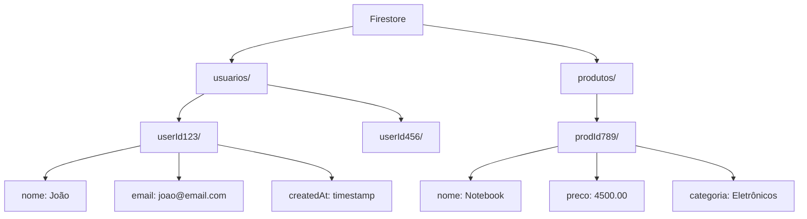

# 🔥 Firebase: Backend e Notificações Push

Guia completo para integrar Firebase em aplicativos Flutter, incluindo
autenticação, Cloud Firestore, Cloud Messaging (notificações push) e Analytics.

---

## O que é o Firebase?

Firebase é uma plataforma de desenvolvimento de aplicativos do Google que
oferece:

| Serviço             | Função                    | Uso                        |
| ------------------- | ------------------------- | -------------------------- |
| **Authentication**  | Login de usuários         | Email, Google, Facebook    |
| **Cloud Firestore** | Banco de dados NoSQL      | Dados em tempo real        |
| **Cloud Messaging** | Notificações push         | Mensagens para usuários    |
| **Storage**         | Armazenamento de arquivos | Imagens, PDFs              |
| **Analytics**       | Métricas de uso           | Comportamento dos usuários |
| **Crashlytics**     | Relatório de erros        | Debug de crashes           |

---

## Configuração Inicial

### 1. Criar Projeto no Firebase

1. Acesse [console.firebase.google.com](https://console.firebase.google.com)
2. Clique em "Adicionar projeto"
3. Dê um nome ao projeto (ex: `meu-app-flutter`)
4. Desative Google Analytics (opcional por enquanto)
5. Clique em "Criar projeto"

### 2. Adicionar App Android

1. No Firebase Console, clique no ícone Android ➕
2. Digite o **package name** (ex: `com.etec.meuapp`)
   - Deve ser igual ao `applicationId` no `build.gradle`
3. Baixe o arquivo `google-services.json`
4. Coloque em: `android/app/google-services.json`

### 3. Configurar Android

**android/build.gradle** (nível do projeto):

```gradle
buildscript {
  dependencies {
    // ... outras dependências
    classpath 'com.google.gms:google-services:4.4.1'
  }
}
```

**android/app/build.gradle** (nível do app):

```gradle
plugins {
  id "com.android.application"
  id "kotlin-android"
  id "dev.flutter.flutter-gradle-plugin"
  id 'com.google.gms.google-services'  // ADICIONAR ESTA LINHA
}

android {
  // ... configurações

  defaultConfig {
    applicationId "com.etec.meuapp"  // Deve bater com o Firebase
    // ...
  }
}
```

### 4. Dependências Flutter

```yaml
dependencies:
  flutter:
    sdk: flutter

  # Core
  firebase_core: ^2.27.1

  # Autenticação
  firebase_auth: ^4.17.9

  # Banco de dados
  cloud_firestore: ^4.15.9

  # Notificações
  firebase_messaging: ^14.7.20
  flutter_local_notifications: ^17.0.0

  # Storage
  firebase_storage: ^11.6.10
```

Execute:

```bash
flutter pub get
```

### 5. Inicializar no main.dart

```dart
import 'package:firebase_core/firebase_core.dart';
import 'package:flutter/material.dart';

void main() async {
  WidgetsFlutterBinding.ensureInitialized();
  await Firebase.initializeApp();
  runApp(const MyApp());
}
```

---

## Firebase Authentication

### Configuração no Console

1. Firebase Console → Authentication → Get Started
2. Ative "Email/Password" e "Google"
3. Para Google: Configure SHA-1 (para debug, use
   `cd android && ./gradlew signingReport`)

### Implementação

```dart
import 'package:firebase_auth/firebase_auth.dart';
import 'package:google_sign_in/google_sign_in.dart';

class AuthService {
  final FirebaseAuth _auth = FirebaseAuth.instance;
  final GoogleSignIn _googleSignIn = GoogleSignIn();

  // Stream de estado de autenticação
  Stream<User?> get authStateChanges => _auth.authStateChanges();

  // Usuário atual
  User? get currentUser => _auth.currentUser;

  // Login com Email/Senha
  Future<UserCredential?> signInWithEmail(String email, String senha) async {
    try {
      return await _auth.signInWithEmailAndPassword(
        email: email,
        password: senha,
      );
    } on FirebaseAuthException catch (e) {
      print('Erro de login: ${e.message}');
      return null;
    }
  }

  // Cadastro com Email/Senha
  Future<UserCredential?> signUpWithEmail(String email, String senha) async {
    try {
      return await _auth.createUserWithEmailAndPassword(
        email: email,
        password: senha,
      );
    } on FirebaseAuthException catch (e) {
      print('Erro de cadastro: ${e.message}');
      return null;
    }
  }

  // Login com Google
  Future<UserCredential?> signInWithGoogle() async {
    try {
      final GoogleSignInAccount? googleUser = await _googleSignIn.signIn();
      if (googleUser == null) return null;

      final GoogleSignInAuthentication googleAuth =
          await googleUser.authentication;

      final credential = GoogleAuthProvider.credential(
        accessToken: googleAuth.accessToken,
        idToken: googleAuth.idToken,
      );

      return await _auth.signInWithCredential(credential);
    } catch (e) {
      print('Erro Google Sign In: $e');
      return null;
    }
  }

  // Logout
  Future<void> signOut() async {
    await _googleSignIn.signOut();
    await _auth.signOut();
  }

  // Resetar senha
  Future<void> resetPassword(String email) async {
    await _auth.sendPasswordResetEmail(email: email);
  }
}
```

---

## Cloud Firestore

Banco de dados NoSQL em tempo real.

### Estrutura de Dados



### Implementação

```dart
import 'package:cloud_firestore/cloud_firestore.dart';

class FirestoreService {
  final FirebaseFirestore _db = FirebaseFirestore.instance;

  // ========== OPERAÇÕES CRUD ==========

  // CREATE - Adicionar documento
  Future<String> addDocument(String collection, Map<String, dynamic> data) async {
    try {
      DocumentReference doc = await _db.collection(collection).add(data);
      return doc.id;
    } catch (e) {
      print('Erro ao adicionar: $e');
      throw e;
    }
  }

  // CREATE com ID específico
  Future<void> setDocument(
    String collection,
    String docId,
    Map<String, dynamic> data,
  ) async {
    await _db.collection(collection).doc(docId).set(data);
  }

  // READ - Obter documento único
  Future<DocumentSnapshot> getDocument(String collection, String docId) async {
    return await _db.collection(collection).doc(docId).get();
  }

  // READ - Listar todos
  Future<QuerySnapshot> getCollection(String collection) async {
    return await _db.collection(collection).get();
  }

  // READ - Com filtros
  Future<QuerySnapshot> queryCollection(
    String collection, {
    String? field,
    dynamic isEqualTo,
    dynamic isGreaterThan,
    String? orderBy,
    bool descending = false,
    int? limit,
  }) async {
    Query query = _db.collection(collection);

    if (field != null) {
      if (isEqualTo != null) {
        query = query.where(field, isEqualTo: isEqualTo);
      }
      if (isGreaterThan != null) {
        query = query.where(field, isGreaterThan: isGreaterThan);
      }
    }

    if (orderBy != null) {
      query = query.orderBy(orderBy, descending: descending);
    }

    if (limit != null) {
      query = query.limit(limit);
    }

    return await query.get();
  }

  // UPDATE - Atualizar documento
  Future<void> updateDocument(
    String collection,
    String docId,
    Map<String, dynamic> data,
  ) async {
    await _db.collection(collection).doc(docId).update(data);
  }

  // DELETE - Remover documento
  Future<void> deleteDocument(String collection, String docId) async {
    await _db.collection(collection).doc(docId).delete();
  }

  // ========== STREAMS EM TEMPO REAL ==========

  // Stream de coleção inteira
  Stream<QuerySnapshot> streamCollection(String collection) {
    return _db.collection(collection).snapshots();
  }

  // Stream de documento único
  Stream<DocumentSnapshot> streamDocument(String collection, String docId) {
    return _db.collection(collection).doc(docId).snapshots();
  }
}
```

### Exemplo: Lista de Tarefas com Firestore

```dart
class Tarefa {
  final String id;
  final String titulo;
  final bool concluida;
  final Timestamp createdAt;

  Tarefa({
    required this.id,
    required this.titulo,
    required this.concluida,
    required this.createdAt,
  });

  factory Tarefa.fromFirestore(DocumentSnapshot doc) {
    Map data = doc.data() as Map<String, dynamic>;
    return Tarefa(
      id: doc.id,
      titulo: data['titulo'] ?? '',
      concluida: data['concluida'] ?? false,
      createdAt: data['createdAt'] ?? Timestamp.now(),
    );
  }

  Map<String, dynamic> toFirestore() {
    return {
      'titulo': titulo,
      'concluida': concluida,
      'createdAt': FieldValue.serverTimestamp(),
    };
  }
}

// Provider/Tela
class TarefasScreen extends StatelessWidget {
  final FirestoreService _firestore = FirestoreService();

  @override
  Widget build(BuildContext context) {
    return Scaffold(
      appBar: AppBar(title: const Text('Minhas Tarefas')),
      body: StreamBuilder<QuerySnapshot>(
        stream: _firestore.streamCollection('tarefas'),
        builder: (context, snapshot) {
          if (snapshot.hasError) {
            return Center(child: Text('Erro: ${snapshot.error}'));
          }

          if (snapshot.connectionState == ConnectionState.waiting) {
            return const Center(child: CircularProgressIndicator());
          }

          List<Tarefa> tarefas = snapshot.data!.docs
              .map((doc) => Tarefa.fromFirestore(doc))
              .toList();

          return ListView.builder(
            itemCount: tarefas.length,
            itemBuilder: (context, index) {
              Tarefa tarefa = tarefas[index];
              return ListTile(
                title: Text(tarefa.titulo),
                leading: Checkbox(
                  value: tarefa.concluida,
                  onChanged: (value) {
                    _firestore.updateDocument(
                      'tarefas',
                      tarefa.id,
                      {'concluida': value},
                    );
                  },
                ),
                trailing: IconButton(
                  icon: const Icon(Icons.delete),
                  onPressed: () {
                    _firestore.deleteDocument('tarefas', tarefa.id);
                  },
                ),
              );
            },
          );
        },
      ),
      floatingActionButton: FloatingActionButton(
        onPressed: () => _adicionarTarefa(context),
        child: const Icon(Icons.add),
      ),
    );
  }

  void _adicionarTarefa(BuildContext context) {
    showDialog(
      context: context,
      builder: (context) {
        String titulo = '';
        return AlertDialog(
          title: const Text('Nova Tarefa'),
          content: TextField(
            onChanged: (value) => titulo = value,
            decoration: const InputDecoration(labelText: 'Título'),
          ),
          actions: [
            TextButton(
              onPressed: () => Navigator.pop(context),
              child: const Text('Cancelar'),
            ),
            TextButton(
              onPressed: () {
                _firestore.addDocument('tarefas', {
                  'titulo': titulo,
                  'concluida': false,
                  'createdAt': FieldValue.serverTimestamp(),
                });
                Navigator.pop(context);
              },
              child: const Text('Salvar'),
            ),
          ],
        );
      },
    );
  }
}
```

---

## Firebase Cloud Messaging (Notificações Push)

### Configuração

**AndroidManifest.xml**:

```xml
<application ...>
  <!-- Configuração para notificações -->
  <meta-data
    android:name="com.google.firebase.messaging.default_notification_channel_id"
    android:value="default_channel" />
</application>
```

### Implementação

```dart
import 'package:firebase_messaging/firebase_messaging.dart';
import 'package:flutter_local_notifications/flutter_local_notifications.dart';

class NotificationService {
  final FirebaseMessaging _fcm = FirebaseMessaging.instance;
  final FlutterLocalNotificationsPlugin _localNotifications =
      FlutterLocalNotificationsPlugin();

  // Inicializar
  Future<void> initialize() async {
    // Solicitar permissão (iOS)
    NotificationSettings settings = await _fcm.requestPermission(
      alert: true,
      badge: true,
      sound: true,
    );

    print('Permissão de notificação: ${settings.authorizationStatus}');

    // Configurar notificações locais
    const AndroidInitializationSettings androidSettings =
        AndroidInitializationSettings('@mipmap/ic_launcher');

    const InitializationSettings initSettings =
        InitializationSettings(android: androidSettings);

    await _localNotifications.initialize(initSettings);

    // Criar canal de notificação
    const AndroidNotificationChannel channel = AndroidNotificationChannel(
      'default_channel',
      'Notificações Padrão',
      importance: Importance.high,
    );

    await _localNotifications
        .resolvePlatformSpecificImplementation<AndroidFlutterLocalNotificationsPlugin>()
        ?.createNotificationChannel(channel);

    // Obter token FCM
    String? token = await _fcm.getToken();
    print('FCM Token: $token');

    // Ouvir mudanças no token
    _fcm.onTokenRefresh.listen((newToken) {
      print('Novo FCM Token: $newToken');
      // Enviar para seu servidor
    });

    // Handler para mensagens em foreground
    FirebaseMessaging.onMessage.listen(_handleForegroundMessage);

    // Handler para quando app é aberto via notificação
    FirebaseMessaging.onMessageOpenedApp.listen(_handleNotificationOpen);
  }

  // Handler mensagens em foreground
  Future<void> _handleForegroundMessage(RemoteMessage message) async {
    print('Mensagem recebida em foreground:');
    print('Título: ${message.notification?.title}');
    print('Corpo: ${message.notification?.body}');

    // Mostrar notificação local
    await _showLocalNotification(
      title: message.notification?.title ?? 'Nova mensagem',
      body: message.notification?.body ?? '',
    );
  }

  // Handler ao abrir notificação
  void _handleNotificationOpen(RemoteMessage message) {
    print('App aberto via notificação: ${message.data}');
    // Navegar para tela específica baseado em message.data
  }

  // Mostrar notificação local
  Future<void> _showLocalNotification({
    required String title,
    required String body,
  }) async {
    const AndroidNotificationDetails androidDetails =
        AndroidNotificationDetails(
      'default_channel',
      'Notificações Padrão',
      importance: Importance.high,
      priority: Priority.high,
    );

    const NotificationDetails details =
        NotificationDetails(android: androidDetails);

    await _localNotifications.show(
      0,
      title,
      body,
      details,
    );
  }

  // Inscrever em tópico
  Future<void> subscribeToTopic(String topic) async {
    await _fcm.subscribeToTopic(topic);
    print('Inscrito no tópico: $topic');
  }

  // Cancelar inscrição
  Future<void> unsubscribeFromTopic(String topic) async {
    await _fcm.unsubscribeFromTopic(topic);
    print('Cancelada inscrição no tópico: $topic');
  }
}
```

### Handler para Background (Top-level)

```dart
// Em main.dart, fora de qualquer classe
@pragma('vm:entry-point')
Future<void> _firebaseMessagingBackgroundHandler(RemoteMessage message) async {
  await Firebase.initializeApp();
  print('Mensagem em background: ${message.messageId}');
}

void main() async {
  WidgetsFlutterBinding.ensureInitialized();
  await Firebase.initializeApp();

  // Registrar handler de background
  FirebaseMessaging.onBackgroundMessage(_firebaseMessagingBackgroundHandler);

  runApp(const MyApp());
}
```

---

## Enviar Notificações (via Console ou API)

### Via Firebase Console

1. Firebase Console → Cloud Messaging
2. Clique em "Nova campanha" → "Notificações"
3. Digite título e texto
4. Selecione alvo (todos os usuários ou segmento)
5. Agende ou envie imediatamente

### Via API (para desenvolvedores)

```dart
// Usando HTTP v1 API com OAuth2
// Requer server key do Firebase

Future<void> sendNotification({
  required String token,
  required String title,
  required String body,
}) async {
  // Implementação com pacote http
  // Endpoint: POST https://fcm.googleapis.com/v1/projects/{project_id}/messages:send
}
```

---

## Firebase Storage (Upload de Arquivos)

```dart
import 'dart:io';
import 'package:firebase_storage/firebase_storage.dart';

class StorageService {
  final FirebaseStorage _storage = FirebaseStorage.instance;

  // Upload de arquivo
  Future<String?> uploadFile({
    required File file,
    required String path, // ex: 'produtos/imagem123.jpg'
  }) async {
    try {
      Reference ref = _storage.ref().child(path);
      UploadTask uploadTask = ref.putFile(file);

      TaskSnapshot snapshot = await uploadTask;
      String downloadUrl = await snapshot.ref.getDownloadURL();

      return downloadUrl;
    } catch (e) {
      print('Erro no upload: $e');
      return null;
    }
  }

  // Download de arquivo
  Future<void> downloadFile({
    required String path,
    required File localFile,
  }) async {
    Reference ref = _storage.ref().child(path);
    await ref.writeToFile(localFile);
  }

  // Deletar arquivo
  Future<void> deleteFile(String path) async {
    Reference ref = _storage.ref().child(path);
    await ref.delete();
  }
}
```

---

## Boas Práticas

1. **Segurança**: Configure regras de segurança no Firestore
2. **Indexação**: Crie índices para queries complexas
3. **Paginação**: Use `limit()` e `startAfter()` para listas grandes
4. **Offline**: Firestore funciona offline por padrão
5. **Erros**: Sempre trate exceções do Firebase

### Regras de Segurança (Firestore)

```javascript
rules_version = '2';
service cloud.firestore {
  match /databases/{database}/documents {
    // Usuários só podem ler/escrever seus próprios dados
    match /usuarios/{userId} {
      allow read, write: if request.auth != null && request.auth.uid == userId;
    }

    // Tarefas públicas para usuários autenticados
    match /tarefas/{tarefaId} {
      allow read, write: if request.auth != null;
    }
  }
}
```

---

## Referências

- **Firebase Flutter:**
  [firebase.google.com/docs/flutter](https://firebase.google.com/docs/flutter/setup)
- **Cloud Firestore:**
  [firebase.google.com/docs/firestore](https://firebase.google.com/docs/firestore)
- **FCM:**
  [firebase.google.com/docs/cloud-messaging](https://firebase.google.com/docs/cloud-messaging)
- **FlutterFire:** [firebase.flutter.dev](https://firebase.flutter.dev/)

---

**Material elaborado para Mobile II - 2026**  
Prof. Gustavo Villalta
