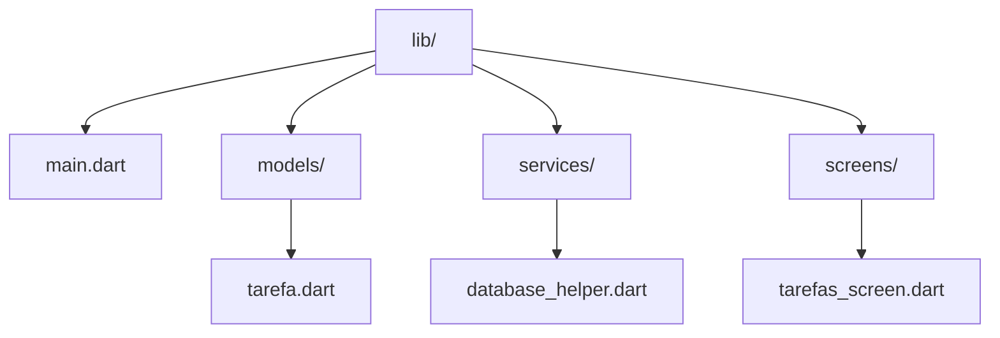

# 🗄️ SQLite: Banco de Dados Local

Guia completo sobre persistência de dados local em Flutter usando SQLite,
incluindo criação de tabelas, operações CRUD, relacionamentos e migrações.

---

## Por que SQLite?

| Característica          | SQLite             | Firestore          | SharedPreferences |
| ----------------------- | ------------------ | ------------------ | ----------------- |
| **Tipo**                | SQL relacional     | NoSQL              | Chave-valor       |
| **Offline**             | ✅ Sim             | ✅ Sim             | ✅ Sim            |
| **Relacionamentos**     | ✅ Sim             | ⚠️ Limitado        | ❌ Não            |
| **Consultas complexas** | ✅ Sim             | ⚠️ Limitado        | ❌ Não            |
| **Volume de dados**     | Grande             | Grande             | Pequeno           |
| **Uso ideal**           | Dados estruturados | Sync em tempo real | Configurações     |

---

## Configuração

### Dependências

```yaml
dependencies:
  flutter:
    sdk: flutter
  sqflite: ^2.3.3
  path: ^1.9.0
```

Execute:

```bash
flutter pub get
```

---

## Estrutura do Projeto



---

## Implementação Completa

### 1. Modelo de Dados

```dart
// models/tarefa.dart
class Tarefa {
  final int? id;
  final String titulo;
  final String descricao;
  final bool concluida;
  final DateTime dataCriacao;
  final DateTime? dataConclusao;
  final int prioridade; // 1=Baixa, 2=Média, 3=Alta

  Tarefa({
    this.id,
    required this.titulo,
    this.descricao = '',
    this.concluida = false,
    required this.dataCriacao,
    this.dataConclusao,
    this.prioridade = 2,
  });

  // Converter objeto para Map (para SQLite)
  Map<String, dynamic> toMap() {
    return {
      'id': id,
      'titulo': titulo,
      'descricao': descricao,
      'concluida': concluida ? 1 : 0,  // SQLite não tem boolean
      'dataCriacao': dataCriacao.toIso8601String(),
      'dataConclusao': dataConclusao?.toIso8601String(),
      'prioridade': prioridade,
    };
  }

  // Criar objeto a partir de Map (do SQLite)
  factory Tarefa.fromMap(Map<String, dynamic> map) {
    return Tarefa(
      id: map['id'] as int?,
      titulo: map['titulo'] as String,
      descricao: map['descricao'] as String,
      concluida: map['concluida'] == 1,
      dataCriacao: DateTime.parse(map['dataCriacao'] as String),
      dataConclusao: map['dataConclusao'] != null
          ? DateTime.parse(map['dataConclusao'] as String)
          : null,
      prioridade: map['prioridade'] as int,
    );
  }

  // Método copyWith para atualizações
  Tarefa copyWith({
    int? id,
    String? titulo,
    String? descricao,
    bool? concluida,
    DateTime? dataCriacao,
    DateTime? dataConclusao,
    int? prioridade,
  }) {
    return Tarefa(
      id: id ?? this.id,
      titulo: titulo ?? this.titulo,
      descricao: descricao ?? this.descricao,
      concluida: concluida ?? this.concluida,
      dataCriacao: dataCriacao ?? this.dataCriacao,
      dataConclusao: dataConclusao ?? this.dataConclusao,
      prioridade: prioridade ?? this.prioridade,
    );
  }

  @override
  String toString() {
    return 'Tarefa(id: $id, titulo: $titulo, concluida: $concluida)';
  }
}
```

### 2. Database Helper (Singleton)

```dart
// services/database_helper.dart
import 'dart:async';
import 'package:path/path.dart';
import 'package:sqflite/sqflite.dart';
import '../models/tarefa.dart';

class DatabaseHelper {
  // Singleton pattern
  static final DatabaseHelper _instance = DatabaseHelper._internal();
  factory DatabaseHelper() => _instance;
  DatabaseHelper._internal();

  static Database? _database;

  // Nome e versão do banco
  static const String _databaseName = 'tarefas.db';
  static const int _databaseVersion = 1;

  // Nome da tabela
  static const String tableTarefas = 'tarefas';

  // Colunas
  static const String colId = 'id';
  static const String colTitulo = 'titulo';
  static const String colDescricao = 'descricao';
  static const String colConcluida = 'concluida';
  static const String colDataCriacao = 'dataCriacao';
  static const String colDataConclusao = 'dataConclusao';
  static const String colPrioridade = 'prioridade';

  // Getter para o database
  Future<Database> get database async {
    if (_database != null) return _database!;
    _database = await _initDatabase();
    return _database!;
  }

  // Inicializar banco de dados
  Future<Database> _initDatabase() async {
    // Obter caminho do banco
    String path = join(await getDatabasesPath(), _databaseName);
    print('Banco de dados em: $path');

    // Abrir/criar banco
    return await openDatabase(
      path,
      version: _databaseVersion,
      onCreate: _onCreate,
      onUpgrade: _onUpgrade,
    );
  }

  // Criar tabelas
  Future<void> _onCreate(Database db, int version) async {
    await db.execute('''
      CREATE TABLE $tableTarefas (
        $colId INTEGER PRIMARY KEY AUTOINCREMENT,
        $colTitulo TEXT NOT NULL,
        $colDescricao TEXT,
        $colConcluida INTEGER NOT NULL DEFAULT 0,
        $colDataCriacao TEXT NOT NULL,
        $colDataConclusao TEXT,
        $colPrioridade INTEGER NOT NULL DEFAULT 2
      )
    ''');

    print('Tabela $tableTarefas criada com sucesso!');
  }

  // Migração de versão
  Future<void> _onUpgrade(Database db, int oldVersion, int newVersion) async {
    // Exemplo de migração futura:
    // if (oldVersion < 2) {
    //   await db.execute('ALTER TABLE $tableTarefas ADD COLUMN nova_coluna TEXT');
    // }
  }

  // ========== OPERAÇÕES CRUD ==========

  // CREATE - Inserir tarefa
  Future<int> insertTarefa(Tarefa tarefa) async {
    final Database db = await database;
    return await db.insert(
      tableTarefas,
      tarefa.toMap(),
      conflictAlgorithm: ConflictAlgorithm.replace,
    );
  }

  // READ - Todas as tarefas
  Future<List<Tarefa>> getAllTarefas() async {
    final Database db = await database;
    final List<Map<String, dynamic>> maps = await db.query(
      tableTarefas,
      orderBy: '$colDataCriacao DESC',
    );

    return List.generate(maps.length, (i) {
      return Tarefa.fromMap(maps[i]);
    });
  }

  // READ - Tarefa por ID
  Future<Tarefa?> getTarefaById(int id) async {
    final Database db = await database;
    final List<Map<String, dynamic>> maps = await db.query(
      tableTarefas,
      where: '$colId = ?',
      whereArgs: [id],
    );

    if (maps.isNotEmpty) {
      return Tarefa.fromMap(maps.first);
    }
    return null;
  }

  // READ - Tarefas pendentes
  Future<List<Tarefa>> getTarefasPendentes() async {
    final Database db = await database;
    final List<Map<String, dynamic>> maps = await db.query(
      tableTarefas,
      where: '$colConcluida = ?',
      whereArgs: [0],
      orderBy: '$colPrioridade DESC, $colDataCriacao DESC',
    );

    return List.generate(maps.length, (i) {
      return Tarefa.fromMap(maps[i]);
    });
  }

  // READ - Tarefas concluídas
  Future<List<Tarefa>> getTarefasConcluidas() async {
    final Database db = await database;
    final List<Map<String, dynamic>> maps = await db.query(
      tableTarefas,
      where: '$colConcluida = ?',
      whereArgs: [1],
      orderBy: '$colDataConclusao DESC',
    );

    return List.generate(maps.length, (i) {
      return Tarefa.fromMap(maps[i]);
    });
  }

  // READ - Buscar por texto
  Future<List<Tarefa>> searchTarefas(String query) async {
    final Database db = await database;
    final List<Map<String, dynamic>> maps = await db.query(
      tableTarefas,
      where: '$colTitulo LIKE ? OR $colDescricao LIKE ?',
      whereArgs: ['%$query%', '%$query%'],
    );

    return List.generate(maps.length, (i) {
      return Tarefa.fromMap(maps[i]);
    });
  }

  // UPDATE - Atualizar tarefa
  Future<int> updateTarefa(Tarefa tarefa) async {
    final Database db = await database;
    return await db.update(
      tableTarefas,
      tarefa.toMap(),
      where: '$colId = ?',
      whereArgs: [tarefa.id],
    );
  }

  // UPDATE - Marcar como concluída
  Future<int> marcarConcluida(int id) async {
    final Database db = await database;
    return await db.update(
      tableTarefas,
      {
        colConcluida: 1,
        colDataConclusao: DateTime.now().toIso8601String(),
      },
      where: '$colId = ?',
      whereArgs: [id],
    );
  }

  // DELETE - Remover tarefa
  Future<int> deleteTarefa(int id) async {
    final Database db = await database;
    return await db.delete(
      tableTarefas,
      where: '$colId = ?',
      whereArgs: [id],
    );
  }

  // DELETE - Remover todas as concluídas
  Future<int> deleteConcluidas() async {
    final Database db = await database;
    return await db.delete(
      tableTarefas,
      where: '$colConcluida = ?',
      whereArgs: [1],
    );
  }

  // ESTATÍSTICAS

  // Contar tarefas
  Future<int> countTarefas({bool? concluidas}) async {
    final Database db = await database;

    String? where;
    List<dynamic>? whereArgs;

    if (concluidas != null) {
      where = '$colConcluida = ?';
      whereArgs = [concluidas ? 1 : 0];
    }

    final result = await db.rawQuery(
      'SELECT COUNT(*) as count FROM $tableTarefas ${where != null ? 'WHERE $where' : ''}',
      whereArgs,
    );

    return Sqflite.firstIntValue(result) ?? 0;
  }

  // Fechar conexão
  Future<void> close() async {
    final Database db = await database;
    await db.close();
    _database = null;
  }
}
```

### 3. Tela de Tarefas com SQLite

```dart
// screens/tarefas_screen.dart
import 'package:flutter/material.dart';
import '../models/tarefa.dart';
import '../services/database_helper.dart';

class TarefasScreen extends StatefulWidget {
  const TarefasScreen({super.key});

  @override
  State<TarefasScreen> createState() => _TarefasScreenState();
}

class _TarefasScreenState extends State<TarefasScreen> {
  final DatabaseHelper _dbHelper = DatabaseHelper();
  List<Tarefa> _tarefas = [];
  bool _isLoading = true;
  int _filtroSelecionado = 0; // 0=Todas, 1=Pendentes, 2=Concluídas

  @override
  void initState() {
    super.initState();
    _carregarTarefas();
  }

  Future<void> _carregarTarefas() async {
    setState(() => _isLoading = true);

    List<Tarefa> tarefas;
    switch (_filtroSelecionado) {
      case 1:
        tarefas = await _dbHelper.getTarefasPendentes();
        break;
      case 2:
        tarefas = await _dbHelper.getTarefasConcluidas();
        break;
      default:
        tarefas = await _dbHelper.getAllTarefas();
    }

    setState(() {
      _tarefas = tarefas;
      _isLoading = false;
    });
  }

  Future<void> _adicionarTarefa() async {
    final resultado = await showDialog<Tarefa>(
      context: context,
      builder: (context) => const DialogTarefa(),
    );

    if (resultado != null) {
      await _dbHelper.insertTarefa(resultado);
      _carregarTarefas();
    }
  }

  Future<void> _toggleConcluida(Tarefa tarefa) async {
    if (tarefa.concluida) {
      // Reabrir
      final atualizada = tarefa.copyWith(
        concluida: false,
        dataConclusao: null,
      );
      await _dbHelper.updateTarefa(atualizada);
    } else {
      // Concluir
      await _dbHelper.marcarConcluida(tarefa.id!);
    }
    _carregarTarefas();
  }

  Future<void> _deletarTarefa(int id) async {
    final confirmar = await showDialog<bool>(
      context: context,
      builder: (context) => AlertDialog(
        title: const Text('Confirmar exclusão'),
        content: const Text('Deseja realmente excluir esta tarefa?'),
        actions: [
          TextButton(
            onPressed: () => Navigator.pop(context, false),
            child: const Text('Cancelar'),
          ),
          TextButton(
            onPressed: () => Navigator.pop(context, true),
            child: const Text('Excluir', style: TextStyle(color: Colors.red)),
          ),
        ],
      ),
    );

    if (confirmar == true) {
      await _dbHelper.deleteTarefa(id);
      _carregarTarefas();
    }
  }

  Color _getPrioridadeColor(int prioridade) {
    switch (prioridade) {
      case 3:
        return Colors.red;
      case 2:
        return Colors.orange;
      case 1:
        return Colors.green;
      default:
        return Colors.grey;
    }
  }

  String _getPrioridadeTexto(int prioridade) {
    switch (prioridade) {
      case 3:
        return 'Alta';
      case 2:
        return 'Média';
      case 1:
        return 'Baixa';
      default:
        return 'Normal';
    }
  }

  @override
  Widget build(BuildContext context) {
    return Scaffold(
      appBar: AppBar(
        title: const Text('Minhas Tarefas'),
        bottom: PreferredSize(
          preferredSize: const Size.fromHeight(48),
          child: SingleChildScrollView(
            scrollDirection: Axis.horizontal,
            padding: const EdgeInsets.symmetric(horizontal: 16, vertical: 8),
            child: SegmentedButton<int>(
              segments: const [
                ButtonSegment(value: 0, label: Text('Todas')),
                ButtonSegment(value: 1, label: Text('Pendentes')),
                ButtonSegment(value: 2, label: Text('Concluídas')),
              ],
              selected: {_filtroSelecionado},
              onSelectionChanged: (Set<int> newSelection) {
                setState(() {
                  _filtroSelecionado = newSelection.first;
                });
                _carregarTarefas();
              },
            ),
          ),
        ),
      ),
      body: _isLoading
          ? const Center(child: CircularProgressIndicator())
          : _tarefas.isEmpty
              ? Center(
                  child: Column(
                    mainAxisAlignment: MainAxisAlignment.center,
                    children: [
                      const Icon(Icons.inbox, size: 80, color: Colors.grey),
                      const SizedBox(height: 16),
                      Text(
                        _filtroSelecionado == 0
                            ? 'Nenhuma tarefa ainda'
                            : 'Nenhuma tarefa encontrada',
                        style: const TextStyle(color: Colors.grey),
                      ),
                    ],
                  ),
                )
              : ListView.builder(
                  itemCount: _tarefas.length,
                  itemBuilder: (context, index) {
                    final tarefa = _tarefas[index];
                    return Dismissible(
                      key: Key(tarefa.id.toString()),
                      direction: DismissDirection.endToStart,
                      background: Container(
                        color: Colors.red,
                        alignment: Alignment.centerRight,
                        padding: const EdgeInsets.only(right: 16),
                        child: const Icon(Icons.delete, color: Colors.white),
                      ),
                      onDismissed: (_) => _deletarTarefa(tarefa.id!),
                      child: Card(
                        margin: const EdgeInsets.symmetric(
                          horizontal: 16,
                          vertical: 4,
                        ),
                        child: ListTile(
                          leading: Checkbox(
                            value: tarefa.concluida,
                            onChanged: (_) => _toggleConcluida(tarefa),
                          ),
                          title: Text(
                            tarefa.titulo,
                            style: TextStyle(
                              decoration: tarefa.concluida
                                  ? TextDecoration.lineThrough
                                  : null,
                              color: tarefa.concluida ? Colors.grey : null,
                            ),
                          ),
                          subtitle: Column(
                            crossAxisAlignment: CrossAxisAlignment.start,
                            children: [
                              if (tarefa.descricao.isNotEmpty)
                                Text(
                                  tarefa.descricao,
                                  maxLines: 1,
                                  overflow: TextOverflow.ellipsis,
                                ),
                              Row(
                                children: [
                                  Container(
                                    padding: const EdgeInsets.symmetric(
                                      horizontal: 8,
                                      vertical: 2,
                                    ),
                                    decoration: BoxDecoration(
                                      color: _getPrioridadeColor(
                                        tarefa.prioridade,
                                      ).withOpacity(0.2),
                                      borderRadius: BorderRadius.circular(12),
                                    ),
                                    child: Text(
                                      _getPrioridadeTexto(tarefa.prioridade),
                                      style: TextStyle(
                                        fontSize: 12,
                                        color: _getPrioridadeColor(
                                          tarefa.prioridade,
                                        ),
                                      ),
                                    ),
                                  ),
                                  const SizedBox(width: 8),
                                  Text(
                                    '${tarefa.dataCriacao.day}/${tarefa.dataCriacao.month}',
                                    style: const TextStyle(fontSize: 12),
                                  ),
                                ],
                              ),
                            ],
                          ),
                          isThreeLine: tarefa.descricao.isNotEmpty,
                        ),
                      ),
                    );
                  },
                ),
      floatingActionButton: FloatingActionButton(
        onPressed: _adicionarTarefa,
        child: const Icon(Icons.add),
      ),
    );
  }
}

// Dialog para adicionar/editar tarefa
class DialogTarefa extends StatefulWidget {
  final Tarefa? tarefa;

  const DialogTarefa({super.key, this.tarefa});

  @override
  State<DialogTarefa> createState() => _DialogTarefaState();
}

class _DialogTarefaState extends State<DialogTarefa> {
  final _tituloController = TextEditingController();
  final _descricaoController = TextEditingController();
  int _prioridade = 2;

  @override
  void initState() {
    super.initState();
    if (widget.tarefa != null) {
      _tituloController.text = widget.tarefa!.titulo;
      _descricaoController.text = widget.tarefa!.descricao;
      _prioridade = widget.tarefa!.prioridade;
    }
  }

  @override
  Widget build(BuildContext context) {
    return AlertDialog(
      title: Text(widget.tarefa == null ? 'Nova Tarefa' : 'Editar Tarefa'),
      content: SingleChildScrollView(
        child: Column(
          mainAxisSize: MainAxisSize.min,
          children: [
            TextField(
              controller: _tituloController,
              decoration: const InputDecoration(
                labelText: 'Título *',
                hintText: 'Digite o título da tarefa',
              ),
              autofocus: true,
            ),
            const SizedBox(height: 16),
            TextField(
              controller: _descricaoController,
              decoration: const InputDecoration(
                labelText: 'Descrição',
                hintText: 'Descrição opcional',
              ),
              maxLines: 3,
            ),
            const SizedBox(height: 16),
            const Text('Prioridade:'),
            SegmentedButton<int>(
              segments: const [
                ButtonSegment(value: 1, label: Text('Baixa')),
                ButtonSegment(value: 2, label: Text('Média')),
                ButtonSegment(value: 3, label: Text('Alta')),
              ],
              selected: {_prioridade},
              onSelectionChanged: (Set<int> newSelection) {
                setState(() {
                  _prioridade = newSelection.first;
                });
              },
            ),
          ],
        ),
      ),
      actions: [
        TextButton(
          onPressed: () => Navigator.pop(context),
          child: const Text('Cancelar'),
        ),
        TextButton(
          onPressed: () {
            if (_tituloController.text.trim().isEmpty) return;

            final tarefa = Tarefa(
              id: widget.tarefa?.id,
              titulo: _tituloController.text.trim(),
              descricao: _descricaoController.text.trim(),
              dataCriacao: widget.tarefa?.dataCriacao ?? DateTime.now(),
              prioridade: _prioridade,
              concluida: widget.tarefa?.concluida ?? false,
            );

            Navigator.pop(context, tarefa);
          },
          child: const Text('Salvar'),
        ),
      ],
    );
  }

  @override
  void dispose() {
    _tituloController.dispose();
    _descricaoController.dispose();
    super.dispose();
  }
}
```

---

## Consultas SQL Avançadas

### Raw Queries

```dart
// Consulta personalizada
Future<List<Map<String, dynamic>>> getEstatisticas() async {
  final Database db = await database;

  return await db.rawQuery('''
    SELECT
      COUNT(*) as total,
      SUM(CASE WHEN $colConcluida = 1 THEN 1 ELSE 0 END) as concluidas,
      SUM(CASE WHEN $colConcluida = 0 THEN 1 ELSE 0 END) as pendentes,
      AVG($colPrioridade) as prioridade_media
    FROM $tableTarefas
  ''');
}

// JOIN entre tabelas
Future<List<Map<String, dynamic>>> getTarefasComCategoria() async {
  final Database db = await database;

  return await db.rawQuery('''
    SELECT
      t.*,
      c.nome as categoria_nome,
      c.cor as categoria_cor
    FROM $tableTarefas t
    LEFT JOIN categorias c ON t.categoria_id = c.id
    ORDER BY t.$colDataCriacao DESC
  ''');
}
```

### Transações

```dart
Future<void> transferirTarefas(int categoriaOrigem, int categoriaDestino) async {
  final Database db = await database;

  await db.transaction((txn) async {
    // Batch de operações
    await txn.update(
      tableTarefas,
      {'categoria_id': categoriaDestino},
      where: 'categoria_id = ?',
      whereArgs: [categoriaOrigem],
    );

    // Outras operações na mesma transação
    await txn.delete(
      'categorias',
      where: 'id = ?',
      whereArgs: [categoriaOrigem],
    );
  });
}
```

### Batch Operations

```dart
Future<void> inserirVariasTarefas(List<Tarefa> tarefas) async {
  final Database db = await database;

  final batch = db.batch();

  for (final tarefa in tarefas) {
    batch.insert(tableTarefas, tarefa.toMap());
  }

  await batch.commit(noResult: true);
}
```

---

## Boas Práticas

1. **Use Singleton** para o DatabaseHelper
2. **Feche conexões** quando não precisar mais
3. **Use transações** para operações múltiplas
4. **Indexe colunas** frequentemente consultadas
5. **Migrações**: Sempre forneça `onUpgrade`
6. **Evite** armazenar blobs grandes (use arquivos)

---

## Referências

- **sqflite:** [pub.dev/packages/sqflite](https://pub.dev/packages/sqflite)
- **SQLite:** [sqlite.org](https://www.sqlite.org/)
- **SQL Tutorial:** [w3schools.com/sql](https://www.w3schools.com/sql/)

---

**Material elaborado para Mobile II - 2026**  
Prof. Gustavo Villalta
