# 🏗️ Arquitetura Flutter: Como Funciona Por Baixo do Capô

> **Entenda o que é Flutter, por que usa Dart, e como cria apps para múltiplas
> plataformas com um único código**

---

## 📖 Índice

1. [O Que é Flutter?](#1-o-que-é-flutter)
2. [Por Que Dart?](#2-por-que-dart)
3. [Flutter Usa Java Por Baixo?](#3-flutter-usa-java-por-baixo)
4. [Como Cria Múltiplos Frontends?](#4-como-cria-múltiplos-frontends)
5. [Arquitetura em Camadas](#5-arquitetura-em-camadas)
6. [Diagrama de Componentes](#6-diagrama-de-componentes)
7. [Widget Tree, Element Tree e Render Tree](#7-widget-tree-element-tree-e-render-tree)
8. [Hot Reload: A Mágica Explicada](#8-hot-reload-a-mágica-explicada)
9. [Comparação: Flutter vs Nativo vs Outros Cross-Platform](#9-comparação)
10. [Resumo Visual](#10-resumo-visual)

---

## 1. O Que é Flutter?

### Definição Oficial

**Flutter** é um **framework de desenvolvimento multiplataforma** criado pela
Google que permite construir aplicativos para:

- 📱 **Android**
- 🍎 **iOS**
- 🌐 **Web**
- 🖥️ **Windows**
- 🍏 **macOS**
- 🐧 **Linux**

...tudo a partir de **um único código-base** escrito em **Dart**.

### Características Principais

| Característica         | Descrição                                 |
| ---------------------- | ----------------------------------------- |
| **Open Source**        | Código aberto no GitHub (google/flutter)  |
| **UI Toolkit**         | Foco em interfaces de usuário             |
| **Performance Nativa** | Compila para código nativo ARM/x64        |
| **Hot Reload**         | Atualização em tempo real (< 1 segundo)   |
| **Widgets Próprios**   | Não usa componentes nativos da plataforma |

### Analogia: Flutter é Como um Motor de Jogo

Pense no Flutter como uma **engine de jogo** (tipo Unity ou Unreal):

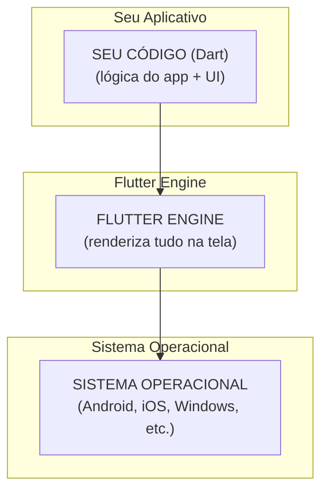

**Diferença crucial:** Assim como um jogo Unity roda igual em qualquer
plataforma, o Flutter **desenha sua própria UI** — não depende dos botões/textos
nativos do sistema.

---

## 2. Por Que Dart?

### Contexto Histórico

Quando o Flutter foi criado (2015-2017), a Google precisava de uma linguagem que
atendesse **4 requisitos críticos**:

| Requisito               | Por Que é Importante                   |
| ----------------------- | -------------------------------------- |
| **Compilação AOT**      | Performance nativa (código de máquina) |
| **Compilação JIT**      | Hot Reload durante desenvolvimento     |
| **Garbage Collection**  | Gerenciamento automático de memória    |
| **Orientada a Objetos** | Tudo é widget, tudo é objeto           |

### Por Que NÃO Outras Linguagens?

Vamos analisar as alternativas que **NÃO** funcionariam:

#### ❌ JavaScript/TypeScript

```
Problema: Precisa de bridge JavaScript → Nativo
Resultado: Performance ruim (veja React Native)
```

#### ❌ Java/Kotlin

```
Problema: Só funciona em Android
Resultado: Não serve para iOS/Web
```

#### ❌ C#

```
Problema: Requer .NET/Mono runtime
Resultado: Bundle size grande, complexidade
```

#### ❌ Python

```
Problema: Interpretado, muito lento
Resultado: Performance inaceitável para UI 60 FPS
```

### Dart: O Melhor dos Dois Mundos

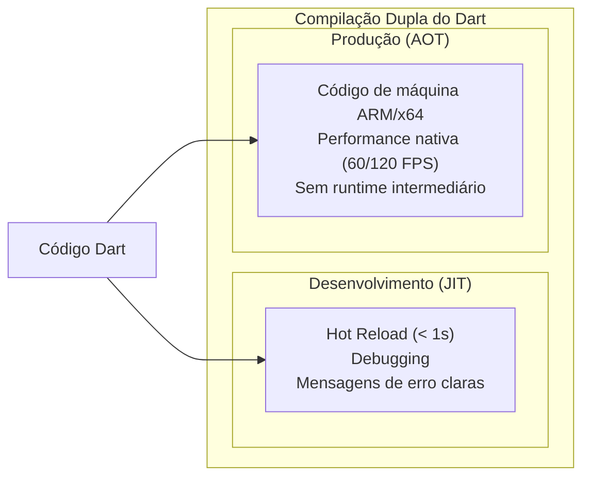

### Exemplo: Compilação AOT vs JIT

```dart
// Seu código Dart
class MeuWidget extends StatelessWidget {
  @override
  Widget build(BuildContext context) {
    return Text('Olá, Mundo!');
  }
}
```

**Durante Desenvolvimento (JIT):**

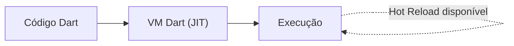

**Para Produção (AOT):**

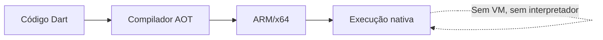

---

## 3. Flutter Usa Java Por Baixo?

### Resposta Curta: **NÃO** (mas com ressalvas)

### Resposta Longa:

#### No Android:

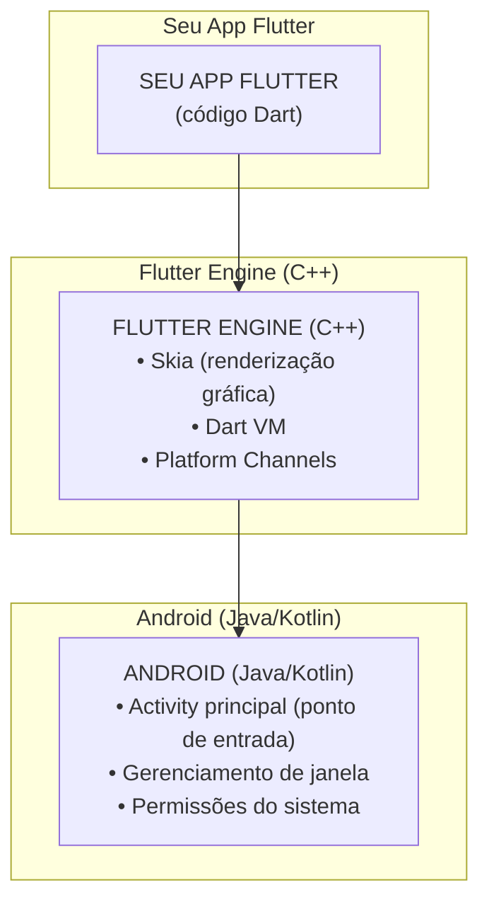

**O que é Java no Android:**

- ✅ Uma `Activity` Java/Kotlin mínima que **inicia** o Flutter
- ✅ Serviços do sistema Android (notificações, permissões)
- ✅ Plugins que acessam APIs nativas

**O que NÃO é Java:**

- ❌ Seu código Dart **NÃO** vira Java
- ❌ A UI **NÃO** usa Views do Android (Button, TextView, etc.)
- ❌ A renderização **NÃO** passa pelo sistema Android

### Comparação: Flutter vs React Native

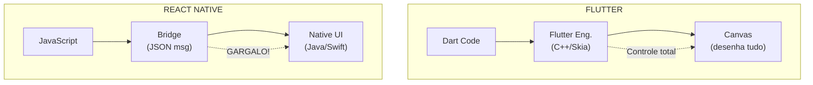

**Conclusão:** Flutter tem **controle total** da renderização. React Native
depende de uma **bridge** lenta entre JavaScript e componentes nativos.

---

## 4. Como Cria Múltiplos Frontends?

### O Segredo: **Flutter Não Usa UI Nativa**

A maioria dos frameworks cross-platform tenta **mapear** componentes:

```
React Native:
<Button> (JS) → <UIButton> (iOS) OU <Button> (Android)

Xamarin:
<Button> (C#) → <UIButton> (iOS) OU <Button> (Android)
```

**Problema:** Cada plataforma tem comportamentos diferentes, bugs diferentes,
limitações diferentes.

### A Abordagem Flutter: **Desenhar Tudo do Zero**

```
Flutter:
<Text> (Dart) → Skia Engine (C++) → Desenha pixels na tela
```

**Não importa a plataforma:** O Flutter **sempre** desenha os pixels
diretamente.

### Analogia: Pintor vs Montador

| Abordagem        | Analogia         | Exemplo                                 |
| ---------------- | ---------------- | --------------------------------------- |
| **Nativo**       | Montador de LEGO | Usa peças prontas (botões nativos)      |
| **React Native** | Tradutor         | Traduz "botão" para peça iOS ou Android |
| **Flutter**      | Pintor           | Desenha o próprio botão do zero         |

### Como Funciona na Prática

```dart
// Você escreve isso:
Text('Olá, Mundo!')

// Flutter faz isso (simplificado):
1. Pega o texto "Olá, Mundo!"
2. Escolhe a fonte (ex: Roboto)
3. Usa Skia para desenhar cada letra
4. Pinta os pixels na tela
5. Pronto! Não usou TextView nativo!
```

### Plataformas Suportadas

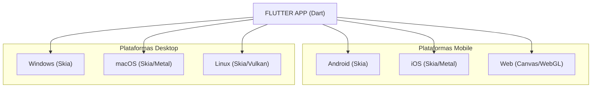

**Tudo usa o mesmo código Dart!** A única diferença é o **backend de
renderização**:

- **Mobile/Desktop:** Skia (biblioteca gráfica C++)
- **Web:** CanvasKit (WebAssembly) ou HTML Canvas
- **iOS moderno:** Metal (opcional, mais performance)

---

## 5. Arquitetura em Camadas

### Diagrama de Camadas do Flutter

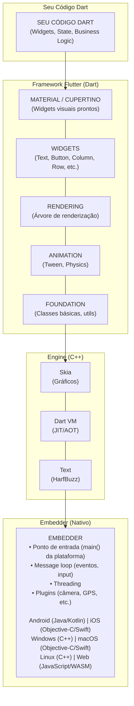

### Detalhamento de Cada Camada

#### Camada 1: Seu Código Dart

```dart
// O que VOCÊ escreve
void main() => runApp(MeuApp());

class MeuApp extends StatelessWidget {
  @override
  Widget build(BuildContext context) {
    return MaterialApp(
      home: Scaffold(
        appBar: AppBar(title: Text('Meu App')),
        body: Center(child: Text('Olá!')),
      ),
    );
  }
}
```

#### Camada 2: Framework Flutter (Dart)

- **Material/Cupertino:** Widgets visuais (botões, cards, etc.)
- **Widgets:** Classes que você usa (`Text`, `Button`, `Column`)
- **Rendering:** Gerencia a árvore de renderização
- **Animation:** Sistema de animações
- **Foundation:** Classes básicas (`String`, `List`, `Future`)

#### Camada 3: Engine (C++)

| Componente   | Função                         |
| ------------ | ------------------------------ |
| **Skia**     | Renderização gráfica 2D        |
| **Dart VM**  | Executa código Dart (JIT/AOT)  |
| **HarfBuzz** | Renderização de texto          |
| **Impeller** | Nova engine (iOS, mais rápida) |

#### Camada 4: Embedder (Nativo)

- **Android:** `FlutterActivity` (Java/Kotlin)
- **iOS:** `FlutterViewController` (Objective-C/Swift)
- **Windows:** `FlutterWindow` (C++)
- **Web:** `main.dart.js` (JavaScript)

---

## 6. Diagrama de Componentes

### Fluxo Completo: Do Código à Tela

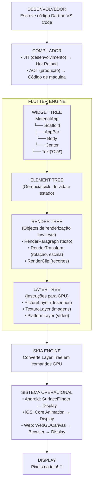

### Árvore Tripla do Flutter (Widget → Element → Render)

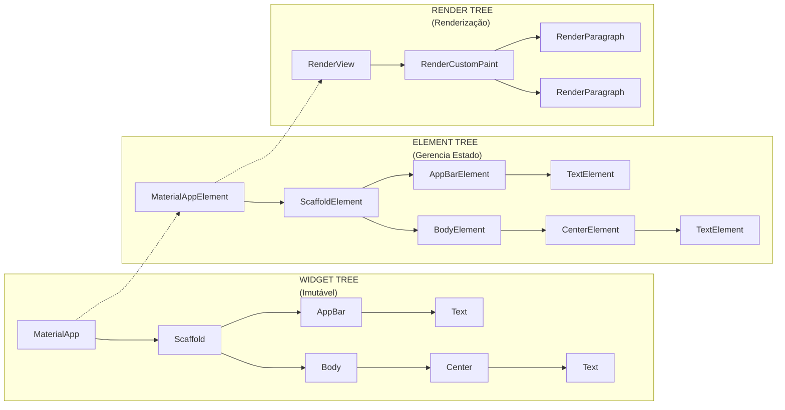

**Por que 3 árvores?**

- **Widget:** Descrição da UI (imutável, recriada frequentemente)
- **Element:** Gerencia o ciclo de vida (persiste entre rebuilds)
- **Render:** Objetos de renderização (eficientes, low-level)

---

## 7. Widget Tree, Element Tree e Render Tree

### Entendendo as 3 Árvores

#### Widget Tree (A que você vê)

```dart
// Isso é a WIDGET TREE
MaterialApp(
  home: Scaffold(
    appBar: AppBar(
      title: Text('Título'),
    ),
    body: Center(
      child: Text('Conteúdo'),
    ),
  ),
)
```

**Características:**

- ✅ **Imutável:** Widgets não mudam, são recriados
- ✅ **Leve:** Apenas configuração/descrição
- ✅ **Descartável:** Recriada a cada `setState()`

#### Element Tree (A gerência)

```
ScaffoldElement (estado preservado!)
├── AppBarElement
│   └── TextElement
└── BodyElement
    └── CenterElement
        └── TextElement
```

**Características:**

- ✅ **Mutável:** Mantém estado entre rebuilds
- ✅ **Gerencia ciclo de vida:** `initState()`, `dispose()`
- ✅ **Otimiza rebuilds:** Só reconstrói o que mudou

#### Render Tree (A renderização)

```
RenderView (root)
└── RenderCustomPaint (canvas)
    ├── RenderParagraph (texto do AppBar)
    └── RenderParagraph (texto do Body)
```

**Características:**

- ✅ **Low-level:** Objetos C++ da engine
- ✅ **Calcula layout:** Tamanho, posição
- ✅ **Pinta na tela:** Desenha pixels

### Como as 3 Árvores Se Relacionam

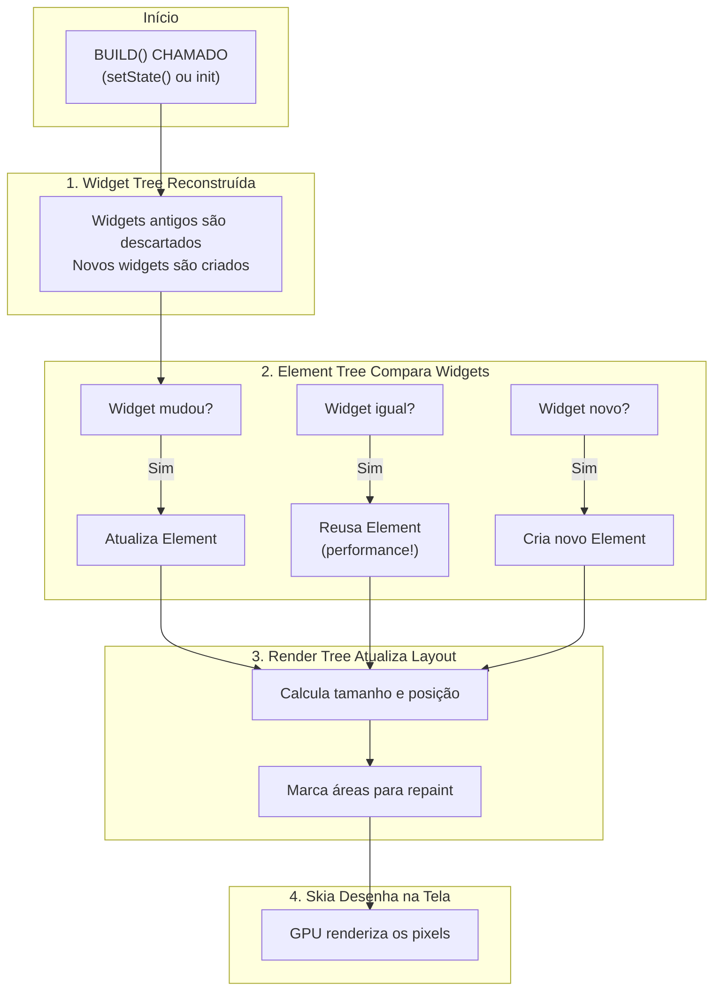

### Exemplo Prático: `setState()`

```dart
class Contador extends StatefulWidget {
  @override
  State<Contador> createState() => _ContadorState();
}

class _ContadorState extends State<Contador> {
  int _contador = 0;

  void _incrementar() {
    setState(() {
      _contador++;  // ← O que acontece aqui?
    });
  }

  @override
  Widget build(BuildContext context) {
    return Text('Contador: $_contador');
  }
}
```

**Quando `_incrementar()` é chamado:**

```
1. setState() marca Element como "dirty" (precisa rebuild)
2. Framework agenda rebuild para próximo frame
3. build() é chamado → NOVA Widget Tree criada
4. Element compara: Text widget mudou (novo valor)
5. Render atualiza: RenderParagraph com novo texto
6. Skia redesenha: Apenas área do texto (repaint eficiente)
7. Tela atualiza: Usuário vê "Contador: 1"
```

**Performance:** Só o texto é redesenhado, não a tela toda!

---

## 8. Hot Reload: A Mágica Explicada

### O Que é Hot Reload?

**Hot Reload** permite ver mudanças no código em **menos de 1 segundo**, sem
perder o estado do app.

### Comparação: Métodos Tradicionais

| Método          | Tempo | Perde Estado? | Como Funciona                    |
| --------------- | ----- | ------------- | -------------------------------- |
| **Restart**     | 5-30s | ✅ Sim        | Recompila tudo, reinicia app     |
| **Hot Reload**  | < 1s  | ❌ Não        | Injeta novo código na VM         |
| **Hot Restart** | 2-5s  | ✅ Sim        | Recompila, mantém estado parcial |

### Como Hot Reload Funciona

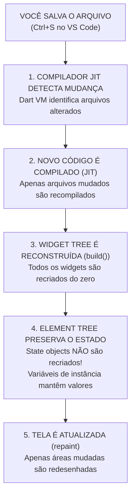

### Exemplo: Estado Preservado

```dart
class Contador extends StatefulWidget {
  @override
  State<Contador> createState() => _ContadorState();
}

class _ContadorState extends State<Contador> {
  int _contador = 0;  // ← ESTE VALOR É PRESERVADO!

  void _incrementar() {
    setState(() => _contador++);
  }

  @override
  Widget build(BuildContext context) {
    return Column(
      children: [
        Text('Contador: $_contador'),
        ElevatedButton(
          onPressed: _incrementar,
          child: Text('Incrementar'),
        ),
      ],
    );
  }
}
```

**Cenário:**

1. App está rodando, contador = 5
2. Você muda a cor do botão no código
3. Hot Reload!
4. **Resultado:** Botão muda de cor, contador **continua 5**!

### Por Que Hot Reload é Tão Rápido?

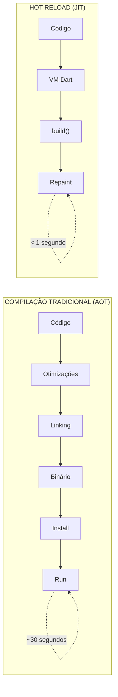

**Segredo:** O código já está rodando na VM. Só injetamos as mudanças!

---

## 9. Comparação: Flutter vs Nativo vs Outros

### Tabela Comparativa

| Característica        | Nativo       | Flutter         | React Native    | Xamarin         |
| --------------------- | ------------ | --------------- | --------------- | --------------- |
| **Linguagem**         | Swift/Kotlin | Dart            | JavaScript      | C#              |
| **Performance**       | 100%         | 90-95%          | 70-80%          | 75-85%          |
| **Hot Reload**        | ❌ Não       | ✅ Sim          | ⚠️ Limitado     | ⚠️ Parcial      |
| **UI Nativa**         | ✅ Sim       | ❌ Não          | ✅ Sim          | ⚠️ Misto        |
| **Bundle Size**       | ~5 MB        | ~10 MB          | ~15 MB          | ~20 MB          |
| **Curva Aprendizado** | Alta         | Média           | Baixa           | Média           |
| **Acesso Nativo**     | ✅ Total     | ⚠️ Plugins      | ⚠️ Bridge       | ✅ Bom          |
| **Multiplataforma**   | ❌ Separação | ✅ Único código | ✅ Único código | ✅ Único código |

### Diagrama: Arquitetura Comparada

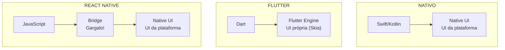

### Quando Usar Cada Um

#### ✅ Flutter é Ideal Para:

- Apps que precisam de UI consistente em todas plataformas
- Prototipagem rápida (Hot Reload é incrível!)
- Apps com muitas animações customizadas
- Equipes pequenas (um código para tudo)
- MVP e startups (velocidade > otimização extrema)

#### ✅ Nativo é Ideal Para:

- Apps que usam recursos nativos avançados
- Performance crítica (jogos, processamento pesado)
- Apps que precisam seguir guidelines de cada plataforma
- Equipes grandes com especialistas por plataforma

#### ✅ React Native é Ideal Para:

- Equipes web (JavaScript já conhecido)
- Apps simples com UI nativa
- Projetos que já usam React

---

## 10. Resumo Visual

### Infográfico: Flutter em 1 Página

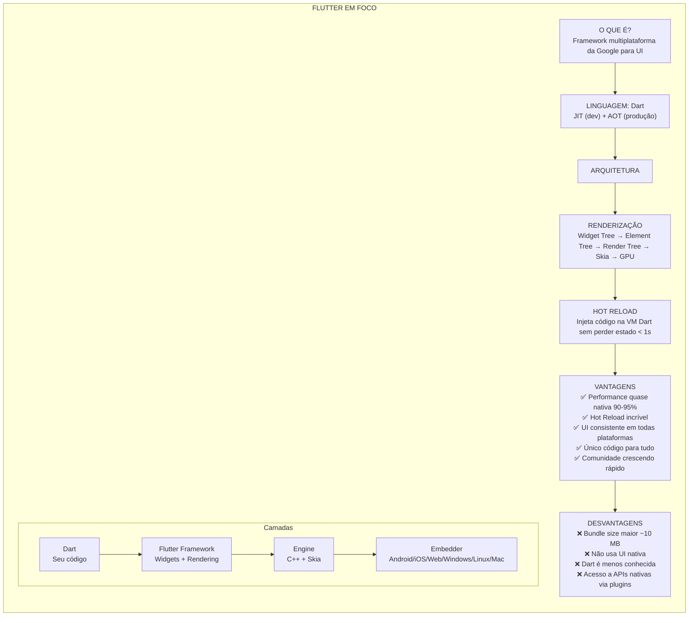

### Mapa Mental: Conceitos Chave

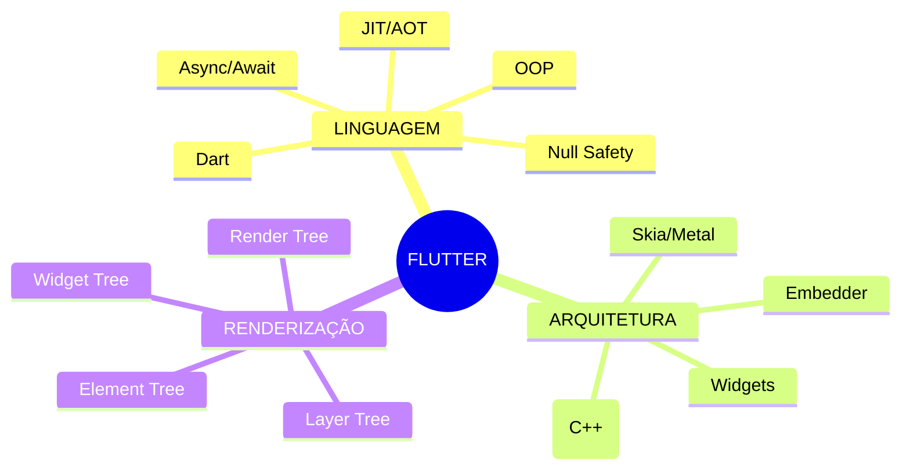

---

## 📚 Referências e Leitura Complementar

### Documentação Oficial

- [Flutter Architecture](https://docs.flutter.dev/resources/architectural-overview)
- [Inside Flutter](https://docs.flutter.dev/resources/inside-flutter)
- [Dart Language Tour](https://dart.dev/guides/language/language-tour)

### Artigos Técnicos

- [How Flutter Renders Widgets](https://medium.com/flutter/how-flutter-renders-widgets)
- [Understanding Flutter's Widget Tree](https://flutter.dev/docs/development/ui/widgets-intro)
- [Dart AOT vs JIT](https://dart.dev/overview)

### Vídeos Recomendados

- [Flutter Deep Dive (Google I/O)](https://www.youtube.com/results?search_query=flutter+deep+dive)
- [How Flutter Works (Fireship)](https://www.youtube.com/results?search_query=how+flutter+works)

---

## 🎯 Exercícios de Fixação

### 1. Verdadeiro ou Falso

1. Flutter usa componentes nativos de cada plataforma.
2. Dart compila para código de máquina em produção.
3. Hot Reload reinicia o app do zero.
4. Flutter desenha todos os pixels na tela.

### 2. Perguntas Abertas

1. Por que Flutter escolheu Dart em vez de JavaScript?
2. Qual a diferença entre Widget Tree, Element Tree e Render Tree?
3. Como o Hot Reload preserva o estado do app?

### 3. Prática

Desenhe um diagrama mostrando o fluxo completo: do código Dart até os pixels na
tela.

---

**Material elaborado para o curso PAM2 - 2026**  
Prof. Gustavo Villalta  
ETEC Ferrucio Humberto Gazzetta - Nova Odessa/SP

---

## 🔗 Links Úteis

- [Flutter Documentation](https://docs.flutter.dev)
- [Dart Documentation](https://dart.dev)
- [Flutter GitHub](https://github.com/flutter/flutter)
- [Skia Graphics Library](https://skia.org)
- [Pub.dev (packages)](https://pub.dev)
