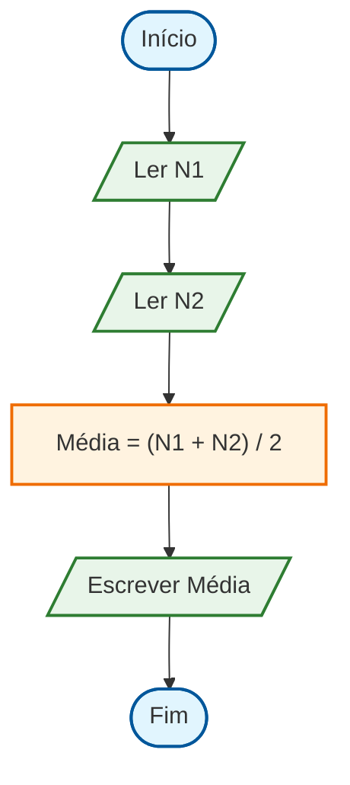

# 🧠 Pensamento Computacional e Algoritmos

Guia completo sobre os fundamentos do pensamento computacional aplicados à
resolução de problemas administrativos, incluindo fluxogramas, pseudocódigo e
lógica de programação.

---

## O que é Pensamento Computacional?

**Pensamento Computacional** é uma metodologia de resolução de problemas que
utiliza conceitos da ciência da computação. Não é apenas "pensar como um
computador", mas sim usar habilidades analíticas para resolver problemas de
forma estruturada.

### Os 4 Pilares

```
┌─────────────────────────────────────────────────────────┐
│           PENSAMENTO COMPUTACIONAL                      │
├─────────────┬─────────────┬─────────────┬───────────────┤
│ Decomposição│  Padrões    │  Abstração  │  Algoritmos   │
├─────────────┼─────────────┼─────────────┼───────────────┤
│ Dividir em  │ Identificar │ Focar no    │ Passos        │
│ partes      │ similaridades│ essencial  │ ordenados     │
│ menores     │             │ ignorar     │ para solucionar│
│             │             │ detalhes    │               │
└─────────────┴─────────────┴─────────────┴───────────────┘
```

---

## 1. Decomposição

Dividir um problema complexo em partes menores e mais gerenciáveis.

### Exemplo: Organizar um Evento Corporativo

```
EVENTO CORPORATIVO
│
├── Planejamento
│   ├── Definir objetivo
│   ├── Estabelecer orçamento
│   └── Escolher data
│
├── Logística
│   ├── Reservar local
│   ├── Contratar buffet
│   └── Organizar transporte
│
├── Comunicação
│   ├── Criar convites
│   ├── Enviar emails
│   └── Confirmar presenças
│
└── Execução
    ├── Montar estrutura
    ├── Receber convidados
    └── Avaliar resultados
```

### Exercício Prático

**Problema:** Calcular o salário líquido de um funcionário

**Decomposição:**

1. Obter salário bruto
2. Calcular INSS
3. Calcular IRRF
4. Calcular outros descontos
5. Subtrair descontos do bruto

---

## 2. Reconhecimento de Padrões

Identificar similaridades ou padrões em problemas diferentes.

### Exemplos de Padrões Administrativos

| Situação                        | Padrão Identificado        |
| ------------------------------- | -------------------------- |
| Calcular comissão de vendedores | Porcentagem sobre valor    |
| Calcular desconto de produtos   | Porcentagem sobre valor    |
| Calcular impostos               | Porcentagem sobre valor    |
| **Padrão geral**                | **Cálculo de porcentagem** |

### Exemplo Prático

```
Problema 1: Calcular 10% de desconto em uma compra
Problema 2: Calcular 15% de comissão sobre vendas
Problema 3: Calcular 8% de imposto sobre serviços

Padrão identificado: valor × (percentual / 100)
```

---

## 3. Abstração

Focar nas informações essenciais e ignorar detalhes irrelevantes.

### Exemplo: Cadastro de Cliente

**Dados Relevantes (essenciais):**

- Nome completo
- CPF/CNPJ
- Email
- Telefone
- Endereço completo

**Dados Irrelevantes (para cadastro):**

- Cor favorita
- Nome do pet
- Time de futebol

### Modelo Abstrato

```
CLIENTE
├── nome: texto
├── documento: número
├── email: texto
├── telefone: número
└── endereco: texto
```

---

## 4. Algoritmos

Sequência finita de passos para resolver um problema.

### Características de um Algoritmo

1. **Finitude**: Deve terminar em algum momento
2. **Definição**: Cada passo deve ser claro
3. **Entrada**: Pode receber dados
4. **Saída**: Deve produzir resultado
5. **Eficácia**: Cada operação deve ser executável

---

## Representação de Algoritmos

### Forma 1: Descrição Narrativa

**Problema:** Calcular média de notas

```
1. Receber a primeira nota
2. Receber a segunda nota
3. Somar as duas notas
4. Dividir a soma por 2
5. Mostrar o resultado
```

### Forma 2: Fluxograma

Símbolos principais:

| Símbolo | Significado   | Uso                |
| :-----: | :------------ | :----------------- |
|   ⭕    | Terminal      | Início/Fim         |
|   ⬜    | Processo      | Ação/Operação      |
|   🔷    | Decisão       | Condição (sim/não) |
|   📝    | Entrada/Saída | Ler/Escrever dados |
|   ➡️    | Seta          | Fluxo/Direção      |

### Exemplo de Fluxograma - Média Aritmética



> 💡 **Dica:** Passe o mouse sobre os elementos do diagrama para ver os
> detalhes!

### Forma 3: Pseudocódigo (PSeInt)

PSeInt é uma ferramenta gratuita para aprender lógica de programação.
**Download:** [pseint.sourceforge.net](https://pseint.sourceforge.net/)

```pseudocode
Algoritmo CalculaMedia
    // Declaração de variáveis
    Definir nota1, nota2, media Como Real

    // Entrada de dados
    Escribir "Digite a primeira nota:"
    Leer nota1

    Escribir "Digite a segunda nota:"
    Leer nota2

    // Processamento
    media <- (nota1 + nota2) / 2

    // Saída
    Escribir "A média é: ", media

    // Condicional
    Si media >= 6 Entonces
        Escribir "Aprovado!"
    Sino
        Escribir "Reprovado!"
    FinSi
FinAlgoritmo
```

---

## Estruturas de Controle

### Estrutura Sequencial

Execução de instruções em sequência, uma após a outra.

```pseudocode
Algoritmo FolhaPagamento
    Definir salarioBruto, inss, salarioLiquido Como Real

    Escribir "Digite o salário bruto:"
    Leer salarioBruto

    inss <- salarioBruto * 0.11  // 11% de INSS
    salarioLiquido <- salarioBruto - inss

    Escribir "Desconto INSS: R$ ", inss
    Escribir "Salário Líquido: R$ ", salarioLiquido
FinAlgoritmo
```

### Estrutura Condicional (Decisão)

**Simples (SE):**

```pseudocode
Si salario > 5000 Entonces
    imposto <- salario * 0.275
FinSi
```

**Composta (SE-SENÃO):**

```pseudocode
Si idade >= 18 Entonces
    Escribir "Maior de idade"
Sino
    Escribir "Menor de idade"
FinSi
```

**Encadeada (SE-SENÃOSE):**

```pseudocode
Si media >= 90 Entonces
    conceito <- "A"
Sino
    Si media >= 70 Entonces
        conceito <- "B"
    Sino
        Si media >= 60 Entonces
            conceito <- "C"
        Sino
            conceito <- "D"
        FinSi
    FinSi
FinSi
```

### Estrutura de Repetição

**PARA (FOR):** Quando sabemos quantas vezes repetir

```pseudocode
Algoritmo Tabuada
    Definir numero, i, resultado Como Entero

    Escribir "Digite um número:"
    Leer numero

    Para i <- 1 Hasta 10 Con Paso 1 Hacer
        resultado <- numero * i
        Escribir numero, " x ", i, " = ", resultado
    FinPara
FinAlgoritmo
```

**ENQUANTO (WHILE):** Quando não sabemos quantas repetições

```pseudocode
Algoritmo CaixaRegistradora
    Definir total, valor Como Real
    Definir continuar Como Caracter

    total <- 0
    continuar <- "S"

    Mientras continuar = "S" Hacer
        Escribir "Digite o valor do produto:"
        Leer valor
        total <- total + valor

        Escribir "Deseja continuar? (S/N)"
        Leer continuar
    FinMientras

    Escribir "Total da compra: R$ ", total
FinAlgoritmo
```

---

## Algoritmos Aplicados à Administração

### 1. Cálculo de Juros Simples

```pseudocode
Algoritmo JurosSimples
    Definir capital, taxa, tempo, juros, montante Como Real

    Escribir "=== CÁLCULO DE JUROS SIMPLES ==="
    Escribir "Capital inicial (R$):"
    Leer capital

    Escribir "Taxa de juros mensal (%):"
    Leer taxa

    Escribir "Tempo (meses):"
    Leer tempo

    // Fórmula: J = C × i × t
    juros <- capital * (taxa / 100) * tempo
    montante <- capital + juros

    Escribir "Juros: R$ ", juros
    Escribir "Montante final: R$ ", montante
FinAlgoritmo
```

### 2. Controle de Estoque

```pseudocode
Algoritmo ControleEstoque
    Definir quantidadeAtual, quantidadeMinima, quantidadeReposicao Como Entero
    Definir nomeProduto Como Caracter

    Escribir "Nome do produto:"
    Leer nomeProduto

    Escribir "Quantidade atual em estoque:"
    Leer quantidadeAtual

    Escribir "Quantidade mínima permitida:"
    Leer quantidadeMinima

    Si quantidadeAtual < quantidadeMinima Entonces
        quantidadeReposicao <- quantidadeMinima * 2 - quantidadeAtual
        Escribir "⚠️ ESTOQUE BAIXO!"
        Escribir "Quantidade a repor: ", quantidadeReposicao, " unidades"
    Sino
        Escribir "✓ Estoque adequado"
    FinSi
FinAlgoritmo
```

### 3. Aprovação de Empréstimo

```pseudocode
Algoritmo AnaliseCredito
    Definir salario, valorParcela, numeroParcelas Como Real
    Definir percentualComprometido Como Real

    Escribir "=== ANÁLISE DE CRÉDITO ==="
    Escribir "Renda mensal: R$"
    Leer salario

    Escribir "Valor desejado: R$"
    Leer valorEmprestimo

    Escribir "Número de parcelas:"
    Leer numeroParcelas

    valorParcela <- valorEmprestimo / numeroParcelas
    percentualComprometido <- (valorParcela / salario) * 100

    Escribir "Valor da parcela: R$ ", valorParcela
    Escribir "Compromete ", percentualComprometido, "% da renda"

    Si percentualComprometido <= 30 Entonces
        Escribir "✓ Empréstimo APROVADO"
    Sino
        Escribir "✗ Empréstimo NEGADO"
        Escribir "Parcela compromete mais de 30% da renda"
    FinSi
FinAlgoritmo
```

---

## Ferramentas para Praticar

| Ferramenta      | Tipo         | Link                   | Uso                       |
| --------------- | ------------ | ---------------------- | ------------------------- |
| **PSeInt**      | Pseudocódigo | pseint.sourceforge.net | Algoritmos em português   |
| **Flowgorithm** | Fluxograma   | flowgorithm.org        | Criar fluxogramas         |
| **Draw.io**     | Diagramas    | diagrams.net           | Fluxogramas profissionais |
| **VisualG**     | Pseudocódigo | visualg3.com.br        | Alternativa ao PSeInt     |

---

## Exercícios Práticos

### Exercício 1: Calculadora de Reajuste Salarial

Crie um algoritmo que:

1. Receba o salário atual
2. Calcule reajuste de 8% se salário < R$ 2000, ou 5% se >= R$ 2000
3. Mostre o novo salário

### Exercício 2: Controle de Caixa

Crie um algoritmo que:

1. Registre entradas e saídas de valores
2. Calcule o saldo atual
3. Pergunte se deseja continuar
4. Ao final, mostre total de entradas, saídas e saldo

### Exercício 3: Simulação de Investimento

Crie um algoritmo que:

1. Receba valor inicial, taxa mensal e período em meses
2. Calcule o montante final usando juros compostos
3. Mostre o rendimento

**Fórmula:** M = C × (1 + i)^t

---

## Dicas para Resolver Problemas

1. **Leia atentamente** o enunciado
2. **Identifique** entradas, processos e saídas
3. **Divida** em partes menores (decomposição)
4. **Use** papel e lápis para rascunhar
5. **Teste** com valores conhecidos
6. **Revise** passo a passo

---

## Referências

- **PSeInt Oficial:** [pseint.sourceforge.net](https://pseint.sourceforge.net/)
- **Flowgorithm:** [flowgorithm.org](http://www.flowgorithm.org/)
- **Apostila de Lógica - UNESP:**
  [www2.faac.unesp.br](http://www2.faac.unesp.br/departimentos/informatica/logica-de-programacao/)
- **Lógica de Programação - SENAI:**
  [www.senaicimatec.com.br](https://www.senaicimatec.com.br/)

---

**Material elaborado para PTIC - 2026**  
Prof. Gustavo Villalta
